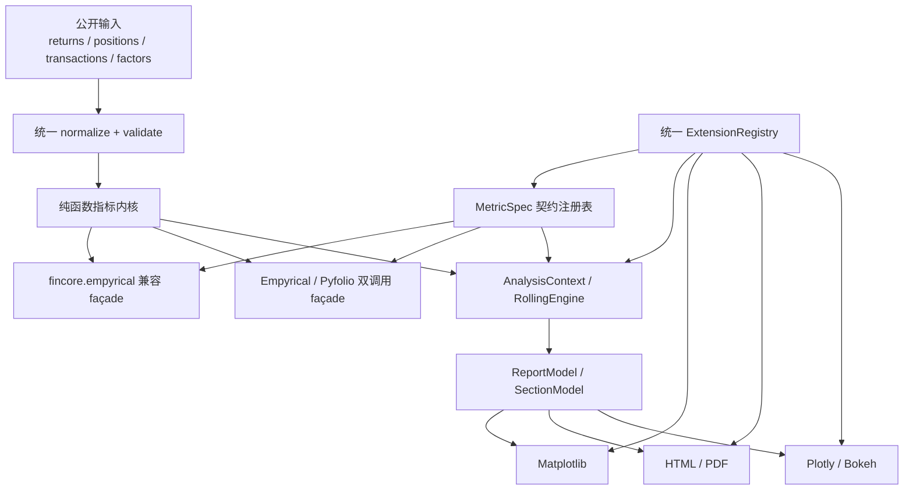

# Fincore Empyrical/Pyfolio 兼容性与发布质量收敛 Implementation Plan

> **For Codex:** REQUIRED SUB-SKILL: Use superpowers:executing-plans to implement this plan task-by-task.

**Goal:** 把 fincore 从“指标很多、覆盖率较高，但兼容声明和真实工作流不一致”的 0.3.x 包，收敛成兼容边界清晰、核心链路可用、类型/打包/文档可验证的发布候选版本。

**Architecture:** 保留纯函数指标内核，以带签名、绑定方式和返回契约的 `MetricSpec`/`WorkflowSpec` 注册表分别驱动指标 façade 与 Pyfolio 工作流，`Empyrical`/`Pyfolio` 类和 `AnalysisContext` 只做受控适配；把 pyfolio 工作流拆成规范化输入、计算模型和渲染器三层；插件、报告和滚动引擎只消费同一套契约，不再各自复制语义。

**Tech Stack:** Python 3.11+、NumPy、pandas、SciPy、Matplotlib、pytest/pytest-xdist/pytest-cov、mypy、ruff、setuptools/PEP 517、MkDocs。

---

## 0. 文档状态与审计边界

- 状态：`Proposed`
- 审计日期：2026-08-12
- fincore 基线：`1fd5f33e84bef2ec22e23eb9319f6e363084324b`（tag 基线为 `v0.3.0`）
- empyrical 对照：`/Users/yunjinqi/Documents/new_projects/empyrical`，commit `74655e974ed2935563820c548c339731f1fe0621`，包版本 `0.6.0`
- pyfolio 对照：`/Users/yunjinqi/Documents/new_projects/pyfolio`，commit `724bbd7dbed9a88bb47e1057f2ca29b3409d8e7a`，包版本 `0.9.6`
- 本计划只把上述本地快照当作兼容 oracle，不把它们等同于互联网中的“最新版本”。
- 本轮只交付分析和计划，不在同一变更中实施功能修复。

### 范围

1. empyrical 公共符号、签名、默认值、返回类型和数值语义。
2. pyfolio 的 returns、positions、transactions、risk、performance attribution、tear sheet 和报告主链。
3. `Empyrical`、`Pyfolio`、`AnalysisContext`、`RollingEngine`、插件和报告之间的架构重复。
4. 输入验证、类型、性能、可选依赖、wheel 内容、CI、文档和上游来源治理。

### 非目标

- 在兼容主链收敛前继续新增金融指标或数据源。
- 本轮直接宣布或发布 1.0.0。
- 用追求全局 100% 行覆盖率替代兼容、数值和真实工作流验收。
- 默认发起真实网络请求来证明 Yahoo、Alpha Vantage、Tushare 或 AkShare 可用。

## 1. 结论先行

建议采用“兼容优先、增强分层”的路线：

1. `fincore.empyrical` 对本地 empyrical 0.6.0 建立严格兼容层；`fincore.metrics` 保留 fincore 增强语义。
2. `fincore.pyfolio` 对已承诺的核心工作流提供函数式兼容 façade；`Pyfolio` 保留为面向 fincore 的 OO 便利层，但二者必须由同一内部模型驱动。
3. `Empyrical(returns).metric()` 作为既有文档承诺继续支持；`AnalysisContext` 是推荐的有状态、带缓存 API。`Empyrical` 本身不再偷偷创建一个未被消费的 `_ctx`。
4. 第一阶段先修复静默错误和端到端断链，再做 registry、报告、插件和性能重构。
5. 在兼容、类型和 installed-wheel 门禁通过前，版本保持 0.3.x，成熟度标记为 Beta；文档不得再宣称“无 breaking changes”“1.0.0 已发布”或“100% coverage”。

### 为什么不建议先做大重构

当前数值核心并非整体失败。探索性地把上游测试公共名称代理到 `Empyrical` 类后得到 `690 passed, 45 skipped`；已有 empyrical 相关窄测试也能达到 `378 passed`。这说明投资回报最高的工作是先固定公共契约和真实工作流，再重构重复实现。反过来，如果先移动模块或继续扩功能，会让尚未被测试锁定的签名、返回形状和金融语义继续漂移。

## 2. 当前能力与优势

| 能力层 | 当前实现 | 值得保留的部分 |
|---|---|---|
| 纯指标 | `fincore/metrics/` 17 个领域模块 | empyrical 主体数值迁移较完整；常用指标懒加载 |
| 高阶分析 | optimization、simulation、attribution、EVT、GARCH | 能力面已超过原 empyrical/pyfolio |
| 有状态分析 | `AnalysisContext`、`RollingEngine` | 懒计算和缓存方向合理 |
| Pyfolio 工作流 | 11 个主要 tear sheet、约 45 个 plot wrapper | 名称覆盖较完整，拆分出 tearsheets 子模块 |
| 报告 | Matplotlib、HTML、Plotly、Bokeh、PDF | 已具备多渲染器基础 |
| Round trips | quantity deque | 相比上游“逐股展开”，内存复杂度更合理 |
| 工程质量 | 87 个源码 Python 文件、301 个测试 Python 文件 | ruff/format/compile 均可通过；当前分支覆盖率约 94% |

另一个应保留的优势是依赖解耦：当前 base 环境使用 pandas 3.0.3，本地 empyrical 0.6.0 会因 eager 导入旧版 `pandas_datareader` 而无法正常 import；fincore 的 core/metric 懒加载没有这个问题。兼容工作不能重新引入上游的 eager 可选依赖。

## 3. 当前验证基线

所有 Python 命令均使用用户指定的 Anaconda base 环境。

本次环境快照为 Python 3.11.8、NumPy 1.26.4、pandas 3.0.3、SciPy 1.17.1、Matplotlib 3.10.9、mypy 1.16.1。后续 baseline 必须自动记录版本，不能把这组版本当作永久事实。

| 检查 | 命令摘要 | 当前结果 | 解释 |
|---|---|---|---|
| 非 slow/integration 测试 | `python -m pytest -o addopts='' tests ... --maxfail=0` | `2268 passed, 1 failed, 14 skipped, 15 deselected` | 不是绿色基线 |
| 分支覆盖率 | 同上加 `--cov=fincore --cov-branch` | `94%` | 高覆盖率不能替代契约验收 |
| 警告 | 同一测试运行 | 11 个 Matplotlib timezone-aware datetime deprecation | 未来 Matplotlib 版本会升级为错误 |
| 失败用例 | EVT CVaR xi >= 1 | 单独运行通过，和 `tests/test_import_time.py` 同跑失败 | 是 `sys.modules` 清理导致的顺序依赖，不是目标 EVT 分支本身失败 |
| ruff | `python -m ruff check ...` | 通过 | 保持为基础门禁 |
| format | `python -m ruff format --check ...` | 通过 | 保持为基础门禁 |
| compile/import | `python -m compileall -q fincore` | 通过 | 仅证明语法/导入，不证明兼容性 |
| mypy | `python -m mypy fincore --ignore-missing-imports` | 30 个文件、175 个错误 | 与 `py.typed` 和 CI 类型承诺冲突 |

当前完整复现命令：

```bash
/Users/yunjinqi/opt/anaconda3/bin/conda run -n base python -m pytest \
  -o addopts='' tests/ -q --tb=short \
  -m "not slow and not integration" \
  --ignore=tests/benchmarks --maxfail=0
```

当前失败的根因链：

```text
tests/test_import_time.py 删除 fincore.* 的 sys.modules 条目
    -> 已收集测试仍持有旧 fincore.risk.evt.evt_cvar 函数
    -> patch("fincore.risk.evt.gpd_fit") 修改新模块对象
    -> 旧函数继续调用旧模块 globals 中未 patch 的 gpd_fit
    -> 用全正 exponential 数据触发 "No negative returns"
```

这类测试污染必须在任何质量数字更新前修复。

## 4. 主要问题与优先级

### 4.1 P0：兼容声明和真实公共 API 不一致

#### Empyrical 公共表面

| 能力面 | empyrical 0.6.0 | fincore 根包 | `fincore.empyrical` 模块 | `Empyrical` 类 |
|---|---:|---:|---:|---:|
| stats 公共函数 | 47 | 19/47 | 0/47 | 42/47 |
| period 常量 | 5 | 0/5 | 0/5（`DAILY` 只是非正式可见） | 不适用 |
| attribution API | 2 | 0/2 | 0/2 | 2/2 |
| 上游总公共符号 | 54 | 不完整 | 1/54 | 类接口不与模块同构 |

直接后果：README 中以下代码会抛 `AttributeError`：

```python
from fincore import empyrical
empyrical.sharpe_ratio(returns)
```

`Empyrical` 类还缺少五个上游 rolling API：

- `roll_alpha_aligned`
- `roll_alpha_beta_aligned`
- `roll_annual_volatility`
- `roll_beta_aligned`
- `roll_sortino_ratio`

#### 两个高风险签名漂移

1. 上游 `calmar_ratio(returns, period=DAILY, annualization=None)`；fincore 在 `period` 前插入 `risk_free`。旧调用 `calmar_ratio(r, "weekly")` 在 fincore 中会把字符串当作无风险利率，最终异常。
2. 上游 `beta(returns, factor_returns, risk_free=0, out=None)`；fincore 在 `out` 前插入 `_period`、`_annualization`。旧第四位置参数不会写入 `out`，但函数仍返回一个看似正确的 beta，属于静默错误。

#### Rolling 与 CVaR 语义漂移

- 上游 `roll_alpha_beta` 默认 window 为 10；fincore 默认普遍改成 252。
- 短于 window 的非空输入，上游返回一个结果，fincore 返回空表。
- ndarray 输入上游返回 ndarray，fincore 部分函数返回 DataFrame。
- CVaR 遇重复分位点时，上游取固定数量 order statistics，fincore 取所有小于等于插值 VaR 的样本；例如 `[-.2, -.1, -.1, -.1, 1.]`、`cutoff=.25` 分别得到 `-0.15` 和 `-0.125`。

这些差异不一定都是金融上错误的，但在“drop-in”承诺下必须通过兼容 façade 保留旧语义，增强语义另行命名和文档化。

### 4.2 P0：Pyfolio 真实跨层链路断裂

| 链路 | 当前症状 | 根因 |
|---|---|---|
| risk tear sheet | `ValueError: not enough values to unpack` | compute 返回单个 DataFrame/Series，sheet 仍按 4/4/3 元组解包 |
| volume exposure | 数值输入错误 | sheet 接收 `shares_held`，实际把 `positions` 传给 compute |
| full/returns tear sheet | 少于 top 个 drawdown 时 `ConversionError` | `gen_drawdown_table` 用 NaT 填充空行，plot 仍遍历空 peak |
| transaction adapter | legacy Zipline 输入抛 `AttributeError` | `make_transaction_frame` 不再展开 date→list，也不支持嵌套 sid |
| performance attribution | wide positions 抛 index-name join 错误 | 公开入口直接进入 stacked-only 内核 |
| attribution 日期缺口 | `Length mismatch` | 计算后按长度强行把 exposure index 替换为 returns index |

风险 tear sheet 的现有测试使用 `_FakePyfolioRisk` 手工返回四/三元组，所以 31 个相关测试全部通过仍无法发现真实故障。wrapper 测试大量只断言 monkeypatch sentinel，也只能证明“转发发生”，不能证明金融结果或图形主链正确。

#### Pyfolio 能力成熟度矩阵

| 能力域 | 当前覆盖 | 成熟度判断 |
|---|---|---|
| Tear sheets | 11 个主要 sheet 已迁移，缺 Flask 专用入口 | 名称较完整，真实工作流未闭环 |
| Plotting | 主要 returns/risk/position/transaction plot 已映射 | 受额外 instance 参数、NaT、时区和 backend 副作用影响 |
| Positions | 六个主要函数存在 | `get_long_short_pos` 返回类型和定义不兼容 |
| Transactions | turnover/slippage 主计算保留 | legacy adapter 字段丢失、输入协议断裂 |
| Capacity | 五个函数基本齐全 | 当前相对最稳定，仍需 schema 门禁 |
| Round trips | 主要能力齐全 | quantity deque 是正向优化，应补大数量性能门禁 |
| Risk | compute/plot 名称齐全 | compute 与 sheet 契约完全错配，P0 |
| Perf attribution | compute/stats/plot 均存在 | wide 入口、归一化和日期对齐存在 P0/P1 问题 |
| Bayesian | 主要函数已映射 | 可选依赖能力，需独立安装矩阵 |
| Reporting | legacy tearsheet、VizBackend、strategy report 三套路径 | 重复计算，离线性和返回契约不一致 |

### 4.3 P0：版本、文档和打包没有单一事实源

- `pyproject.toml` 和 `fincore.__version__` 是 0.3.0，最新 tag 是 v0.3.0。
- `CHANGELOG.md`、迁移文档和旧完成报告却宣称 1.0.0、Production Ready、100% coverage。
- `dist/` 同时留有 0.3.0 和 1.0.0 构建物。
- `setup.py` 标记 Beta 且依赖下限更旧；`pyproject.toml` 标记 Production/Stable。
- `all = ["fincore[viz,bayesian,datareader]"]` 产生自依赖 metadata，而不是明确依赖并集。
- wheel 没有包含 `fincore/datas/*.csv` 或 `fincore/utils/static/*.xlsx`；源码又没有明确读取这些资产。
- PDF 运行时需要 Playwright，却只在 dev extra 中。
- `Pyfolio` 位于根包稳定导出表中，但加载它会无条件 import Matplotlib，而 Matplotlib 不是 core dependency。

### 4.4 P1：高层架构重复且部分是“注册成功但实际不可用”



当前与目标的差距：

- `AnalysisContext` 直接保存可变 pandas 引用，缓存可能在调用方原地修改数据后过期。
- `AnalysisContext.plot()` 丢弃绘图结果，返回 backend 实例，与 docstring 不符。
- `AnalysisContext.to_json()` 只返回字符串，迁移文档却传 `path=`。
- `Empyrical.__init__` 创建 `_ctx`，生产代码从未使用它。
- `report/compute.py` 再写一套指标编排，没有复用 `AnalysisContext`。
- `plugin/registry.py` 和 `hooks/events.py` 有两套 hook 注册表与不同返回语义。
- `viz.get_backend()` 硬编码四个 backend，不查询已注册的 plugin backend。
- `RollingEngine` 宣称 single pass，实际逐指标执行；Sharpe/volatility 重复 rolling std，Sortino 公式也与独立 `downside_risk` 不同。

### 4.5 P1：验证、类型和运行时副作用

- `fincore/validation.py` 和 `fincore/exceptions.py` 几乎没有被生产指标入口调用，覆盖率为 0%。
- 同一坏输入在不同入口会出现 pandas/NumPy 原生异常、NaN 或 fincore 自定义异常，无法预测。
- 包发布了 `py.typed`，但 mypy 仍有 175 个错误。
- `fincore/pyfolio.py` 在库导入时调用 `matplotlib.use("Agg")`，会覆盖 GUI/Jupyter 调用方的 backend。
- `print_table(run_flask_app=True)` 把 XLSX 写进 `fincore/utils/static/`。本次全量测试实际把 tracked XLSX 改了 1 byte，证明测试会污染源码树，且 installed wheel 可能是只读的。
- HTML report 从 CDN 加载 ECharts，PDF 只等待后继续；离线报告不能保证图表完整。

### 4.6 P2：性能与长期维护

- `roll_alpha`、`roll_alpha_beta` 在 n=2520/window=252 的本地对比中约为上游 15.8x/17.5x 慢，原因是每个 window 进入 Python 循环。
- `roll_max_drawdown` 当前较快，但创建 O(n×window) 的二维临时矩阵，长序列峰值内存不可控。
- benchmark CI 是手动 workflow，回退检查 `continue-on-error: true`，无法阻止性能退化。
- provider 批量获取缺统一 retry/backoff/TTL cache/部分失败模型。
- 上游文件、fixture 和有意语义漂移没有 provenance manifest；拆分出的部分 pyfolio 文件不再保留原文件级版权头。应做来源/许可证通知审计，但本计划不把它表述为已经确认的法律违规。
- `fetch_style_factors()` 当前公开但始终抛 `NotImplementedError`，`BrinsonAttribution.calculate(method="brinson_hood")` 也公开未实现选项；能力矩阵必须标注 `implemented`、`provider-required`、`experimental`、`not-implemented`，不能都归为“生产可用”。

### 4.7 关键证据索引

| 结论 | 代码证据 |
|---|---|
| README 示例调用不存在的模块函数 | `README.md:70-76`，`fincore/empyrical.py:731` |
| Empyrical 常用方法被解析为 static function | `fincore/empyrical.py:110-139`，`fincore/_registry.py:36-166` |
| 无效 `_ctx` | `fincore/empyrical.py:190-209`；生产代码无其他消费者 |
| Calmar/Beta 位置参数漂移 | `fincore/metrics/ratios.py:368-373`，`fincore/metrics/alpha_beta.py:277-284` |
| Risk compute/sheet 错配 | `fincore/metrics/positions.py:250-336`，`fincore/tearsheets/sheets.py:1025-1060` |
| Drawdown padding 进入 plot | `fincore/metrics/drawdown.py:327-375`，`fincore/tearsheets/returns.py:517-527` |
| Package 目录写 XLSX | `fincore/utils/common_utils.py:423-434` |
| Matplotlib 全局 backend 副作用 | `fincore/pyfolio.py:13-14,48-54` |
| Context 缓存/返回契约 | `fincore/core/context.py:98-102,271-302,336-347` |
| 两套 hook/硬编码 backend | `fincore/plugin/registry.py:37-39,191-201`，`fincore/hooks/events.py:46-54,107-141`，`fincore/viz/base.py:62-108` |
| RollingEngine 未 single-pass | `fincore/core/engine.py:29-39,98-149` |
| 测试顺序污染 | `tests/test_import_time.py:23-29,51-55` |
| 打包事实冲突 | `pyproject.toml:5-70`，`setup.py:18-74`，`docs/MIGRATION.md:149-169` |
| 公开但未完成能力 | `fincore/attribution/style.py:599-642`，`fincore/attribution/brinson.py:265-294` |

## 5. 目标公共契约

### 5.1 API 分层

| 表面 | 目标 | 稳定性 |
|---|---|---|
| `fincore.empyrical` | empyrical 0.6.0 的 54 个公共符号、签名和 legacy 语义 | strict compat |
| `fincore` flat API | 0.3.x 保持现有映射；后续 major 的候选目标才是常用 strict-compatible 子集 | semver migration |
| `Empyrical` | class-level 显式参数 + instance-level 可确定绑定；代理同一纯函数 | fincore convenience |
| `fincore.metrics` | fincore 增强接口；差异必须在文档和 changelog 中列明 | semver-managed |
| `fincore.pyfolio` | 本计划列出的 pyfolio 0.9.6 核心函数式工作流 | compatibility profile |
| `Pyfolio` | 对同一内部工作流的 OO façade | fincore convenience |
| `AnalysisContext` | 推荐的有状态、不可变快照、缓存 API | stable after contract gates |

### 5.2 兼容等级

- C0：公共符号存在。
- C1：对 callable，`inspect.signature` 的参数名、顺序、kind、默认值兼容；常量不适用 C1。
- C2：输入不变性、返回类型/shape/index/dtype、异常兼容。
- C3：数值在规定容差内兼容，NaN/Inf/时区/边界策略明确。
- C4：真实跨层工作流兼容，包括表格结构、Figure/ReportResult 和离线输出。
- R：从 fresh wheel 安装后通过上述门禁。

文档不得把只达到 C0 的函数描述成“fully compatible”。

### 5.3 验证与迁移 profile

同一 kernel 可以被不同公共表面调用，但不能用一套“更严格”的校验偷偷改变 legacy 行为：

| Profile | 入口 | 验证规则 | 迁移原则 |
|---|---|---|---|
| `legacy_empyrical` | `fincore.empyrical` | 镜像 pinned empyrical 对 NaN/Inf、empty、对齐和异常的处理 | 只有 oracle 变化或明确 major migration 才改变 |
| `legacy_pyfolio` | `fincore.pyfolio` compatibility profile | 镜像 pinned pyfolio 的签名、默认值和返回形态；禁止其 package-directory 写入并登记安全性差异 | 不新增 warning，不把增强参数塞入公开签名 |
| `enhanced` | `fincore.metrics`、增强 flat API | 使用严格 schema、领域异常和显式 alignment policy | 现有签名按 semver 保留；变更先弃用，再到 major 切换 |
| `context` | `AnalysisContext`、report model | 使用 immutable snapshot 和严格 schema | 与 `enhanced` 共用异常体系，不要求与 legacy 异常相同 |

`fincore` flat API 在 0.3.x 保持现有映射，避免本轮修复再制造破坏；Task 2 的 migration manifest 必须逐项记录 `current_target`、`recommended_target`、`deprecate_in`、`remove_or_switch_in`。严格调用立即可迁移到 `fincore.empyrical`，flat API 是否切换到 strict subset 只在后续 major release 决定。

## 6. 迭代总览与退出门

| Iteration | 重点 | 预计工作量 | 必须退出条件 |
|---|---|---:|---|
| I0 | 基线、顺序污染、API manifest、质量声明 | 3–4 人日 | 串行/并行收集稳定；compat manifest 可复现 |
| I1 | Empyrical façade、签名、rolling/CVaR/对齐 | 5–7 人日 | 54/54 symbols；49 个 callable 的签名与 legacy 数值门禁全绿 |
| I2 | Pyfolio risk/transactions/perf-attrib/drawdown 主链 | 6–8 人日 | 不用 fake 的 risk/full tear sheet 与归因链全绿 |
| I3 | 输入契约、AnalysisContext、报告/渲染副作用 | 6–8 人日 | 不污染源码；离线报告；context 缓存/返回契约全绿 |
| I4 | ExtensionRegistry、RollingEngine 和性能 | 5–7 人日 | 插件端到端可用；性能/RSS 门禁可重复 |
| I5 | 类型、打包、CI、文档、来源与发布候选 | 8–12 人日 | mypy 0；wheel/extras smoke；所有发布声明一致 |

基础工作量约 33–46 人日；考虑 175 个既有 mypy 错误、跨平台 wheel/Playwright 和许可证人工复核，另留 20% 风险缓冲，总计划约 40–55 人日。I0–I2 是发布阻断项；I3–I5 必须按小 PR 分段，且不能在尚有 P0 静默错误时发布 Stable/1.0。

## 7. 详细实施任务

执行前先在用户指定环境中补齐开发工具；不要用裸 `python`/`pytest`：

```bash
/Users/yunjinqi/opt/anaconda3/bin/conda run -n base python -m pip install -e ".[dev,viz]"
/Users/yunjinqi/opt/anaconda3/bin/conda run -n base python -m pip install build twine mkdocs-material "mkdocstrings[python]"
```

开始每个 Task 前先检查 `git status --short`，只 stage 本 Task 拥有的路径；测试生成物和用户已有变更不得混入提交。

### Task 1: 修复测试污染（模块与文件）并固化可信基线

**Files:**
- Modify: `fincore/utils/common_utils.py`
- Modify: `tests/test_import_time.py`
- Modify: `tests/test_utils/test_display_utils.py`
- Create: `tests/quality/test_test_process_isolation.py`
- Create: `tests/quality/test_no_package_writes.py`
- Create: `scripts/collect_quality_baseline.py`
- Create: `docs/quality/current-baseline.json`
- Create: `docs/quality/current-baseline.md`
- Modify: `pyproject.toml`

**Step 1: 写出当前顺序依赖和源码写入的失败测试**

`tests/quality/test_test_process_isolation.py` 使用 subprocess 运行最小组合，避免测试本身再操作当前进程的模块缓存：

```python
from __future__ import annotations

import subprocess
import sys


def test_import_benchmark_does_not_break_later_monkeypatches() -> None:
    result = subprocess.run(
        [
            sys.executable,
            "-m",
            "pytest",
            "-o",
            "addopts=",
            "tests/test_import_time.py",
            "tests/test_risk/evt/test_evt_cvar.py::"
            "TestEVTCVArEdgeCases::test_evt_cvar_gpd_xi_ge_1_raises_line_425",
            "-q",
            "--tb=short",
        ],
        capture_output=True,
        text=True,
        check=False,
    )
    assert result.returncode == 0, result.stdout + result.stderr
```

`tests/quality/test_no_package_writes.py` 在任何真实写入前拦截 `to_excel`：

```python
import pandas as pd
import pytest

from fincore.utils import common_utils

def test_run_flask_display_does_not_implicitly_export(monkeypatch) -> None:
    def forbidden_export(*_args, **_kwargs):
        pytest.fail("run_flask_app attempted to write an XLSX into the package")

    monkeypatch.setattr(pd.DataFrame, "to_excel", forbidden_export)
    monkeypatch.setattr(common_utils, "display", lambda *_args, **_kwargs: None)
    monkeypatch.setattr(common_utils, "HTML", lambda html: html)

    common_utils.print_table(
        pd.DataFrame({"x": [1.0]}),
        name="Stress Events",
        run_flask_app=True,
    )
```

第二个测试用 monkeypatch 在落盘前失败，因此 RED 阶段本身不会再改写 tracked XLSX；不得为了得到失败证据先真实覆盖用户工作区文件。

**Step 2: 验证测试当前失败**

```bash
/Users/yunjinqi/opt/anaconda3/bin/conda run -n base python -m pytest \
  -o addopts='' tests/quality/test_test_process_isolation.py \
  tests/quality/test_no_package_writes.py -q --tb=short --maxfail=0
```

Expected: 两个回归都 FAIL，分别包含 `No negative returns in data` 和禁止隐式 XLSX export 的消息；运行前后 `git status --short -- fincore` 完全一致。

**Step 3: 最小修复两类测试污染**

- 不再从当前 pytest 进程删除 `fincore.*`。
- 冷导入时间用独立 subprocess 测量；当前进程的 benchmark 只测已加载/正常懒加载路径。
- 删除无用的 `importlib`，确保 benchmark 不返回跨进程 module 对象。
- `print_table(run_flask_app=True)` 只执行 legacy HTML/display 行为，不再调用 `to_excel`、创建 `fincore/utils/static/` 或写 site-packages。显式文件导出留给 Task 8 的 `ExportConfig(output_dir=...)`；这一安全性差异在 Task 2 compatibility matrix 登记为 intentional divergence。
- 把 `tests/test_utils/test_display_utils.py` 中“写临时 static 目录”的断言改成“未提供显式 export config 时绝不调用 `to_excel`”；不能仅把 package 路径换成另一个隐式路径。
- 从全局 pytest `addopts` 移除 `-n auto --dist=loadscope`；并行度由 CI 命令显式选择，使 core contributor 环境不安装 xdist 时也能收集。

**Step 4: 运行两个聚焦回归**

```bash
/Users/yunjinqi/opt/anaconda3/bin/conda run -n base python -m pytest \
  -o addopts='' tests/quality/test_test_process_isolation.py \
  tests/quality/test_no_package_writes.py tests/test_utils/test_display_utils.py \
  tests/test_import_time.py tests/test_risk/evt/test_evt_cvar.py \
  -q --tb=short --maxfail=0
```

Expected: 0 failures，且 source worktree 的 package fingerprint 不变。

**Step 5: 生成而不是手写质量快照**

`scripts/collect_quality_baseline.py` 先把**当前工作树内容**复制到 `TemporaryDirectory`（排除 `.git`、cache、build/dist），然后只在这个 disposable copy 内依次运行：可信 `not slow and not integration` baseline、`serial` 单进程、同 selector 的 non-serial 单进程/xdist，以及 branch coverage。这样既包含本 Task 尚未 commit 的修复，也不会让任何遗留测试写回共享工作区。

```bash
/Users/yunjinqi/opt/anaconda3/bin/conda run -n base python \
  scripts/collect_quality_baseline.py \
  --json docs/quality/current-baseline.json \
  --markdown docs/quality/current-baseline.md
```

脚本必须记录 source commit/dirty state、copy manifest SHA256、Python/NumPy/pandas/SciPy/Matplotlib 版本、四组测试的精确 selector、collected/passed/skipped、branch coverage、warnings 和执行时间；在每组测试前后比较 disposable copy 中所有 tracked package bytes 及非-cache 文件 inventory，发现写入即失败。机器门禁读取 JSON；Markdown 由同一 JSON 渲染，不硬编码 README badge 数字。`serial` 只单进程；non-serial 单进程/xdist 的 collected/passed/skipped 必须一致。offline integration 到 Task 12 独立运行。

**Step 6: Commit**

```bash
git add fincore/utils/common_utils.py tests/test_import_time.py \
  tests/test_utils/test_display_utils.py tests/quality/test_test_process_isolation.py \
  tests/quality/test_no_package_writes.py \
  scripts/collect_quality_baseline.py docs/quality/current-baseline.json \
  docs/quality/current-baseline.md pyproject.toml
git commit -m "test: isolate import benchmarks and record quality baseline"
```

### Task 2: 冻结上游 API/签名/来源 manifest

**Files:**
- Create: `scripts/generate_compat_manifest.py`
- Create: `tests/compat/fixtures/empyrical-0.6.0-api.json`
- Create: `tests/compat/fixtures/pyfolio-0.9.6-api.json`
- Create: `tests/compat/fixtures/fincore-flat-api-migrations.json`
- Create: `tests/compat/oracle/requirements-empyrical-0.6.0.txt`
- Create: `tests/compat/oracle/requirements-pyfolio-0.9.6.txt`
- Create: `tests/compat/test_manifest_integrity.py`
- Create: `docs/compatibility/empyrical-0.6.0.md`
- Create: `docs/compatibility/pyfolio-0.9.6.md`
- Create: `docs/upstream-provenance.md`
- Create after legal review if required: `THIRD_PARTY_NOTICES.md`
- Modify: `README.md`
- Modify: `CHANGELOG.md`
- Modify: `docs/MIGRATION.md`
- Modify: `mkdocs_docs/getting-started/migration.md`

**Step 1: 写 manifest 完整性测试**

```python
from __future__ import annotations

import json
from pathlib import Path


FIXTURES = Path(__file__).parent / "fixtures"


def test_empyrical_manifest_is_pinned_and_complete() -> None:
    data = json.loads((FIXTURES / "empyrical-0.6.0-api.json").read_text())
    assert data["version"] == "0.6.0"
    assert data["commit"] == "74655e974ed2935563820c548c339731f1fe0621"
    assert len(data["public_symbols"]) == 54
    assert len(data["callables"]) == 49
    assert {"calmar_ratio", "beta", "perf_attrib", "DAILY"} <= set(data["public_symbols"])


def test_pyfolio_manifest_is_pinned() -> None:
    data = json.loads((FIXTURES / "pyfolio-0.9.6-api.json").read_text())
    assert data["version"] == "0.9.6"
    assert data["commit"] == "724bbd7dbed9a88bb47e1057f2ca29b3409d8e7a"
    assert "create_full_tear_sheet" in data["compatibility_profile"]
    assert "create_risk_tear_sheet" in data["compatibility_profile"]
```

**Step 2: 验证缺 fixture 时失败**

```bash
/Users/yunjinqi/opt/anaconda3/bin/conda run -n base python -m pytest \
  -o addopts='' tests/compat/test_manifest_integrity.py -q
```

Expected: FAIL，fixture 不存在。

**Step 3: 实现只读 manifest 生成器**

命令接口固定为：

```bash
/Users/yunjinqi/opt/anaconda3/bin/conda run -n base python \
  scripts/generate_compat_manifest.py \
  --empyrical-root /Users/yunjinqi/Documents/new_projects/empyrical \
  --pyfolio-root /Users/yunjinqi/Documents/new_projects/pyfolio \
  --output tests/compat/fixtures
```

生成器默认在 base 环境用 `ast` 静态解析上游 `__init__.py`、函数定义、别名和常量，产出 public path、symbol、结构化参数、返回注释、上游 commit、文件 SHA256、fixture 来源和 compatibility profile；不得把 sibling checkout 加入 `sys.path` 后直接 import。当前 base + pandas 3 会在 empyrical 的 eager `pandas_datareader` 导入处失败，因此不能以 `inspect.signature` 直导上游作为必经步骤。

对 AST 无法解析的动态 factory，生成器把条目标记为 `needs_dynamic_review`。可选动态核验只能通过 `--oracle-python <path>` 调用一个按 `tests/compat/oracle/requirements-*.txt` 创建的隔离解释器；核验结果与静态来源一起 frozen，并要求 reviewer 把 `reviewed=true` 写入 manifest。CI 只读取 frozen JSON，不依赖 sibling checkout、本机绝对路径或可联网安装。

**Step 4: 写兼容矩阵和 provenance**

- 每个符号标注 C0–C4 状态。
- 记录复制/修改来源，不只放一个 LICENSE 链接；由人工/法务确认后生成所需 `THIRD_PARTY_NOTICES.md`/SPDX notice，工程计划不预判具体许可证结论。
- pyfolio 的本地根 LICENSE 与源文件 Apache header 不一致，应记录并安排人工许可证审计；不要自行下法律结论。

同时立即做一次“当前事实修正”，不等待最终发布文档：

- 明确当前版本是 0.3.0，不再建议安装不存在的 `fincore>=1.0.0`。
- 把 1.0 内容移到 `[Unreleased]`，旧完成报告标为 historical snapshot。
- 暂时将 “drop-in / no breaking changes / 100% coverage” 改为指向 compatibility matrix 的精确状态。
- 保留功能示例，但只有当前能够执行的示例可以出现在 Quick Start。

**Step 5: 验证并 Commit**

```bash
/Users/yunjinqi/opt/anaconda3/bin/conda run -n base python -m pytest \
  -o addopts='' tests/compat/test_manifest_integrity.py -q

git add scripts/generate_compat_manifest.py tests/compat docs/compatibility \
  docs/upstream-provenance.md README.md CHANGELOG.md docs/MIGRATION.md \
  mkdocs_docs/getting-started/migration.md
git commit -m "test: pin empyrical and pyfolio compatibility manifests"
```

若人工复核要求且确实创建了 `THIRD_PARTY_NOTICES.md`，在 commit 前把该路径追加到显式 stage 清单；不得假设可选文件一定存在。

### Task 3: 建立真正的 empyrical 兼容 façade

**Files:**
- Modify: `fincore/empyrical.py`
- Modify: `fincore/__init__.py`
- Modify: `fincore/_registry.py`
- Modify: `fincore/metrics/alpha_beta.py`
- Modify: `fincore/metrics/ratios.py`
- Modify: `fincore/metrics/rolling.py`
- Create: `tests/compat/empyrical/test_public_api.py`
- Create: `tests/compat/empyrical/test_signatures.py`
- Create: `tests/compat/empyrical/test_out_contract.py`
- Create: `tests/compat/empyrical/test_state_binding.py`

**Step 1: 写公共表面和关键签名失败测试**

```python
from __future__ import annotations

import inspect

import numpy as np
import pandas as pd

import fincore.empyrical as ep
from fincore import Empyrical


EXPECTED = {
    "DAILY",
    "WEEKLY",
    "MONTHLY",
    "QUARTERLY",
    "YEARLY",
    "sharpe_ratio",
    "calmar_ratio",
    "beta",
    "roll_sortino_ratio",
    "roll_annual_volatility",
    "perf_attrib",
    "compute_exposures",
}


def test_module_exports_legacy_symbols() -> None:
    assert EXPECTED <= set(ep.__all__)
    assert EXPECTED <= set(dir(ep))


def test_legacy_signatures() -> None:
    assert str(inspect.signature(ep.calmar_ratio)) == "(returns, period='daily', annualization=None)"
    assert str(inspect.signature(ep.beta)) == "(returns, factor_returns, risk_free=0.0, out=None)"


def test_beta_fourth_positional_argument_is_out() -> None:
    returns = np.array([0.01, 0.02, -0.01, 0.03])
    factor = np.array([0.01, 0.01, -0.02, 0.02])
    out = np.full((), 999.0)
    result = ep.beta(returns, factor, 0.0, out)
    assert out.item() == result


def test_documented_instance_binding() -> None:
    idx = pd.date_range("2024-01-01", periods=30, freq="B")
    returns = pd.Series(np.linspace(-0.01, 0.02, len(idx)), index=idx)
    emp = Empyrical(returns=returns)
    assert emp.sharpe_ratio() == Empyrical.sharpe_ratio(returns)


@pytest.mark.parametrize("entry", load_empyrical_callable_manifest())
def test_every_legacy_callable_has_frozen_signature(entry) -> None:
    public = getattr(ep, entry["symbol"])
    assert normalize_signature(inspect.signature(public)) == entry["signature"]
```

**Step 2: 验证当前失败**

```bash
/Users/yunjinqi/opt/anaconda3/bin/conda run -n base python -m pytest \
  -o addopts='' tests/compat/empyrical/test_public_api.py \
  tests/compat/empyrical/test_signatures.py \
  tests/compat/empyrical/test_out_contract.py \
  tests/compat/empyrical/test_state_binding.py -q --maxfail=0
```

Expected: module exports、签名、out 和 instance binding 均至少有一项失败。

**Step 3: 引入单一 `MetricSpec`**

`fincore/_registry.py` 的每项必须明确：

```python
@dataclass(frozen=True)
class MetricSpec:
    surface: Literal[
        "empyrical_module",
        "fincore_flat",
        "empyrical_class",
        "metrics",
        "context",
    ]
    public_name: str
    variant: str
    kernel_ref: str
    adapter_ref: str
    signature_manifest_key: str | None
    binding: Literal["static", "returns", "returns_factor"]
    validation_profile: Literal["legacy_empyrical", "enhanced"]
    result_contract_key: str
    result_projection: Literal["identity", "scalar", "series", "frame", "legacy_tuple", "out_buffer"]
    out_policy: Literal["unsupported", "return_only", "write_and_return"]
```

- registry 以 `(surface, public_name, variant)` 为唯一键；同名 `calmar_ratio` 的 strict module wrapper、0.3.x enhanced flat 映射和 class/context binding 是独立 entry，不能靠一个布尔兼容标记猜分支。
- `kernel_ref`/`adapter_ref` 使用惰性字符串引用，避免 registry import 可选依赖；adapter 负责输入/返回投影，`signature_manifest_key` 和 `result_contract_key` 分别指向 frozen 签名与 shape/index/dtype/异常契约。
- module façade、flat API 和 class descriptor 从同一张多表面 registry 解析，但按各自 surface 选择 entry；因此既能共享 kernel，又不会把 strict signature 强加给 0.3.x flat API。
- legacy façade 使用具有真实兼容调用约束的显式 wrapper，或在生成 wrapper 内先用 frozen `Signature.bind()` 执行参数绑定；只设置 `__signature__` 却继续接受错误参数不算兼容。
- fincore 增强参数不能出现在 legacy wrapper 的位置参数中。`fincore.empyrical.calmar_ratio` 和 `.beta` 新增显式 strict wrapper，分别恢复上游签名和第四位置 `out`。
- 本 Task 不改 `fincore.metrics.ratios.calmar_ratio`、`fincore.metrics.alpha_beta.beta` 的现有增强签名，也不突然切换 0.3.x flat API；目标 keyword-only 设计进入 Task 2 的迁移表，经过弃用期后只在 major release 落地。
- 补齐五个缺失 rolling API。
- `Empyrical` 实例绑定只对 `returns`/`returns_factor` spec 自动填充；类调用仍要求显式数据。
- 删除未使用的 eager `_ctx`；需要缓存时用户使用 `AnalysisContext`。

**Step 4: 运行 façade、原有和 README smoke tests**

```bash
/Users/yunjinqi/opt/anaconda3/bin/conda run -n base python -m pytest \
  -o addopts='' tests/compat/empyrical tests/test_empyrical tests/test_metrics \
  -q --tb=short --maxfail=0
```

Expected: 0 failures；54/54 上游公共符号达到 C0，49/49 callable 达到 C1；数值 C2/C3 由 Task 4 收敛。

**Step 5: Commit**

```bash
git add fincore/empyrical.py fincore/__init__.py fincore/_registry.py \
  fincore/metrics/alpha_beta.py fincore/metrics/ratios.py fincore/metrics/rolling.py \
  tests/compat/empyrical
git commit -m "fix: restore empyrical public and positional contracts"
```

### Task 4: 收敛 empyrical 数值、rolling 和时间序列语义

**Files:**
- Modify: `fincore/metrics/risk.py`
- Modify: `fincore/metrics/rolling.py`
- Modify: `fincore/metrics/basic.py`
- Modify: `fincore/metrics/returns.py`
- Modify: `fincore/metrics/perf_attrib.py`
- Create: `fincore/contracts/__init__.py`
- Create: `fincore/contracts/time_series.py`
- Create: `tests/compat/empyrical/test_numeric_contracts.py`
- Create: `tests/compat/empyrical/test_rolling_contracts.py`
- Create: `tests/compat/empyrical/test_index_contracts.py`
- Create: `tests/compat/empyrical/test_perf_attrib_alignment.py`

**Step 1: 写边界矩阵参数化测试**

至少覆盖：

- Series/DataFrame/ndarray；float32/float64/int。
- empty、单元素、全 NaN、部分 NaN、±Inf、常数、收益 ≤ -100%。
- 重复 quantile；short/exact/long rolling window；`out`。
- naive/UTC/Asia-Shanghai/DST；乱序、重复、部分交集、无交集 index。
- DAILY/WEEKLY/MONTHLY/QUARTERLY/YEARLY/custom annualization；ISO 周跨年。

关键回归：

```python
def test_legacy_cvar_uses_fixed_tail_count() -> None:
    values = np.array([-0.2, -0.1, -0.1, -0.1, 1.0])
    assert ep.conditional_value_at_risk(values, cutoff=0.25) == -0.15


def test_short_roll_window_matches_legacy_shape() -> None:
    returns = np.arange(6, dtype=float) / 100
    factor = returns / 2
    result = ep.roll_alpha_beta(returns, factor)
    assert isinstance(result, np.ndarray)
    assert result.shape == (1, 2)


def test_legacy_weekly_grouping_matches_pinned_oracle() -> None:
    idx = pd.to_datetime(["2019-12-30", "2020-01-01"])
    result = ep.aggregate_returns(pd.Series([0.01, 0.02], index=idx), "weekly")
    # empyrical 0.6.0 combines calendar year with ISO week number.
    assert len(result) == 2


def test_enhanced_iso_week_uses_iso_year() -> None:
    idx = pd.to_datetime(["2019-12-30", "2020-01-01"])
    result = aggregate_returns(
        pd.Series([0.01, 0.02], index=idx),
        "weekly",
        week_year="iso",
    )
    assert len(result) == 1
```

**Step 2: 先运行并记录 legacy-compatible 与 intentional-divergence**

```bash
/Users/yunjinqi/opt/anaconda3/bin/conda run -n base python -m pytest \
  -o addopts='' tests/compat/empyrical/test_numeric_contracts.py \
  tests/compat/empyrical/test_rolling_contracts.py \
  tests/compat/empyrical/test_index_contracts.py \
  tests/compat/empyrical/test_perf_attrib_alignment.py -q --maxfail=0
```

Expected: CVaR ties、rolling 默认/shape、增强 ISO-week 选项和 attribution 日期缺口至少一项失败；legacy weekly 测试必须从一开始就与 frozen oracle 同为 2 组。

**Step 3: 实现兼容投影和统一索引策略**

- legacy façade 保持上游 order-statistics CVaR；增强 expected-shortfall API 可保留插值策略，但换清晰名称。
- `roll_*` 保持 legacy window/shape/type；`rolling_*` 作为增强 pandas API。
- Series/DataFrame 对齐统一经 `fincore/contracts/time_series.py`；legacy wrapper 显式传 manifest 冻结的 oracle policy，增强入口必须显式选择 `outer_dropna`、`inner` 或 `strict`，禁止由输入类型偷偷决定。
- tz-aware/naive 混用时，legacy façade 镜像 oracle；增强/context 默认抛 `DataAlignmentError`，并提供显式 `normalize_tz="UTC"` 选项，不静默转换。
- `fincore.empyrical.aggregate_returns` 保留 pinned oracle 的 calendar-year + ISO-week 组合；`fincore.metrics.returns.aggregate_returns(..., week_year="iso")` 才提供 ISO-year + ISO-week 修正，并在 compatibility matrix 登记 intentional divergence。
- attribution 先求公共日期或按 policy 补缺，禁止按长度直接覆盖 index；逐日验证 `total_returns = common_returns + specific_returns`。

**Step 4: 跑差分、性质和输入不变性测试**

```bash
/Users/yunjinqi/opt/anaconda3/bin/conda run -n base python -m pytest \
  -o addopts='' tests/compat/empyrical tests/test_empyrical/stats \
  tests/test_metrics -q --tb=short --maxfail=0
```

Expected: 0 failures；所有非有意漂移使用 `allclose(equal_nan=True)`；输入 Series/DataFrame 不被原地修改。

**Step 5: Commit**

```bash
git add fincore/contracts fincore/metrics/risk.py fincore/metrics/rolling.py \
  fincore/metrics/basic.py fincore/metrics/returns.py fincore/metrics/perf_attrib.py \
  tests/compat/empyrical
git commit -m "fix: align empyrical numeric and time-series semantics"
```

### Task 5: 建立规范 portfolio/transaction/risk 模型并修复 risk tear sheet

**Files:**
- Create: `fincore/contracts/portfolio.py`
- Modify: `fincore/metrics/positions.py`
- Modify: `fincore/metrics/transactions.py`
- Modify: `fincore/tearsheets/sheets.py`
- Modify: `fincore/tearsheets/risk.py`
- Modify: `fincore/pyfolio.py`
- Create: `tests/compat/pyfolio/test_risk_e2e.py`
- Create: `tests/compat/pyfolio/test_transactions.py`
- Create: `tests/compat/pyfolio/test_positions.py`

**Step 1: 写不用 fake 的真实 risk 链测试**

```python
def test_real_risk_tear_sheet_returns_figure(pyfolio_risk_inputs) -> None:
    pf = Pyfolio()
    fig = pf.create_risk_tear_sheet(
        positions=pyfolio_risk_inputs.positions,
        sectors=pyfolio_risk_inputs.sectors,
        caps=pyfolio_risk_inputs.caps,
        shares_held=pyfolio_risk_inputs.shares_held,
        volumes=pyfolio_risk_inputs.volumes,
        returns=pyfolio_risk_inputs.returns,
        estimate_intraday=False,
        run_flask_app=True,
    )
    assert isinstance(fig, matplotlib.figure.Figure)
    # 11 GridSpec rows are rendered by 8 axes: sector 3 + cap 3 + volume 2.
    assert len(fig.axes) == 8
```

交易 schema 测试必须确认 legacy 和 canonical 输入生成同一个表，并保留字段：

```python
EXPECTED_COLUMNS = [
    "dt", "sid", "symbol", "amount", "price",
    "order_id", "commission", "txn_dollars",
]
```

**Step 2: 验证当前失败**

```bash
/Users/yunjinqi/opt/anaconda3/bin/conda run -n base python -m pytest \
  -o addopts='' tests/compat/pyfolio/test_risk_e2e.py \
  tests/compat/pyfolio/test_transactions.py \
  tests/compat/pyfolio/test_positions.py -q --maxfail=0
```

Expected: risk 解包、volume 输入、legacy transaction 和 `get_long_short_pos` 语义失败。

**Step 3: 实现内部 typed result，兼容 façade 再投影**

```python
@dataclass(frozen=True)
class ExposureBundle:
    long: pd.DataFrame
    short: pd.DataFrame
    gross: pd.DataFrame
    net: pd.DataFrame


@dataclass(frozen=True)
class VolumeExposureBundle:
    long: pd.Series
    short: pd.Series
    gross: pd.Series
```

- `ExposureBundle` 的 index 是日期、columns 是具名 category（sector 名或 cap bucket）；禁止用无标签 tuple 暗示列顺序。`VolumeExposureBundle` 单独表达三条 volume 序列。
- 内部 compute 返回上述具名对象；pyfolio compatibility wrapper 按 manifest 冻结的 category order 投影为上游 4/4/3 tuple，并对缺列/重复列报契约错误。
- style exposure 按 gross exposure 归一化并排除 cash。
- volume 使用 `shares_held`，不是 dollar positions。
- `get_long_short_pos` compatibility path 返回归一化的 `long/short/net exposure` DataFrame；当前金额汇总另命名为 `get_long_short_notional`。
- transaction normalizer 支持 flat list、规范 DataFrame、Zipline date→list，并拒绝缺必需字段的 DataFrame，不再原样放行。

**Step 4: 运行真实链与旧单元测试**

```bash
/Users/yunjinqi/opt/anaconda3/bin/conda run -n base python -m pytest \
  -o addopts='' tests/compat/pyfolio tests/test_metrics/test_positions_metrics.py \
  tests/test_metrics/missing_coverage/test_transactions.py \
  tests/test_metrics/test_transactions_edge_cases.py \
  tests/test_tearsheets/sheets_coverage/test_risk.py \
  -q --tb=short --maxfail=0
```

Expected: 0 failures；真实 compute → plot → sheet 链必须至少有一条，不允许全部由 fake 覆盖。

**Step 5: Commit**

```bash
git add fincore/contracts/portfolio.py fincore/metrics/positions.py \
  fincore/metrics/transactions.py fincore/tearsheets/sheets.py \
  fincore/tearsheets/risk.py fincore/pyfolio.py tests/compat/pyfolio
git commit -m "fix: restore pyfolio portfolio and risk workflow contracts"
```

### Task 6: 修复 perf-attrib、drawdown 和 full tear sheet 主链

**Files:**
- Create: `fincore/contracts/workflows.py`
- Create: `fincore/_pyfolio_impl.py`
- Modify: `fincore/metrics/perf_attrib.py`
- Modify: `fincore/metrics/drawdown.py`
- Modify: `fincore/tearsheets/returns.py`
- Modify: `fincore/tearsheets/sheets.py`
- Modify: `fincore/pyfolio.py`
- Modify: `tests/test_pyfolio/perf_attrib/test_perf_attrib_simple.py`
- Modify: `tests/test_pyfolio/perf_attrib/test_perf_attrib_regression.py`
- Modify: `tests/test_pyfolio/test_txn.py`
- Create: `tests/compat/pyfolio/test_public_api.py`
- Create: `tests/compat/pyfolio/test_perf_attrib.py`
- Create: `tests/compat/pyfolio/test_drawdown_e2e.py`
- Create: `tests/compat/pyfolio/test_full_tear_sheet_e2e.py`
- Create: `tests/compat/pyfolio/test_no_source_writes.py`

**Step 1: 先修无效断言**

所有裸 `.equals()` 必须变成：

```python
pd.testing.assert_frame_equal(actual, expected)
pd.testing.assert_series_equal(actual, expected)
```

确保测试在故意篡改 actual 后会失败，再恢复正确 fixture。

**Step 2: 写 wide/stacked 和少 drawdown 回归**

```python
def test_wide_and_stacked_perf_attrib_are_equivalent(attrib_inputs) -> None:
    wide = compute_exposures(
        attrib_inputs.wide_positions,
        attrib_inputs.factor_loadings,
        stack_positions=True,
        pos_in_dollars=True,
    )
    stacked = compute_exposures(
        attrib_inputs.stacked_positions,
        attrib_inputs.factor_loadings,
        stack_positions=False,
        pos_in_dollars=True,
    )
    pd.testing.assert_frame_equal(wide, stacked)


def test_drawdown_plot_skips_padding_rows(short_drawdown_returns) -> None:
    ax = Pyfolio().plot_drawdown_periods(short_drawdown_returns, top=10)
    assert ax.get_title() == "Top 10 drawdown periods"


def test_functional_pyfolio_facade_hides_internal_instance(returns) -> None:
    from fincore import pyfolio

    signature = inspect.signature(pyfolio.create_returns_tear_sheet)
    assert "pyfolio_instance" not in signature.parameters
    result = pyfolio.create_returns_tear_sheet(
        returns,
        run_flask_app=True,
    )
    assert isinstance(result, matplotlib.figure.Figure)


@pytest.mark.parametrize("entry", load_pyfolio_profile())
def test_full_pyfolio_profile_has_frozen_path_and_signature(entry) -> None:
    public = resolve_public_path(entry["public_path"])
    assert callable(public)
    assert normalize_signature(inspect.signature(public)) == entry["signature"]


def test_pyfolio_implementation_import_is_lazy() -> None:
    result = run_isolated_import_probe("fincore.pyfolio")
    assert result.backend_unchanged
    assert result.eager_optional_modules == []


def test_compat_workflow_never_writes_inside_package(returns, tracked_package_hashes) -> None:
    pyfolio.create_returns_tear_sheet(
        returns,
        run_flask_app=True,
    )
    assert hash_tracked_package_files() == tracked_package_hashes
```

**Step 3: 验证当前失败**

```bash
/Users/yunjinqi/opt/anaconda3/bin/conda run -n base python -m pytest \
  -o addopts='' tests/compat/pyfolio/test_public_api.py \
  tests/compat/pyfolio/test_perf_attrib.py \
  tests/compat/pyfolio/test_drawdown_e2e.py \
  tests/compat/pyfolio/test_full_tear_sheet_e2e.py -q --maxfail=0
```

Expected: wide positions、NaT peak 或 full tear sheet 至少一项失败。

**Step 4: 实现最小正确修复**

- 恢复 `stack_positions`/`pos_in_dollars` 两种入口；兼容模式以含 cash 的净资产归一化，再去 cash。
- 若保留 gross-normalized 增强模式，参数名必须显式为 `normalization="gross"`。
- `regression_style` 要么真正生效，要么从增强 API 弃用；兼容 façade 保留参数并给出明确定义。
- drawdown table 只返回真实 drawdown 行，或 plot 在 `peak` 为 NaT 时跳过；不能把空行传给 Matplotlib。
- full tear sheet 端到端测试必须关闭/接管 display，并验证返回 Figure/ReportResult、axes 数和关键表，不只验证“不抛异常”。
- 将 timezone-aware index 在绘图边界转换为 Matplotlib 支持的统一表示，11 个 deprecation warning 降为 0。
- 为 Task 2 冻结的 pyfolio compatibility profile **全部条目**生成模块级惰性 wrapper，并用 manifest 参数化 public-path/signature 测试逐项覆盖；公开签名不能泄露内部 `pyfolio_instance`/`empyrical_instance` 参数。`Pyfolio` 类和函数式 façade 必须调用同一内部 workflow，不能复制实现。
- `WorkflowSpec` 以 `(surface, public_name, variant)` 为键，至少保存 `signature_manifest_key`、惰性 `workflow_ref`/`adapter_ref`、`validation_profile`、`result_contract_key` 和返回 projection；它与 `MetricSpec` 共用解析器约定，但不把 tear-sheet lifecycle 硬塞成单值指标。
- strict `create_returns_tear_sheet` 不公开 pinned pyfolio 0.9.6 中不存在的 `set_context`；内部若需禁用上下文，只能在构造私有 `Pyfolio(set_context=False)` workflow 时处理。
- wrapper 的模块导入不解析重型可选实现、不改变 Matplotlib backend；第一次调用再加载所需 extra，缺依赖时给出可操作的安装提示。
- 将当前重型 `Pyfolio` 类实现移动到私有 `fincore/_pyfolio_impl.py`；公共 `fincore/pyfolio.py` 只保留轻量 manifest wrapper 和对 `Pyfolio` 的模块级 `__getattr__`。仅执行 `import fincore.pyfolio` 不得 import 私有实现，显式访问类或首次调用 workflow 才加载。
- strict compatibility workflow 的 `run_flask_app=True` 只返回上游约定的内存对象，不把 XLSX 或临时文件写进 `fincore/utils/static/`；显式导出目的地在 Task 8 的增强 API 完成。

**Step 5: 运行 Pyfolio 全域门禁并 Commit**

```bash
/Users/yunjinqi/opt/anaconda3/bin/conda run -n base python -m pytest \
  -o addopts='' tests/compat/pyfolio tests/test_pyfolio tests/test_tearsheets \
  -q --tb=short --maxfail=0

git add fincore/contracts/workflows.py fincore/_pyfolio_impl.py \
  fincore/metrics/perf_attrib.py fincore/metrics/drawdown.py \
  fincore/tearsheets/returns.py fincore/tearsheets/sheets.py fincore/pyfolio.py \
  tests/test_pyfolio tests/compat/pyfolio
git commit -m "fix: close pyfolio attribution and tear-sheet workflows"
```

### Task 7: 接入统一输入验证并修正 AnalysisContext 契约

**Files:**
- Create: `fincore/contracts/validation.py`
- Modify: `fincore/validation.py`
- Modify: `fincore/exceptions.py`
- Modify: `fincore/core/context.py`
- Modify: `fincore/report/compute.py`
- Create: `fincore/report/artifacts.py`
- Modify: `fincore/empyrical.py`
- Create: `tests/contracts/test_returns_schema.py`
- Create: `tests/contracts/test_portfolio_schema.py`
- Create: `tests/test_core/test_context_cache_contract.py`
- Create: `tests/test_core/test_context_plot_contract.py`
- Create: `tests/test_core/test_context_export_contract.py`

**Step 1: 写缓存陈旧与输出契约失败测试**

```python
def test_context_takes_an_immutable_snapshot(returns) -> None:
    ctx = AnalysisContext(returns)
    before = ctx.sharpe_ratio
    returns.iloc[:] = 0.0
    assert ctx.sharpe_ratio == before


def test_replace_data_invalidates_all_cached_metrics(returns) -> None:
    ctx = AnalysisContext(returns)
    before = ctx.sharpe_ratio
    ctx.replace_data(returns=returns * -1)
    assert ctx.sharpe_ratio != before


def test_to_json_writes_when_path_is_given(returns, tmp_path) -> None:
    target = tmp_path / "metrics.json"
    payload = AnalysisContext(returns).to_json(path=target)
    assert target.read_text(encoding="utf-8") == payload


def test_plot_returns_artifacts_not_backend(returns) -> None:
    result = AnalysisContext(returns).plot(backend="matplotlib")
    assert result.backend == "matplotlib"
    assert result.figures
```

**Step 2: 验证当前失败**

```bash
/Users/yunjinqi/opt/anaconda3/bin/conda run -n base python -m pytest \
  -o addopts='' tests/contracts tests/test_core/test_context_cache_contract.py \
  tests/test_core/test_context_plot_contract.py \
  tests/test_core/test_context_export_contract.py -q --maxfail=0
```

**Step 3: 统一公共边界**

- `MetricSpec`/workflow spec 必须携带 validation profile。legacy Empyrical/Pyfolio façade 继续镜像上游对 NaN/Inf、empty、对齐和异常的行为；不能先经过增强 schema 而改变 oracle 结果。
- `enhanced`/`context` profile 的 returns/positions/transactions/factors/market-data 五类 schema 检查 index、排序、重复、时区、必需列、数值有限性、重叠区间和 cash 约定。
- validator 同时绑定 positional 和 keyword 参数；内部 kernel 不重复做昂贵验证。
- `AnalysisContext` 构造时 defensive copy，提供原子 `replace_data()` 并自动 invalidate。
- alpha/beta 缓存同一个 `alpha_beta` 结果。
- `plot()` 返回 `ReportArtifacts`；`to_json(path=None)` 同时支持返回字符串和显式写文件。
- positions/transactions 若不进入 context 输出，则从构造参数移除并走 deprecation；推荐在 `perf_stats()` 中纳入已定义的 leverage/turnover。
- `report/compute.py` 消费 context/registry，不再维护第二套指标名称和公式。

**Step 4: 运行 schema/context/report 门禁**

```bash
/Users/yunjinqi/opt/anaconda3/bin/conda run -n base python -m pytest \
  -o addopts='' tests/contracts tests/test_core tests/test_report \
  -q --tb=short --maxfail=0
```

Expected: 0 failures；同一 validation profile 内的增强 flat API、class 和 context 对坏输入得到同一类领域异常；legacy façade 则以 frozen oracle 结果/异常为准，不强求与增强层一致。

**Step 5: Commit**

```bash
git add fincore/contracts fincore/validation.py fincore/exceptions.py \
  fincore/core/context.py fincore/report/compute.py fincore/report/artifacts.py \
  fincore/empyrical.py \
  tests/contracts tests/test_core
git commit -m "refactor: unify input and analysis context contracts"
```

### Task 8: 拆分计算模型与渲染器，消除运行时副作用

**Files:**
- Create: `fincore/report/model.py`
- Modify: `fincore/report/artifacts.py`
- Modify: `fincore/report/compute.py`
- Modify: `fincore/report/render_html.py`
- Modify: `fincore/report/render_pdf.py`
- Modify: `fincore/pyfolio.py`
- Modify: `fincore/tearsheets/sheets.py`
- Modify: `fincore/utils/common_utils.py`
- Create: `fincore/report/assets/echarts.min.js`
- Create: `tests/test_report/test_offline_report.py`
- Create: `tests/test_report/test_pdf_cleanup.py`
- Create: `tests/test_pyfolio/test_backend_side_effect.py`
- Create: `tests/test_utils/test_export_destination.py`

**Step 1: 写副作用回归**

```python
def test_import_pyfolio_preserves_selected_backend() -> None:
    matplotlib.use("svg", force=True)
    before = matplotlib.get_backend()
    importlib.import_module("fincore.pyfolio")
    assert matplotlib.get_backend() == before


def test_table_export_requires_explicit_destination(tmp_path) -> None:
    result = print_table(
        pd.DataFrame({"x": [1]}),
        name="test",
        export=ExportConfig(output_dir=tmp_path),
    )
    assert result.files == [tmp_path / "strategy_performance_test.xlsx"]
```

离线报告测试拦截网络请求，并检查 HTML/PDF 的图表资源完整。

**Step 2: 验证当前失败和源码污染**

```bash
/Users/yunjinqi/opt/anaconda3/bin/conda run -n base python -m pytest \
  -o addopts='' tests/test_report/test_offline_report.py \
  tests/test_report/test_pdf_cleanup.py \
  tests/test_pyfolio/test_backend_side_effect.py \
  tests/test_utils/test_export_destination.py -q --maxfail=0

git status --short
```

Expected: backend 或导出路径测试失败；测试后不得再新增/修改 `fincore/utils/static/*`。

**Step 3: 建立一次计算、多端渲染的模型**

- `ReportModel`/`SectionModel` 只含结构化数值、表格和序列。
- Matplotlib、HTML、PDF、Plotly、Bokeh 只做渲染。
- `ReportArtifacts` 记录 figures/files/html，并定义 `close()` 生命周期。
- 移除库导入时的 `matplotlib.use()`；backend 由应用、CLI 或测试选择。
- strict pyfolio compatibility façade 保留 pinned `run_flask_app` 签名、返回行为且不新增 `DeprecationWarning`。新的 `return_result` + `ExportConfig(output_dir=...)` 只出现在增强 report/Pyfolio 接口；现有非 strict 入口若未来切换，必须遵循 Task 2 migration manifest 的弃用期。
- PDF 临时文件全部放 `TemporaryDirectory`，所有失败路径都由 context manager 清理。
- ECharts 固定版本作为 package asset 内嵌，离线渲染不请求 CDN。

**Step 4: 验证并 Commit**

```bash
/Users/yunjinqi/opt/anaconda3/bin/conda run -n base python -m pytest \
  -o addopts='' tests/test_report tests/test_pyfolio tests/test_tearsheets \
  tests/test_utils -q --tb=short --maxfail=0

git status --short

git add fincore/report fincore/pyfolio.py fincore/tearsheets \
  fincore/utils/common_utils.py tests/test_report tests/test_pyfolio tests/test_utils
git commit -m "refactor: separate report models from side-effect-free renderers"
```

### Task 9: 合并插件/Hook 注册表并打通真实消费者

**Files:**
- Create: `fincore/plugin/specs.py`
- Modify: `fincore/plugin/registry.py`
- Modify: `fincore/plugin/__init__.py`
- Modify: `fincore/hooks/events.py`
- Modify: `fincore/viz/base.py`
- Modify: `fincore/core/context.py`
- Modify: `fincore/core/engine.py`
- Create: `tests/integration/test_plugin_end_to_end.py`
- Create: `tests/test_plugin/test_registry_isolation.py`

**Step 1: 写“注册后真实可用”测试**

```python
def test_registered_backend_is_used_by_context(returns) -> None:
    @register_viz_backend("recording")
    class RecordingBackend:
        def render(self, model, **kwargs):
            return ReportArtifacts(backend="recording", metadata={"rows": len(model.returns)})

    result = AnalysisContext(returns).plot(backend="recording")
    assert result.metadata["rows"] == len(returns)


def test_registered_metric_is_used_by_analysis(returns) -> None:
    @register_metric("positive_rate")
    def positive_rate(values):
        return float((values > 0).mean())

    assert AnalysisContext(returns).compute("positive_rate") == positive_rate(returns)
```

**Step 2: 验证当前失败**

```bash
/Users/yunjinqi/opt/anaconda3/bin/conda run -n base python -m pytest \
  -o addopts='' tests/integration/test_plugin_end_to_end.py \
  tests/test_plugin/test_registry_isolation.py -q --maxfail=0
```

**Step 3: 合并 registry**

- 只保留一个 `ExtensionRegistry`，metrics、viz、hooks 共用。
- 定义重复注册策略、优先级、scope、线程锁和测试隔离 context manager。
- `hooks.events.AnalysisContext` 改名为 `AnalysisHookContext` 并 deprecate 旧名，避免与核心类冲突。
- `viz.get_backend()`、`AnalysisContext.compute()` 和 `RollingEngine` 都查询 registry。
- hook 返回值语义统一：transform hook 返回更新后的对象，notification hook 返回 `None`。

**Step 4: 验证并 Commit**

```bash
/Users/yunjinqi/opt/anaconda3/bin/conda run -n base python -m pytest \
  -o addopts='' tests/test_plugin tests/test_hooks \
  tests/integration/test_plugin_end_to_end.py -q --maxfail=0

git add fincore/plugin fincore/hooks/events.py fincore/viz/base.py \
  fincore/core/context.py fincore/core/engine.py tests/test_plugin \
  tests/integration/test_plugin_end_to_end.py
git commit -m "refactor: connect a single extension registry end to end"
```

### Task 10: 优化 RollingEngine 和 rolling 内存/性能

**Dependency:** Task 9 已完成；`RollingEngine.available_metrics` 必须消费 Task 9 的最终 registry，不能并行猜接口。

**Files:**
- Modify: `fincore/core/engine.py`
- Modify: `fincore/metrics/rolling.py`
- Modify: `fincore/metrics/round_trips.py`
- Create: `fincore/core/rolling_moments.py`
- Create: `tests/test_core/test_engine_equivalence.py`
- Create: `tests/benchmarks/test_rolling_regression.py`
- Create: `tests/benchmarks/test_round_trip_scaling.py`
- Create: `scripts/run_rolling_benchmarks.py`
- Create: `scripts/run_round_trip_benchmarks.py`
- Create: `scripts/compare_benchmarks.py`
- Modify: `.github/workflows/ci.yml`

**Step 1: 写公式等价与独立 runner schema 测试**

```python
def test_engine_sortino_matches_canonical_metric(returns) -> None:
    actual = RollingEngine(returns, window=63).compute(["sortino"])["sortino"]
    expected = roll_sortino_ratio(returns, window=63)
    pd.testing.assert_series_equal(actual, expected)


def test_subprocess_benchmark_payload_has_provenance(benchmark_payload) -> None:
    assert benchmark_payload["commit"]
    assert benchmark_payload["python"]
    assert benchmark_payload["numpy"]
    assert benchmark_payload["pandas"]
    assert benchmark_payload["input_size"]
    assert benchmark_payload["window"]
    assert benchmark_payload["wall_seconds"] > 0
    assert benchmark_payload["rss_before_bytes"] > 0
    assert benchmark_payload["peak_rss_bytes"] > 0
    assert benchmark_payload["rss_delta_bytes"] >= 0
    assert benchmark_payload["tracemalloc_peak_bytes"] > 0
```

`benchmark_payload` 来自 `scripts/run_rolling_benchmarks.py`，不是 pytest-benchmark 的原生 JSON。runner 对每个 metric/n/window case 启动一个全新 subprocess，在 imports 完成后记录 RSS baseline，再执行 workload；用 `resource.getrusage` 读取峰值，并把 macOS 的 byte 与 Linux 的 KiB 统一为 byte，同时记录 `tracemalloc` 峰值。pytest-benchmark 只可作为延迟补充，不得声称原生提供 RSS。

`test_round_trip_scaling.py` 同时锁住已有 quantity-deque 优势：固定 transaction 行数，只把每行成交数量从 10 放大到 10,000,000，输出 PnL/数量按定义缩放，但 queue node 数、wall time 和 RSS 不得按股数放大；这防止未来退回上游“逐股展开”。

**Step 2: 记录修复前 baseline**

```bash
/Users/yunjinqi/opt/anaconda3/bin/conda run -n base python \
  scripts/run_rolling_benchmarks.py \
  --sizes 2520 25200 --windows 21 63 252 504 \
  --repeats 7 --output /tmp/fincore-rolling-before.json
/Users/yunjinqi/opt/anaconda3/bin/conda run -n base python \
  scripts/run_round_trip_benchmarks.py \
  --amounts 10 10000000 --rows 100 10000 \
  --repeats 7 --output /tmp/fincore-round-trips-before.json
```

Expected: 每个 metric × n × window 都有独立进程的 wall time、RSS baseline/peak/delta、tracemalloc peak 和环境 provenance；runner schema test 通过。

**Step 3: 实现共享 rolling moments**

- mean/std/cov/downside moments 每个 window 只计算一次。
- alpha/beta/alpha_beta 使用向量化 rolling moments，避免逐窗口 Python 循环。
- max drawdown 改为分块或有界内存算法；数值与 legacy oracle 一致。
- `RollingEngine.available_metrics` 由 registry 提供，不再硬编码六项。

**Step 4: 运行正确性与回退门禁**

```bash
/Users/yunjinqi/opt/anaconda3/bin/conda run -n base python -m pytest \
  -o addopts='' tests/test_core/test_engine_equivalence.py \
  tests/compat/empyrical/test_rolling_contracts.py -q --maxfail=0

/Users/yunjinqi/opt/anaconda3/bin/conda run -n base python \
  scripts/run_rolling_benchmarks.py \
  --sizes 2520 25200 --windows 21 63 252 504 \
  --repeats 7 --output /tmp/fincore-rolling-after.json
/Users/yunjinqi/opt/anaconda3/bin/conda run -n base python \
  scripts/run_round_trip_benchmarks.py \
  --amounts 10 10000000 --rows 100 10000 \
  --repeats 7 --output /tmp/fincore-round-trips-after.json

/Users/yunjinqi/opt/anaconda3/bin/conda run -n base python \
  scripts/compare_benchmarks.py \
  --baseline /tmp/fincore-rolling-before.json \
  --candidate /tmp/fincore-rolling-after.json \
  --max-time-regression 0.25 --max-rss-regression 0.25
/Users/yunjinqi/opt/anaconda3/bin/conda run -n base python \
  scripts/compare_benchmarks.py \
  --baseline /tmp/fincore-round-trips-before.json \
  --candidate /tmp/fincore-round-trips-after.json \
  --max-time-regression 0.25 --max-rss-regression 0.25
```

before/after artifact 只写 CI artifact 目录或显式临时目录，不进入 Git；若要更新长期 baseline，另走带平台标签和人工 review 的独立 commit，不能把本机 `/tmp` 结果当作跨平台真值。

Acceptance:

- roll alpha/alpha-beta median ≤ 上游 1.25x，或在 ADR 中记录平台可重复的更优绝对阈值。
- 不能以 n=25200/window=252 单点宣称复杂度改善。固定 window 比较 n=2520→25200：time/RSS delta 斜率不得呈超线性；固定 n=25200 比较 window=21→504：RSS delta 不得随 24 倍 window 近似线性放大，具体门限为 `max(1.5 × baseline_delta, baseline_delta + 64 MiB)`。
- comparison artifact 同时输出各轴 log-log slope、每行 byte 和原始 case；任一 case 缺失或 RSS 单位未知即失败。
- 固定 rows 时，成交数量放大 1,000,000 倍后的 time/RSS delta 均不得超过小数量 case 的 1.25 倍或绝对增加 32 MiB（二者取更宽）；固定 amount 时允许随 transaction rows 近线性增长。
- CI 性能比较不再 `continue-on-error`。

**Step 5: Commit**

```bash
git add fincore/core/engine.py fincore/core/rolling_moments.py \
  fincore/metrics/rolling.py fincore/metrics/round_trips.py \
  tests/test_core/test_engine_equivalence.py tests/benchmarks/test_rolling_regression.py \
  tests/benchmarks/test_round_trip_scaling.py scripts/run_rolling_benchmarks.py \
  scripts/run_round_trip_benchmarks.py \
  scripts/compare_benchmarks.py \
  .github/workflows/ci.yml
git commit -m "perf: share rolling moments and gate time and memory regressions"
```

### Task 11: 统一打包、可选依赖、wheel 内容和版本事实源

**Files:**
- Modify: `pyproject.toml`
- Delete or reduce to shim: `setup.py`
- Modify: `MANIFEST.in`
- Modify: `fincore/__init__.py`
- Modify: `.gitignore`
- Create: `scripts/check_release_consistency.py`
- Create: `scripts/test_installed_wheel.py`
- Create: `tests/packaging/test_wheel_contents.py`
- Create: `tests/packaging/test_optional_extras.py`
- Create: `tests/packaging/test_extras_union.py`
- Modify: `.github/workflows/ci.yml`
- Modify: `.github/workflows/publish.yml`

**Step 1: 写 release consistency 和 wheel 失败测试**

检查：

- pyproject、运行时 `__version__`、tag、CHANGELOG、wheel METADATA 同版。
- metadata 不含 `Requires-Dist: fincore[...]` 自依赖。
- core wheel 能 `import fincore`；访问缺少 extra 的功能时抛带安装命令的 `DependencyError`。
- `from fincore import *` 在 core-only 安装下不因 Matplotlib 失败。为此从根 `__all__` 移除需要 extra 的 `Pyfolio`（以及 smoke 证明仍会拉 extra 的其他名字）；`from fincore import Pyfolio` 仍是受支持的显式惰性访问，缺 `pyfolio` extra 时抛含 `pip install fincore[pyfolio]` 的 `DependencyError`。不得用会在 star import 时解析重型模块的伪惰性导出。
- package asset 只有真实运行所需文件；示例 CSV/XLSX 移到 `tests/fixtures` 或 `examples/data`。
- 解析 normalized requirement 后断言 `all` 精确等于所有非 alias 功能 extras 的 union；`viz` 等兼容 alias 单独声明被哪些 extras 覆盖，防止手工重复列表漂移。

**Step 2: 重构 extras**

建议组合：

```toml
[project.optional-dependencies]
pyfolio = ["matplotlib>=3.3", "seaborn>=0.11", "ipython>=7"]
interactive = ["plotly>=5", "bokeh>=3"]
report-pdf = ["playwright>=1.40", "PyPDF2>=3"]
report-xlsx = ["openpyxl>=3"]
bayesian = ["pymc>=5"]
data-yahoo = ["yfinance>=0.2"]
data-alphavantage = ["requests>=2.31"]
data-pandas-datareader = ["pandas-datareader>=0.8"]
data-cn = ["tushare>=1", "akshare>=1"]

# 0.3.x compatibility aliases: keep for at least one documented minor cycle.
datareader = ["pandas-datareader>=0.8"]
viz = [
  "matplotlib>=3.3", "seaborn>=0.11", "ipython>=7",
  "PyPDF2>=3", "bokeh>=3", "plotly>=5",
]

# Preserve the existing contributor installation contract.
dev = [
  "pytest>=6", "pytest-xdist>=2", "pytest-cov>=2.10",
  "pytest-benchmark>=3.2", "pytest-sugar>=0.9", "parameterized>=0.7",
  "ruff>=0.4", "mypy>=1.5", "types-requests>=2.25",
  "yfinance>=0.2", "requests>=2.25",
  "matplotlib>=3.3", "seaborn>=0.11", "PyPDF2>=3",
  "bokeh>=3", "plotly>=5", "playwright>=1.40", "openpyxl>=3",
  "pre-commit>=3", "bandit[toml]>=1.7",
]

# Exact normalized union of functional extras above; excludes dev and aliases.
all = [
  "matplotlib>=3.3", "seaborn>=0.11", "ipython>=7",
  "plotly>=5", "bokeh>=3", "playwright>=1.40", "PyPDF2>=3",
  "openpyxl>=3", "pymc>=5", "yfinance>=0.2", "requests>=2.31",
  "pandas-datareader>=0.8", "tushare>=1", "akshare>=1",
]
```

PEP 621 extras 不使用 `fincore[...]` 自引用；少量重复换取 wheel metadata 清晰且可验证。`dev`、`datareader` 和 `viz` 是 0.3.x 已存在的安装契约：本轮不删除，其中 `viz` 在弃用期覆盖原有 Matplotlib/Seaborn/IPython/PyPDF2/Bokeh/Plotly 依赖集；`datareader` 映射到新命名的 `data-pandas-datareader`。任何依赖下限提升必须有支持矩阵证据和独立 migration 记录，不能顺手发生。

**Step 3: 单一版本源**

- pyproject 是唯一项目 metadata 源。
- `fincore.__version__` 通过 `importlib.metadata.version("fincore")` 获取，并为源码树提供受测 fallback。
- `setup.py` 删除，或只保留无重复 metadata 的兼容 shim。
- `dist/` 不进版本控制；旧 1.0 构建物不作为当前发布证据。
- 兼容门禁完成前 classifier 使用 Beta。

**Step 4: build + installed-consumer 验收**

```bash
/Users/yunjinqi/opt/anaconda3/bin/conda run -n base python -m build --outdir /tmp/fincore-dist
/Users/yunjinqi/opt/anaconda3/bin/conda run -n base python -m twine check /tmp/fincore-dist/*
/Users/yunjinqi/opt/anaconda3/bin/conda run -n base python \
  scripts/check_release_consistency.py --dist /tmp/fincore-dist
/Users/yunjinqi/opt/anaconda3/bin/conda run -n base python \
  scripts/test_installed_wheel.py --dist /tmp/fincore-dist \
  --profiles core pyfolio interactive bayesian report-pdf all
/Users/yunjinqi/opt/anaconda3/bin/conda run -n base python -m pytest \
  -o addopts='' tests/packaging -q --maxfail=0
```

`scripts/test_installed_wheel.py` 对每个 profile 创建独立 `TemporaryDirectory`，用 base Python 的 `pip --target <target>` 安装刚构建的 wheel 及 extra，再以 **repo 之外的临时 cwd** 启动全新 subprocess。consumer 使用 base interpreter 的 `-S -E`（禁用 site/user site 与环境注入），在 bootstrap 代码中只把 target 插入 `sys.path`，同时保留 stdlib；不继承 `PYTHONPATH`。它必须断言：

- `Path(fincore.__file__).resolve()` 位于 target；从 checkout 或 base site-packages 导入即失败。
- NumPy/pandas/SciPy 等 core 第三方依赖，以及 profile 允许导入的 Matplotlib/PyMC 等，其 `__file__` 也位于 target。
- core profile 下 `importlib.util.find_spec()` 找不到 Matplotlib/PyMC/Playwright 等未安装 extras；显式访问对应能力只得到预期 `DependencyError`。
- `from fincore import *` 不触发 optional module；显式 `from fincore import Pyfolio` 的缺依赖行为另测。

Playwright Python package smoke 属于该矩阵，浏览器二进制安装/真实 PDF 渲染作为明确的二阶段 job 单列。

Expected: 0 failures；core/pyfolio/interactive/bayesian/report-pdf/all 都完成真实 wheel 安装与 fresh-consumer smoke，且 `all == union(functional extras)` 测试通过。

**Step 5: Commit**

```bash
git add pyproject.toml setup.py MANIFEST.in fincore/__init__.py .gitignore \
  scripts/check_release_consistency.py scripts/test_installed_wheel.py \
  tests/packaging .github/workflows
git commit -m "build: make packaging and release metadata reproducible"
```

### Task 12: 分批清零类型错误并把 CI 变成发布门禁

**Dependency:** Task 11 以及此前所有代码任务已完成；本 Task 只针对最终接口收敛类型和门禁，避免对移动目标重复返工。

**Files:**
- Modify in owned batches: `fincore/**/*.py`
- Modify: `pyproject.toml`
- Modify: `.github/workflows/ci.yml`
- Modify: `.github/workflows/test-priority.yml`
- Delete or retire: `.github/workflows/ci-enhanced.yml`
- Create: `scripts/audit_test_markers.py`
- Create: `scripts/check_coverage_baseline.py`
- Modify: `tests/integration/test_workflows.py`
- Create: `tests/quality/test_public_types.py`

**Step 1: 固化类型错误清单和 batch 规则**

先保存 full-package mypy 的结构化 baseline（当前审计为 175 errors / 30 files）。Task 12 是一个 release epic，不是一个大提交；必须按下面 12A–12E 独立 review/commit。每批退出条件都是 owned scope 0 errors、full-package 总错误数不高于上一批，且不得新增全局 ignore：

| Batch | Owned scope | 验收命令 | Commit |
|---|---|---|---|
| 12A | `contracts/`、`core/`、`validation.py`、`exceptions.py` | 对这些路径运行 scoped mypy，0 errors | `type: close contracts and core boundaries` |
| 12B | `metrics/` | 对 `fincore/metrics` 运行 scoped mypy，0 errors | `type: close metric kernel boundaries` |
| 12C | `empyrical.py`、`pyfolio.py`、`__init__.py`、`_registry.py` | 对这四个路径运行 mypy | `type: close public facade boundaries` |
| 12D | `tearsheets/`、`report/`、`viz/`、`plugin/`、`hooks/` | 对这些目录运行 mypy | `type: close reporting and extension boundaries` |
| 12E | `attribution/`、`data/`、`optimization/`、`risk/`、`simulation/`、`utils/` 和剩余模块 | 对列出的目录及 `fincore` 全包运行 mypy | `type: close remaining package boundaries` |

所有 scoped mypy 命令都使用 `/Users/yunjinqi/opt/anaconda3/bin/conda run -n base python -m mypy <owned-paths> --ignore-missing-imports`。每批只 stage owned scope 和对应测试；不得以一次 `git add fincore` 合并 175 个错误修复。

**Step 2: 建立严格类型边界**

- public API 不返回模糊的 `Any`。
- DataFrame/Series/ndarray overload 在 façade 层声明，kernel 层使用规范类型。
- `py.typed` 保留的前提是 full-package mypy 为 0。
- 删除对 core/metrics 的长期宽松 override；若某个第三方 stub 阻塞，用精确到行或模块的说明性 ignore。
- 每批补回归测试并单独提交；若类型修复需要运行时语义改变，退回对应功能 Task，而不是混进类型 commit。

**Step 3: 清理 marker 和 workflow**

- marker audit 检查每个**发布必跑** CI selector 至少收集 1 个测试；修改当前五个 integration 用例所在的 `tests/integration/test_workflows.py`，给每个用例同时保留父 marker `integration`，并且恰好添加一个 `integration_offline` 或 `integration_online` 子 marker。audit 对“缺父 marker、缺 subtype、同时有两个 subtype”全部失败，确保所有 `not integration` selector 都排除 online/offline integration，禁止把网络测试伪装成发布必过的离线门。当前仓库没有任何 `slow` 标记用例，因此本轮不创建空的 slow job，也不把 `slow` selector 纳入 non-empty audit；未来第一次增加 slow 用例时再由 marker audit 自动要求相应 CI owner。
- 主 CI 显式运行 serial、可比的 non-serial serial/parallel、compat、integration-offline、wheel-consumer、lint、type、security、branch-coverage 和 docs。
- build/publish 必须依赖全部阻断 job，而不只依赖 tests。
- 删除 `-x`，使用 `--maxfail=0` 收集完整失败证据。
- docs workflow 以仓库实际默认分支 `master` 为触发源；只有远端真实切换后才改 `main`。
- 删除硬编码测试数量和长期失真的 badge。

**Step 4: 完整质量与发布门禁**

```bash
/Users/yunjinqi/opt/anaconda3/bin/conda run -n base python -m ruff check \
  fincore tests scripts examples benchmarks
/Users/yunjinqi/opt/anaconda3/bin/conda run -n base python -m ruff format --check \
  fincore tests scripts examples benchmarks
/Users/yunjinqi/opt/anaconda3/bin/conda run -n base python -m mypy fincore --ignore-missing-imports
/Users/yunjinqi/opt/anaconda3/bin/conda run -n base python -m compileall -q fincore
/Users/yunjinqi/opt/anaconda3/bin/conda run -n base python scripts/audit_test_markers.py

/Users/yunjinqi/opt/anaconda3/bin/conda run -n base python -m pytest \
  -o addopts='' tests/ -q --tb=short --maxfail=0 \
  -m "not slow and not integration and not serial" --ignore=tests/benchmarks \
  --cov=fincore --cov-branch --cov-report=json:/tmp/fincore-coverage.json
/Users/yunjinqi/opt/anaconda3/bin/conda run -n base python \
  scripts/check_coverage_baseline.py --coverage-json /tmp/fincore-coverage.json \
  --baseline docs/quality/current-baseline.json --changed-lines-min 95

/Users/yunjinqi/opt/anaconda3/bin/conda run -n base python -m pytest \
  -o addopts='' tests/ -q --tb=short --maxfail=0 \
  -m "serial and not slow and not integration" --ignore=tests/benchmarks

/Users/yunjinqi/opt/anaconda3/bin/conda run -n base python -m pytest \
  -o addopts='' tests/ -q --tb=short --maxfail=0 \
  -m "not serial and not slow and not integration" --ignore=tests/benchmarks \
  --junitxml=/tmp/fincore-nonserial-single.xml
/Users/yunjinqi/opt/anaconda3/bin/conda run -n base python -m pytest \
  -o addopts='' tests/ -q --tb=short --maxfail=0 \
  -m "not serial and not slow and not integration" --ignore=tests/benchmarks \
  --junitxml=/tmp/fincore-nonserial-parallel.xml \
  -n auto --dist=loadscope
/Users/yunjinqi/opt/anaconda3/bin/conda run -n base python \
  scripts/audit_test_markers.py --compare-junit \
  /tmp/fincore-nonserial-single.xml /tmp/fincore-nonserial-parallel.xml
/Users/yunjinqi/opt/anaconda3/bin/conda run -n base python -m pytest \
  -o addopts='' tests/compat -q --tb=short --maxfail=0
/Users/yunjinqi/opt/anaconda3/bin/conda run -n base python -m pytest \
  -o addopts='' tests/ -q --tb=short --maxfail=0 -m integration_offline

/Users/yunjinqi/opt/anaconda3/bin/conda run -n base python -m bandit -r fincore -c pyproject.toml
/Users/yunjinqi/opt/anaconda3/bin/conda run -n base python -m build --outdir /tmp/fincore-dist
/Users/yunjinqi/opt/anaconda3/bin/conda run -n base python \
  scripts/test_installed_wheel.py --dist /tmp/fincore-dist \
  --profiles core pyfolio interactive bayesian report-pdf all
/Users/yunjinqi/opt/anaconda3/bin/conda run -n base python -m mkdocs build --strict
```

Expected: ruff/format/mypy/compile/marker/tests/branch coverage/Bandit/fresh wheel/docs 全部 0 errors/failures；两个 non-serial JUnit 的 collected/passed/skipped 一致；non-serial branch coverage 不低于 Task 1 的同 selector 可信 baseline，serial job 单独全绿，changed lines ≥ 95%。Playwright 浏览器渲染仍按 Task 11 的独立 job 验收。

**Step 5: 提交 CI 门禁（12F）**

只有 12A–12E 均合入后，才单独提交 workflow/marker/baseline gate：

```bash
git add pyproject.toml scripts/audit_test_markers.py \
  scripts/check_coverage_baseline.py tests/integration/test_workflows.py \
  tests/quality .github/workflows
git commit -m "ci: enforce compatibility types and installed release gates"
```

### Task 13: 重写当前文档事实，封存旧快照并准备发布候选

**Files:**
- Modify: `README.md`
- Modify: `CHANGELOG.md`
- Modify: `docs/MIGRATION.md`
- Modify: `docs/API_STABILITY.md`
- Modify: `docs/已实现函数索引.md`
- Create: `docs/迭代计划/README.md`
- Modify: `mkdocs_docs/getting-started/migration.md`
- Modify: `mkdocs_docs/development/api-stability.md`
- Modify: `mkdocs_docs/development/changelog.md`
- Modify: `mkdocs.yml`
- Modify: `.github/workflows/docs.yml`
- Create: `docs/quality/release-candidate-checklist.md`
- Create: `mkdocs_docs/development/compatibility.md`

**Step 1: 把示例变成可执行测试**

README/MkDocs 的安装、classic API、instance API、AnalysisContext export、Pyfolio 主链分别抽成 doctest 或 `tests/docs/test_examples.py`。文档代码不得再先写后猜。

**Step 2: 建立文档真相规则**

- `mkdocs_docs/` 是公开站点源；`docs/plans/` 是内部计划/证据。
- 在 `docs/迭代计划/README.md` 建立快照索引，明确旧目录是 historical、不是当前发布证据；新建或实质更新的快照记录 `snapshot_commit`、`verified_at`、原始命令。不批量改写历史正文。
- README 只引用机器生成的当前质量快照。
- 明确 Python 3.11+ 相对 empyrical 的 breaking change。
- 明确 `fincore.empyrical` strict compat、`fincore.metrics` enhanced 和 pyfolio compatibility profile。
- API stability 只覆盖达到既定 C 等级的表面，不笼统承诺所有 `Empyrical`/`Pyfolio` 方法。

**Step 3: 构建文档并运行示例**

```bash
/Users/yunjinqi/opt/anaconda3/bin/conda run -n base python -m pytest \
  -o addopts='' tests/docs -q --maxfail=0
/Users/yunjinqi/opt/anaconda3/bin/conda run -n base python -m mkdocs build --strict
/Users/yunjinqi/opt/anaconda3/bin/conda run -n base python -m build --outdir /tmp/fincore-dist-final
/Users/yunjinqi/opt/anaconda3/bin/conda run -n base python -m twine check /tmp/fincore-dist-final/*
/Users/yunjinqi/opt/anaconda3/bin/conda run -n base python \
  scripts/check_release_consistency.py --dist /tmp/fincore-dist-final
/Users/yunjinqi/opt/anaconda3/bin/conda run -n base python \
  scripts/test_installed_wheel.py --dist /tmp/fincore-dist-final \
  --profiles core pyfolio interactive bayesian report-pdf all
```

Expected: 0 failures/warnings；最终文档进入的 wheel 重新通过 metadata 和 fresh-consumer 门禁；master 推送能触发 docs workflow。

**Step 4: 发布候选复核**

`docs/quality/release-candidate-checklist.md` 必须逐项链接原始 CI artifact：

- C0–C4 compatibility matrix。
- serial/parallel/full test evidence。
- mypy、ruff、security、docs。
- wheel metadata、contents、fresh consumer。
- 离线 HTML/PDF。
- benchmark time/RSS provenance。
- third-party notice 人工复核。

任何一项为空，不得标记 Stable 或 1.0。

**Step 5: Commit**

```bash
git add README.md CHANGELOG.md docs mkdocs_docs mkdocs.yml .github/workflows/docs.yml
git commit -m "docs: align compatibility and release claims with evidence"
```

## 8. 最终验收标准

### 功能与兼容

- [ ] `fincore.empyrical` 的 54/54 公共符号达到 C0，其中 49/49 callable 达到 C1；承诺的核心 callable 达到 C3。
- [ ] `fincore.pyfolio` compatibility profile 全部达到 C1，risk/returns/perf-attrib/full-sheet 主链达到 C4。
- [ ] `calmar_ratio` 旧位置参数可用，`beta` 第四位置 `out` 原地写回。
- [ ] rolling 默认值、短窗口、type/shape/index 与 compatibility manifest 一致。
- [ ] CVaR ties、NaN/Inf、极端收益和时间对齐都有显式 policy。
- [ ] risk tear sheet 使用真实 `Pyfolio` + 真实 metrics 返回有效结果。
- [ ] legacy/canonical transaction 输入无损归一化。
- [ ] wide/stacked perf-attrib 等价，日期缺口不崩溃且归因恒等式成立。
- [ ] 少于 top 个 drawdown 的 full tear sheet 不再触发 NaT ConversionError。

### 架构与副作用

- [ ] flat/module/class/context/report 使用同一 metric/contract source。
- [ ] plugin backend/metric/hook 注册后能被真实消费者使用。
- [ ] 导入 fincore/Pyfolio 不改变 Matplotlib backend。
- [ ] 测试和运行时不写 site-packages 或源码树。
- [ ] report 一次计算，多端渲染；离线 HTML/PDF 图表完整。
- [ ] `AnalysisContext` 缓存不会因外部原地修改变陈旧。

### 工程与发布

- [ ] 全包 mypy 0 errors，`py.typed` 名副其实。
- [ ] 串行、并行、compat、offline integration、wheel consumer 全绿。
- [ ] overall branch coverage 不低于本计划修正后的可信 baseline；changed lines ≥ 95%。
- [ ] Matplotlib timezone deprecation warning 为 0；新增 warning 必须显式预算。
- [ ] rolling time/RSS regression ≤ 25%，关键 alpha 指标达到既定上游比例。
- [ ] pyproject 是唯一 metadata 源，wheel 无自依赖、无陈旧/意外资产。
- [ ] README、MkDocs、CHANGELOG、tag、runtime version 和 wheel metadata 一致。
- [ ] 来源/许可证通知完成人工复核并进入发布物。

## 9. 风险与控制

| 风险 | 控制措施 |
|---|---|
| 同时兼容 legacy 与增强语义导致 façade 复杂 | 严格分开 `fincore.empyrical` 与 `fincore.metrics`，不在同一位置参数里猜测两种协议 |
| 上游本地项目未来变化 | manifest 固定 commit/SHA，升级走显式再生成和 review |
| 大范围 registry 重构引入回归 | I1/I2 先建立差分与真实 E2E，再进入 I3/I4 |
| 可视化 golden 在平台间不稳定 | 比较 Figure 结构、表格和语义；必要时图像容差只在固定平台运行 |
| 类型修复变成无边界重写 | 按模块错误预算递减，小 PR，禁止新增全局 ignore |
| 性能优化改变数值 | differential/性质测试先行，同时 gate time 和 peak RSS |
| 可选依赖矩阵太重 | core 必跑；各 extra 分 job；真实网络/provider 测试保持显式 opt-in |
| 许可证判断超出工程范围 | 工程侧提供来源、header、commit 和变换清单，最终由人工/法务复核 |

## 10. 推荐执行顺序

执行 DAG 为 `1 → 2 → 3 → 4 → 5 → 6 → 7 → 8 → 9 → 10 → 11 → 12 → 13`。Task 1–6 每个完成后都运行其领域全集；Task 6 完成时做第一次 P0 go/no-go review。Task 10 明确依赖 Task 9 的 registry；Task 12 明确依赖 Task 11 和全部最终代码接口；Task 13 只能描述已经被门禁证明的事实，因此最后执行。

可以并行的只有不修改相同文件、也不预设未冻结接口的 fixture 准备、文档调研和许可证人工核对；代码主链不并行，以免 `.github/workflows/ci.yml`、`pyproject.toml`、registry 和 façade 多方冲突。

## 11. 发布候选之后的非阻断 backlog

以下改进有价值，但不应挤进兼容收敛主链；完成 Task 13 后分别立 RFC、预算和真实环境验收：

- Data provider 可靠性：统一 timeout、retry/backoff、rate-limit、TTL cache、部分失败结果和离线 replay；真实 provider 测试保持凭证隔离、显式 opt-in。
- 未完成公开能力：为 style-factor provider 和 `brinson_hood` 选择“实现、实验性入口、或从公开能力矩阵移除”之一，不能长期用稳定 API 返回 `NotImplementedError`。
- 跨版本支持矩阵：至少覆盖项目声明的 Python 下限、当前 Python，以及 pandas 的最低/当前主版本；只有这些 wheel/数值门禁通过后才调整依赖下限。
- 自动 upstream drift review：定期重新生成候选 manifest，但只创建 review artifact，不自动覆盖 frozen oracle 或兼容结论。
