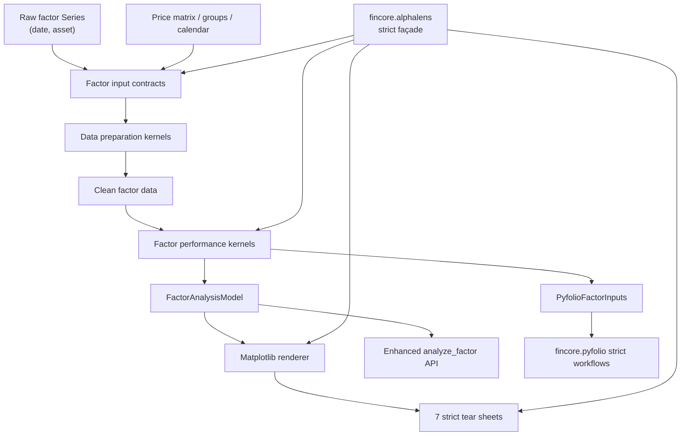

# Fincore Alphalens Integration Implementation Plan

> **For Codex:** REQUIRED SUB-SKILL: Use superpowers:executing-plans to implement this plan task-by-task.

**Goal:** 将本地 Alphalens 因子研究能力以可追溯、可兼容、可测试、可独立安装的方式集成进 fincore；将 pinned 上游测试场景逐例重写为 fincore 的强断言兼容测试并可追溯验收，同时复用已经验证过的 Empyrical/Pyfolio 收敛架构和发布门禁。

**Architecture:** 对外提供轻量的 `fincore.alphalens` 兼容 package，保留 `performance`、`utils`、`plotting`、`tears` 四个模块路径；内部新增独立的 `fincore.factor_analysis` 领域包，将数据准备、计算模型和 Matplotlib 渲染分层。严格兼容入口与 fincore 增强入口共享内核，但使用不同的校验 profile、异常投影和副作用策略；Alphalens 生成的组合输入直接进入现有 `fincore.pyfolio` 工作流，不再依赖外部 empyrical、pyfolio 或 sibling checkout。

**Tech Stack:** Python 3.11+、NumPy、pandas、SciPy、statsmodels（factor extra）、Matplotlib/Seaborn/IPython（alphalens extra）、pytest/pytest-xdist/pytest-cov、mypy、ruff、setuptools/PEP 517、MkDocs。

---

## 0. 文档状态与审计边界

- 状态：`Proposed`
- 审计日期：2026-08-13
- fincore 基线：`5f1929f7f8f82f0bbbe59124116b7a7f8855bf9f`，`master`，审计时工作树干净
- Alphalens 对照：`/Users/yunjinqi/Documents/new_projects/alphalens`，commit `3fa17ad4c3edb025d1410de7aeba9673cba7791c`，审计时工作树干净
- Empyrical 对照：commit `74655e974ed2935563820c548c339731f1fe0621`，冻结版本 `0.6.0`
- Pyfolio 对照：commit `724bbd7dbed9a88bb47e1057f2ca29b3409d8e7a`，冻结版本 `0.9.6`
- 本计划只交付设计、任务拆分和验收协议，不修改业务代码、不发布版本、不创建 tag。
- 实施必须在专用 worktree/分支进行；每个开发者只 stage 自己拥有的路径，禁止把其他人的工作树变更带入提交。

### 0.1 默认决策

以下决策用于让开发者立即开工；如产品负责人要改变，必须在 Task 1 合并前修改本计划和 manifest profile：

1. 兼容入口是 `fincore.alphalens`，并保留：
   - `fincore.alphalens.performance`
   - `fincore.alphalens.utils`
   - `fincore.alphalens.plotting`
   - `fincore.alphalens.tears`
2. 不提供顶层 `import alphalens` 替代包。这样不会与 standalone Alphalens 同名安装冲突。
3. 不新增数千行 `Alphalens` OO 大类。首版增强入口是 `fincore.factor_analysis.analyze_factor()`；如以后需要 `FactorAnalysisContext`，只能作为同一内核上的便利层。
4. 不把 `factor_returns`、`positions`、`cumulative_returns` 等冲突名称平铺到 fincore 根命名空间。
5. 本地 Alphalens 的 pinned commit 是唯一身份。其版本信息不可信：
   - `_version.py` 在当前 checkout 报告 `0.4.0`；
   - `setup.py` fallback 是 `1.0.0+dev`；
   - 仓库没有可用于当前 HEAD 的 tag；
   - `_version.py` 还记录不在本仓对象库中的旧 revision `77084f1...`。
6. 兼容 profile 名称固定为 `cloudquant-local-3fa17ad`，fixture 文件名使用 `alphalens-0.4.0-cloudquant-*`，但所有验收以完整 commit 和 blob SHA256 为准。
7. 首版只实现本地快照已有的 Matplotlib tear sheets；HTML、PDF、Plotly、Bokeh、多因子组合研究和数据供应商接入是非目标。
8. 严格 tear-sheet façade 保留 legacy 的 `plt.show()`/`None` 返回行为；增强 API 默认 `show=False` 并返回结构化模型或 Figure。两条路径都不得修改全局 Matplotlib backend、写包目录或写 site-packages。
9. `/Users/yunjinqi/Documents/new_projects/alphalens/tests/` 的三个 pinned 测试文件是**测试迁移输入**，不是 CI 的运行时依赖：每个 active 参数化 case 和每个已注释 tear-sheet variant 必须有稳定 source case ID、来源 SHA256、迁移目标和断言等级。迁移是重写为 fincore namespace、native `pytest.parametrize`、强断言的测试合同；禁止在 CI 直接 import/run sibling tests，也禁止原样复制已失效的 `.equals()` 或 smoke-only 断言。

### 0.2 术语边界

| 术语 | 本计划定义 | 不得混用的现有概念 |
| --- | --- | --- |
| factor signal | 以 `(date, asset)` 为 MultiIndex 的横截面信号 Series | `factor_returns` 时间序列 |
| price matrix | DatetimeIndex × asset 的宽表价格 | Pyfolio positions |
| clean factor data | 包含 `factor`、forward-return、`factor_quantile`、可选 `group` 的 MultiIndex DataFrame | `fincore.attribution` 的 factor loadings |
| factor analysis | IC、分位数组合收益、换手、rank autocorrelation、event study | 持仓绩效归因 |
| strict profile | 模拟 pinned Alphalens 的签名、结构、数值和 legacy 副作用 | fincore 增强校验 |
| enhanced profile | 严格 schema、结构化结果、无隐式显示 | 不承诺 drop-in 行为 |

### 0.3 Global Constraints（所有 Task 隐式继承，冲突时以此为准）

以下约束适用于每个 Task，任何实现若违反即为审查失败：

- **命令环境**：所有命令使用 `/Users/yunjinqi/opt/anaconda3/bin/conda run -n base python -m ...`；禁止裸 `python`、`python3`、`pytest`。
- **profile 分离**：strict façade 与 enhanced 内核的校验、异常、NaN/empty/timezone/alignment/max_loss 语义严格分离（§3.2）；增强校验不得改写 strict 的 frozen oracle 行为。
- **Import budget**（§5.2）：`import fincore`、`from fincore import *`、`import fincore.alphalens` 不得加载 statsmodels/Matplotlib/Seaborn/IPython；optional imports 只在调用边界发生；缺依赖抛 `DependencyError` 且消息含正确的 `pip install fincore[...]`。
- **无 backend 副作用**：任何 fincore 模块不得调用 `matplotlib.use()`。
- **无写入**：任何运行路径不得写 package 目录、源码树或 site-packages；测试生成物只进 `build/` 或 `tmp_path`。
- **依赖边界**：不新增 external `empyrical`/`pyfolio`/`alphalens`/Git URL runtime 依赖；不把 sibling checkout 路径打进 wheel 或 CI 必需输入。
- **测试纪律**：禁止裸 `.equals()`（用 `pd.testing.assert_*`）；禁止只断言"未抛异常"；禁止通过修改 expected 直到绿色；禁止削弱现有 `tests/compat`（empyrical/pyfolio）断言——现有 647 passed 基线必须无回归。
- **质量门禁保持**：全包 `mypy fincore --ignore-missing-imports` 0 错误、ruff check/format（含 CI 的 ruff 0.16+ 与 mypy 2.3+ 严格性）、bandit、`mkdocs build --strict` 必须全绿；`py.typed` 保持真实。
- **打包**：pyproject 是唯一 metadata 源；无 `fincore[...]` 自引用；`all` 是全部 functional extras 的规范化显式并集。
- **分支纪律**：实现仅在专用 worktree/分支；每个开发者只 stage 自己 Track 拥有的路径；禁止 revert 他人提交；本计划不发布版本、不打 tag。

---

## 1. 结论先行与方案选择

### 1.1 推荐方案：兼容 façade + 独立因子域 + 模型/渲染分层

这是本计划采用的方案：

```text
fincore.alphalens.* strict façade
        |
        | legacy signature + adapter + exception/result projection
        v
fincore.factor_analysis contracts and kernels
        |
        +--> FactorAnalysisModel --> Matplotlib renderer --> strict/enhanced tear sheets
        |
        +--> PyfolioFactorInputs --> fincore.pyfolio workflows
```

选择原因：

- 延续 fincore 已经验证的 Empyrical/Pyfolio 模式：冻结来源、strict/enhanced 分层、C0–C4、fresh-wheel 验收。
- 不复制 external empyrical Git 依赖；Alphalens 唯一的 `ep.cum_returns` 调用改接 fincore 内部兼容内核。
- 不把 4,000 多行源码再次压成一个 OO 文件。
- 能保留用户熟悉的模块路径，又让 fincore 的增强 API 获得明确的数据契约和无副作用结果。
- 计算一次即可被多个 tear sheet/renderer 消费，避免原实现重复计算。

### 1.2 备选方案与取舍

| 方案 | 优点 | 缺点 | 决策 |
| --- | --- | --- | --- |
| A. 原样复制 4 个模块到 fincore | 最快看到函数名 | 带入 eager optional imports、旧 pandas 行为、Versioneer、隐式 show、外部 empyrical；架构和测试债务最大 | 拒绝 |
| B. façade + factor domain + model/renderer | 兼容、增强、依赖和发布边界清晰；可分工 | 初期需要 manifest、adapter 和双层测试 | 采用 |
| C. fincore 运行时依赖 sibling/PyPI/Git Alphalens | fincore 改动少 | 当前环境无法收集测试；Git 依赖不可复现；不能保证 wheel 独立；无法统一 Pyfolio/report | 拒绝 |

### 1.3 明确非目标

- 不迁移 `versioneer.py`、`_version.py`、旧 Python classifier、notebook、大图片和 virtual-document 产物。
- 不把 sibling checkout 作为运行时依赖或 CI 必需输入。
- 不在默认 CI 访问 GitHub/Gitee 或安装浮动 Git URL。
- 不修复 standalone Alphalens 仓库；其测试源码不作为 fincore 的运行时/CI 依赖。Task 1.5 必须把其所有可识别 case 记录到 pinned inventory，并在 fincore 中逐例重写为有强断言的目标测试或 C4 workflow variant。
- 不声明“完全兼容”“Production Ready”或版本升级，除非本计划全部 release gates 有证据。
- 不把行覆盖率或“没有抛异常”当成因子数值、图表和跨层工作流证明。
- 不扩展现有 `fincore.attribution` 的语义来容纳横截面因子信号。

## 2. 已核验的当前事实

### 2.1 Alphalens 源码能力矩阵

| 模块 | 规模 | 静态 public definitions | 主要能力 | 重依赖 |
| --- | ---: | ---: | --- | --- |
| `performance.py` | 1,341 行 | 16 个函数 | IC、权重、分位数收益、alpha/beta、turnover、event、Pyfolio 输入 | empyrical、statsmodels |
| `utils.py` | 1,041 行 | 17 个函数 + 2 个异常类 | forward returns、分箱、清洗、calendar、loss guard、display | IPython |
| `plotting.py` | 957 行 | 21 个函数 | 统计表、IC/收益/turnover/event 图 | Matplotlib、Seaborn、statsmodels |
| `tears.py` | 740 行 | 7 个函数 + `GridFigure` | summary/returns/information/turnover/full/event tear sheets | Matplotlib |
| 合计 | 4,079 行 | 61 个函数 + 3 个类 = 64 | 完整本地兼容 profile | — |

`__init__.py` 的公开入口只有四个模块，因此本计划冻结“这四个模块中由本仓定义、名称不以下划线开头的 64 个对象”，不把 `pd`、`np`、`stats` 等 imported names 误算为兼容 API。

### 2.2 实测测试基线

所有 Python 命令均使用用户指定的 Anaconda base 环境。

当前环境：

| 组件 | 版本 |
| --- | --- |
| Python | 3.11.8 |
| NumPy | 1.26.4 |
| pandas | 3.0.3 |
| SciPy | 1.17.1 |
| Matplotlib | 3.10.9 |
| Seaborn | 0.13.2 |
| statsmodels | 0.14.6 |
| installed empyrical | 0.5.6 |
| pandas-datareader | 0.10.0 |

直接运行 sibling tests：

```bash
/Users/yunjinqi/opt/anaconda3/bin/conda run -n base python -m pytest \
  -o addopts='' tests -q --tb=short --maxfail=0
```

结果：3 个 test module 全部 collection error。根因链为：

```text
alphalens.performance eager import empyrical
  -> installed empyrical eager import pandas_datareader
  -> pandas-datareader 0.10.0 调用 pandas 3 已变化的 deprecate_kwarg
  -> TypeError during collection
```

在不改源码的诊断运行中，将 `empyrical` 临时指向 `fincore.empyrical` 后：

- 116 个测试被执行；
- 102 passed；
- 14 failed；
- 其中 8 个 `factor_weights` case 和 6 个 clean-factor case 受 pandas 3 的 `stack`/缺失值语义及旧期望构造影响；
- `tests/test_tears.py` 的整个测试类被注释，7 个 tear-sheet workflow 实际收集数为 0；
- standalone tests 还存在 12 处只调用 `.equals()` 却没有 `assert` 的无效断言。

因此“102 passed”只能证明部分 fixture 路径可运行，不能当作 compatibility 或 tear-sheet 证据。

fincore 当前兼容门禁复验：

```bash
/Users/yunjinqi/opt/anaconda3/bin/conda run -n base python -m pytest \
  -o addopts='' tests/compat -q --tb=short --maxfail=0
```

结果：`647 passed, 1 skipped, 4 warnings`。这证明 manifest、strict façade、C0–C4 和 wheel-oriented 的既有模式可以复用。

### 2.3 上游测试迁移盘点（必须逐例处置）

本计划**不是**把 sibling 的测试目录原样复制到 fincore：当前 upstream suite 在现代 pandas 环境不能稳定收集，且存在无效断言和整类注释。它也不能被静默替换成少量新 smoke test。Task 1.5 要从 pinned Git blob 静态提取 source case，而不是 import upstream package；所有 source case 都必须在 checked-in migration map 中有唯一去向。

| pinned 测试源 | Git blob | SHA256 | source case | 当前质量 / collection 状态 | fincore 迁移落点 |
| --- | --- | --- | ---: | --- | --- |
| `tests/test_utils.py` | `22480c305a07b8ccd83e15ed7b6d1b06be08307e` | `0f476933684b1eae8f86c3ce9dcf3806b840cc69a1005e19f43a52d4bdf31334` | 36（10 个方法） | 36 个有 `assert_frame_equal`/`assert_series_equal` | Task 3 的 `test_forward_returns.py`、`test_factor_cleaning.py`，C2/C3 强断言 |
| `tests/test_performance.py` | `5f38d92b936f3b7f0afb0b4d63a84edd347766a1` | `278ecc858a228e686edd6e8aa4ef30d42fe7258a9af5da14263de61607474917` | 81（12 个参数化方法） | 12 个静态 `assert_*` 被注释并以裸 `.equals()` 替代，覆盖到 81 个 parameter row；诊断运行只收集 80 个，另 1 个被 parameterized 生成名称冲突遮蔽 | Task 4 的 `test_performance.py` 和 enhanced analytics tests；每个 case 重写为 C2/C3 数值或 invariant 断言 |
| `tests/test_tears.py` | `8c1b74705e89ae3fe090049120c06d34fe7f13fd` | `227d23e8eebb3585b29f5f953e67f817517d802148f3e72c0cf8b27087853b86` | 24 个 decorator row，展开为 96 个内部 workflow invocation variant | 整个 `TearsTestCase` 被注释，收集数 0，恢复后也只是“未抛异常” smoke | Task 8 的 `test_tearsheets_e2e.py` / `test_tears.py`，重建为 C4 结构、show/close 和资源所有权断言 |

固定 inventory 数为 **117 个 active declared case**（36 utils + 81 performance）、**116 个在已记录的诊断性兼容注入运行中可 collection 的 case**（一个 parameterized name collision）、**24 个 dormant tear decorator row** 和其展开的 **96 个 workflow invocation variant**。其中 `source_collection_state`、`assertion_quality` 与 migration disposition 是三个不同事实：被原仓遮蔽或注释不等于可以在 fincore 中漏迁；每个 source row 及其所有内部 invocation 都必须映射到可收集的 fincore 参数化 case。

迁移规则：

- case ID 固定为 `tests/<file>::<Class>::<method>#<zero-padded-ordinal>`；非参数方法 ordinal 为 `00`。生成工具必须从 commit `3fa17ad4c3edb025d1410de7aeba9673cba7791c` 的 blob 产生，不能读取未 pin 的 worktree；
- `test_utils.py` 的 36 个 case 必须保留输入/期望数据语义，但使用 factory + `.copy(deep=True)`，不继承 upstream class-level 可变 DataFrame；
- `test_performance.py` 的 81 个 case 必须恢复成 `pd.testing`/`numpy.testing` 或明确定义的数学 invariant；`equals()` 返回值、注释掉的 assert、只检查“不抛异常”均不是可接受迁移；
- `test_tears.py` 的 24 个 decorator row 及其 96 个内部 workflow invocation 必须由真实 strict C4 workflow 覆盖；不得把它们压缩成 7 个无参数 smoke test；
- migration map 不允许 `skip`、`xfail`、`smoke_only`、`raw_copy` 或无 target selector 的 accepted disposition。确有原仓 defect 时，记录 `source_collection_state=shadowed`/`commented_out`，但迁移 disposition 仍是强断言重写；
- 不添加 `parameterized` 作为 fincore 的依赖；使用 native `pytest.parametrize`，每个 `pytest.param(..., id=source_case_id)` 使 collection nodeid 可由 audit 脚本验证；
- 如复用任何原始测试的受版权保护表达、注释或 fixture 文本，先保留 Apache-2.0/Quantopian attribution 并纳入 Task 1 的人工 license review；默认采用行为等价的重写，而非大段复制。

### 2.4 来源与许可证风险

- sibling 根 `LICENSE` 是 MIT text；
- `performance.py`、`utils.py`、`plotting.py`、`tears.py` 保留 Quantopian Apache-2.0 文件头；
- Git 历史明确出现 `ff4d582 从官网copy相关的代码`；
- fincore 本身使用 Apache-2.0；
- 以上事实与现有 Pyfolio provenance 风险相似，但本计划不作法律结论。

发布前必须由人工决定：

1. 哪些文件属于复制/修改，哪些是重新实现；
2. 每个目标文件需保留何种 copyright/SPDX/header；
3. 是否需要 `THIRD_PARTY_NOTICES.md`；
4. 根 MIT text 与文件级 Apache-2.0 notice 如何处理。

许可证人工审核是 release blocker，不阻断以 clean-room/behavior-first 方式编写测试和内核。

## 3. 目标架构



### 3.1 包布局

```text
fincore/
  alphalens/                    # strict compatibility package
    __init__.py
    _compat.py
    performance.py
    plotting.py
    tears.py
    utils.py
  factor_analysis/              # canonical enhanced domain
    __init__.py
    analysis.py
    calendar.py
    data.py
    exceptions.py
    models.py
    performance.py
    portfolio.py
    render_matplotlib.py
    tears.py
  contracts/
    factor_analysis.py
    factor_workflows.py
```

### 3.2 调用 profile

| Profile | 入口 | 校验与行为 |
| --- | --- | --- |
| `legacy_alphalens_cloudquant_0_4_0` | `fincore.alphalens.*` | 精确签名；保留 legacy shape/index/warnings/exceptions；tear sheets 显示并返回 `None` |
| `enhanced_factor_analysis` | `fincore.factor_analysis.*` | 明确 schema；结构化异常；不隐式显示；返回 model/Figure；安全默认值 |
| `pyfolio_bridge` | `create_pyfolio_input` 和 enhanced portfolio adapter | 返回可被现有 fincore Pyfolio contract 消费的 returns/positions/benchmark |

strict wrapper 必须同时遵守两层冻结协议：`inspect.signature()` 可见的 introspection signature，以及装饰器实际接受的 call grammar。普通 callable 先按 source-visible signature 绑定；`@customize` 隐藏接受的 `set_context` 必须先由 decorator adapter 提取再绑定；`quantize_factor` 因 legacy decorator 未使用 `functools.wraps`，其 `(*args, **kwargs)` introspection signature 与底层 source signature 必须分别冻结。增强验证不得偷偷改变 strict 的 NaN、empty、timezone、alignment、`max_loss` 或异常行为。

### 3.3 目标数据契约

`FactorSignal`：

- pandas Series；
- 两级 MultiIndex，规范名称为 `date`、`asset`；
- date level 为统一 timezone 的 DatetimeIndex；
- `(date, asset)` 唯一；
- legacy profile 可接收 NaN 并在 cleaning 阶段计算 loss；
- enhanced profile 明确重复项、未排序索引和非数值值的处理策略。

`PriceMatrix`：

- pandas DataFrame；
- DatetimeIndex；
- asset columns 唯一；
- factor 资产可少于 price columns，但缺失 factor asset 必须可诊断；
- factor/prices timezone 不匹配在 strict profile 投影为 `NonMatchingTimezoneError`。

`CleanFactorData`：

- 两级 MultiIndex `(date, asset)`；
- 必含 `factor`、至少一个 forward-period 列、`factor_quantile`；
- `group` 可选；
- forward-period labels 使用 pinned profile 的 Timedelta 字符串；
- index/columns 顺序、dtype、category 顺序进入 C2 门禁。

`FactorLossReport`：

- `initial_count`；
- `forward_returns_loss`；
- `binning_loss`；
- `total_loss`；
- `max_loss`；
- strict wrapper 生成与 legacy 等价的消息/异常；
- enhanced API 返回结构化报告，不依赖解析 stdout。

`FactorAnalysisModel`：

- 保存输入快照和 forward periods；
- 保存不可变 `FactorAnalysisConfig`，以及 quantile statistics、factor weights/returns/cumulative returns/positions、mean returns/std errors、alpha/beta、IC、turnover、rank autocorrelation、按 group/time 的派生结果、可选 event/Pyfolio bridge 结果；
- 输入在计算时 deep-copy，调用方后续原地修改不能使 model 静默变化；
- config 和结果共同生成确定性 fingerprint；model 不维护可变 cache；
- renderer 只消费 model，不调用任何 performance/data kernel 重复计算统计。

## 4. 兼容范围与验收等级

### 4.1 Profile 数量

| 域 | 函数 | 类 | 验收目标 |
| --- | ---: | ---: | --- |
| utils | 17 | 2 | C0–C3 |
| performance | 16 | 0 | C0–C3 |
| plotting | 21 | 0 | C0–C2 + 图形语义 |
| tears | 7 | 1 | C0–C2 + C4 |
| 总计 | 61 | 3 | 64/64 C0；适用项 100% C1 |

### 4.2 等级定义

- C0：`fincore.alphalens.<module>.<name>` 可解析，且对象类型正确。
- C1：分别兼容 introspection signature 与 accepted-call grammar；覆盖参数名、顺序、kind、默认值、隐藏 decorator kwargs、有效调用和参数绑定错误；类只检查适用的 constructor/method。
- C2：输入不变性、返回类型、shape、index、columns、dtype、warnings 和异常契约兼容。
- C3：固定 case 的数值、NaN、group neutral、calendar、quantile/bin、event-window 语义在容差内兼容。
- C4：7 个 tear sheets 运行真实 compute → model → plot → sheet 链；`create_pyfolio_input` 能进入 fincore Pyfolio 真实 workflow。
- R：fresh wheel 的 core、factor-analysis、alphalens、alphalens+pyfolio、all profiles 全绿。

manifest 只冻结目标，不能把 manifest 中的 `C*=not-verified` 改成“通过”来代替测试。每一级必须链接到真实测试或 CI artifact。

### 4.3 数值容差

- 整数、标签、shape、index/columns：精确相等；
- 正常 float：`rtol=1e-10, atol=1e-12`；
- 回归/分布统计在跨 BLAS 平台：`rtol=1e-8, atol=1e-10`；
- NaN/Inf mask：精确相等；
- 图形：比较 axes 数量、标题、label、artist 类型和 plotted data；禁止以整图像素 golden 作为唯一证据。

## 5. 依赖与发布策略

### 5.1 Runtime extras

建议新增两个功能 extra：

```toml
factor-analysis = ["statsmodels>=0.14"]
alphalens = [
  "statsmodels>=0.14",
  "matplotlib>=3.3",
  "seaborn>=0.11",
  "ipython>=7",
]
```

- `factor-analysis` 保证完整计算面（包括 alpha/beta regression）。
- `alphalens` 保证 strict plotting/tear-sheet 面。
- 不增加 external `empyrical`、`pyfolio`、`alphalens` 或任何 Git URL。
- `all` 必须是全部 functional extras 的规范化显式并集。
- 现有 `viz` compatibility alias 不自动扩张；用户要 Alphalens 时显式安装 `fincore[alphalens]`。
- runtime metadata 使用经矩阵验证的版本范围；oracle requirements 使用精确版本/约束。两者不得混为一份文件。

### 5.2 Import budget

- `import fincore`、`from fincore import *`：不得导入 statsmodels/Matplotlib/Seaborn/IPython。
- `import fincore.alphalens`：不得导入 statsmodels/Matplotlib/Seaborn/IPython。
- `import fincore.alphalens.performance` 和 `utils`：不得导入 Matplotlib/Seaborn/IPython。
- 只有调用 regression、plot 或 tear sheet 时才加载对应 optional dependency。
- 缺依赖必须抛 `DependencyError`，消息包含 `pip install fincore[factor-analysis]` 或 `pip install fincore[alphalens]`。
- 任何模块不得调用 `matplotlib.use()`。

## 6. 迭代总览、依赖和工作量

| Iteration | Tasks | 目标 | 基础工作量 | 退出条件 |
| --- | --- | --- | ---: | --- |
| I0 | 1、1.5、2 | snapshot、upstream-test migration map、manifest、兼容 package、schema 骨架 | 6–9 人日 | 64/64 C0，适用项 C1；141/141 source row、96/96 tear invocation 有去向；import 无重依赖 |
| I1 | 3 | factor data/calendar | 6–8 人日 | cleaning/forward returns C2–C3 |
| I2 | 4–5 | performance + Pyfolio bridge | 8–11 人日 | 33 个 compute/utils surface 达到目标；Pyfolio bridge C4 |
| I3 | 6–8 | model、renderer、7 tear sheets | 10–13 人日 | 7/7 真实 tear-sheet 链全绿 |
| I4 | 9 | extras、wheel、CI | 4–5 人日 | R profiles 全绿 |
| I5 | 10–11 | docs、examples、性能/资源门禁 | 5–7 人日 | 文档可执行；benchmark 有 provenance |
| I6 | 12 | 全量验收和证据 | 2–3 人日 | 所有 release blockers 有证据或明确 pending |

基础总量约 41–56 人日；预留 20% 给 pandas/SciPy 跨版本、图形平台、上游 case 重写和集成返工，总开发计划约 49–67 人日。4 人团队在依赖切片合理时预计 3–4 周日历时间。法律/许可证人工审核不计入上述开发工期，但未关闭会延后可发布日期。

### 6.1 并行波次

```text
Wave 0: Task 1 -> Task 1.5 -> Task 2
Wave 1: Task 3 || Task 4 的 pre-cleaned-data cases || Task 9 的 packaging RED tests
Wave 2: Task 5 || Task 6 || Task 7
Wave 3: Task 8 || Task 10 || Task 11
Wave 4: Task 12 (controller-owned)
```

Task 4 可以先用 frozen pre-cleaned factor_data fixture 开发，但最终合并必须在 Task 3 contracts 之后。Task 7 可以先针对 model fixture 开发，但最终合并必须在 Task 6 之后。

### 6.2 文件所有权

| Track | 独占路径 | 允许共享的协调文件 |
| --- | --- | --- |
| A Compatibility | `scripts/generate_compat_manifest.py`、`scripts/generate_alphalens_upstream_test_inventory.py`、`scripts/check_alphalens_upstream_test_migration.py`、`tests/compat/fixtures/alphalens-*`、`tests/compat/test_alphalens_upstream_test_migration.py`、`tests/compat/alphalens/test_public_api.py`、`test_signatures.py`、`fincore/alphalens/` | `docs/upstream-provenance.md`、`tests/conftest.py` |
| B Data | `fincore/factor_analysis/{calendar,data,exceptions}.py`、data/forward tests | `fincore/contracts/factor_analysis.py` 由 Track A 先建，后续变更需协调 |
| C Analytics | `fincore/factor_analysis/{performance,portfolio}.py`、performance/bridge tests | 不修改 façade signatures |
| D Viz | `fincore/factor_analysis/{models,analysis,render_matplotlib,tears}.py`、plot/tear tests | 不修改 Pyfolio tearsheets |
| E Release | `pyproject.toml`、requirements、packaging tests、wheel script、CI、public docs | 最后统一更新 `CHANGELOG.md` 和 release checklist |

所有 worker 都不是独占仓库的唯一开发者：先拉取/查看其他人的变更，禁止 revert 他人提交，冲突时适配已经合并的 contract。

## 7. 详细实施任务

所有命令均在 `/Users/yunjinqi/Documents/new_projects/fincore` 执行。禁止使用裸 `python`、`python3` 或 `pytest`。

### Task 1: 冻结 Alphalens snapshot、API profile、语义 case 和 provenance

**Dependencies:** 无

**Owner:** Track A

**Estimate:** 2–3 人日

**Files:**

- Modify: `scripts/generate_compat_manifest.py`
- Modify: `tests/compat/test_manifest_integrity.py`
- Create: `tests/compat/fixtures/alphalens-0.4.0-cloudquant-api.json`
- Create: `tests/compat/fixtures/alphalens-0.4.0-cloudquant-cases.json`
- Create: `tests/compat/oracle/alphalens-0.4.0-cloudquant-environment.json`
- Create: `tests/compat/oracle/alphalens-0.4.0-cloudquant-conda-explicit.txt`
- Create: `tests/compat/oracle/requirements-alphalens-0.4.0-cloudquant.txt`
- Create: `scripts/generate_alphalens_oracle.py`
- Create: `docs/compatibility/alphalens-0.4.0-cloudquant.md`
- Modify: `docs/upstream-provenance.md`

**Step 1: 先写 manifest RED tests**

至少包含：

```python
def test_alphalens_manifest_is_pinned_and_complete() -> None:
    data = _load("alphalens-0.4.0-cloudquant-api.json")
    assert data["profile"] == "cloudquant-local-3fa17ad"
    assert data["commit"] == "3fa17ad4c3edb025d1410de7aeba9673cba7791c"
    assert data["reported_versions"] == {
        "versioneer": "0.4.0",
        "setup_fallback": "1.0.0+dev",
    }
    assert data["counts"] == {"functions": 61, "classes": 3, "definitions": 64}
    assert set(data["modules"]) == {"performance", "plotting", "tears", "utils"}
    assert len({entry["path"] for entry in data["source_files"]}) == 5
    assert {entry["path"] for entry in data["evidence_files"]} == {
        "LICENSE",
        "README.md",
        "setup.py",
        "alphalens/_version.py",
    }
    _assert_portable_provenance(data)


def test_alphalens_generation_does_not_rewrite_existing_manifests(tmp_path) -> None:
    # Generate only Alphalens into a throwaway dir, then verify the
    # empyrical/pyfolio fixture bytes in the repo remain unchanged.
    pinned = {name: (FIXTURES / name).read_bytes() for name in _EXISTING_FIXTURES}
    subprocess.run(
        [
            sys.executable,
            str(ROOT / "scripts" / "generate_compat_manifest.py"),
            "--alphalens-root",
            str(ALPHALENS_ROOT),
            "--target",
            "alphalens",
            "--output",
            str(tmp_path),
        ],
        check=True,
    )
    assert {name: (FIXTURES / name).read_bytes() for name in _EXISTING_FIXTURES} == pinned
    assert (tmp_path / "alphalens-0.4.0-cloudquant-api.json").read_bytes()
    # Regenerating a second time must be byte-idempotent.
    first = (tmp_path / "alphalens-0.4.0-cloudquant-api.json").read_bytes()
    subprocess.run(
        [
            sys.executable,
            str(ROOT / "scripts" / "generate_compat_manifest.py"),
            "--alphalens-root",
            str(ALPHALENS_ROOT),
            "--target",
            "alphalens",
            "--output",
            str(tmp_path),
        ],
        check=True,
    )
    assert (tmp_path / "alphalens-0.4.0-cloudquant-api.json").read_bytes() == first
```

说明：`FIXTURES` 复用 `tests/compat/test_manifest_integrity.py` 的既有常量；`ROOT`、`ALPHALENS_ROOT`、`_EXISTING_FIXTURES`（现有 empyrical/pyfolio fixture 文件名列表）在同一模块顶部新增，保持与该文件既有 subprocess 生成测试（`test_full_generator_is_byte_idempotent_when_pinned_roots_are_available`）相同的结构。

测试还必须验证：

- 每个 entry 有 `module`、`symbol`、`kind`、`source_signature`、`introspection_signature`、`accepted_call_cases`、`source_line`、`source_sha256`、`C0..C4`；
- 64 个 `(module, symbol)` 唯一；
- 7 个 tear sheet 名称精确；
- `@customize` call cases 覆盖隐藏的 `set_context=True/False`；`quantize_factor` 同时记录 legacy `(*args, **kwargs)` introspection 和底层 source signature；
- 绝对路径、用户名和 sibling root 不进入 JSON；
- source bytes 来自 `git show <commit>:<path>`，不是 worktree；
- `source_files` 精确包含四个核心源文件和 `__init__.py`；`evidence_files` 精确包含 root LICENSE、README、`setup.py` 和 `_version.py`，两组都记录 blob SHA256；
- `reported_versions` 必须从已 pin 的 `setup.py`/`_version.py` blob 解析并链接对应 SHA，不得手写；
- old empyrical/pyfolio regeneration 保持 byte-identical；
- oracle `reviewed=true` 仅在 evidence key 未变化时保留。

**Step 2: 运行 RED**

```bash
/Users/yunjinqi/opt/anaconda3/bin/conda run -n base python -m pytest \
  -o addopts='' tests/compat/test_manifest_integrity.py \
  -q --tb=short --maxfail=0
```

Expected: FAIL，缺少 Alphalens fixture/generator target。

**Step 3: 扩展 generator，但保持旧 CLI 兼容**

新增独立 target：

```bash
/Users/yunjinqi/opt/anaconda3/bin/conda run -n base python \
  scripts/generate_compat_manifest.py \
  --alphalens-root /Users/yunjinqi/Documents/new_projects/alphalens \
  --target alphalens \
  --output tests/compat/fixtures
```

实现约束：

- `--target` 可重复；没有 Alphalens target 时不读取/不改 Alphalens fixture；
- 旧的 empyrical+pyfolio 命令和输出保持兼容；
- 不 import sibling package；
- 默认 subprocess/Git 非交互且有 30 秒 timeout；
- 只解析受限 AST，不 eval 任意代码；
- `stats.norm` 等动态默认值标记 `needs_dynamic_review=true`，不可伪造 canonical runtime value；
- local version ambiguity 原样登记，identity 仍是 commit。

**Step 4: 冻结可复现 oracle execution tuple**

先在一次性隔离环境中找到能加载 pinned checkout 的组合，然后提交两层锁：

- `alphalens-...-environment.json`：source commit、Python 完整版本、OS/arch、所有 distribution 版本与 build、locale/timezone、BLAS、serializer schema、conda explicit lock SHA256；
- `alphalens-...-conda-explicit.txt`：当前审阅平台的精确 package URL/build/hash，不允许 channel floating solve；
- `requirements-...txt`：pip-only 包使用 `--require-hashes`；
- `scripts/generate_alphalens_oracle.py`：拒绝 execution fingerprint 不匹配、dirty checkout、commit 不匹配或未锁依赖的运行。

生成命令固定为：

```bash
/Users/yunjinqi/opt/anaconda3/bin/conda run -n base python \
  scripts/generate_alphalens_oracle.py \
  --source /Users/yunjinqi/Documents/new_projects/alphalens \
  --commit 3fa17ad4c3edb025d1410de7aeba9673cba7791c \
  --environment tests/compat/oracle/alphalens-0.4.0-cloudquant-environment.json \
  --explicit-lock tests/compat/oracle/alphalens-0.4.0-cloudquant-conda-explicit.txt \
  --cases tests/compat/fixtures/alphalens-0.4.0-cloudquant-cases.json \
  --output build/alphalens-oracle-candidate.json
```

该 orchestrator 可启动由 explicit lock 创建的一次性 prefix，但不得修改 Anaconda base；只有 candidate 的 environment fingerprint、case schema、source SHA 和输出 digest 都通过 review，才允许把 golden result 合入 cases fixture。默认 CI 只验证已审阅 fixture 和 fingerprint，不重建 oracle 环境。

**Step 5: 生成并人工审阅 API/case fixtures**

`alphalens-...-cases.json` 只保存小型、可审阅、可 JSON 表达的 deterministic cases：

- daily、business-day、intraday、tz-aware；
- ties/NaN/zero-aware；
- group neutral；
- bins 与 quantiles；
- `max_loss` boundary；
- pre-cleaned performance inputs；
- event window；
- Pyfolio returns/positions/benchmark。

oracle 运行在隔离临时 checkout 和上述完整 execution tuple 中；仅有 requirements 文件不算可复现。所有 Series/DataFrame 必须用明确 serializer 保存 index names、timezone、columns、dtype、values 和 NaN mask。review 记录必须包含 reviewer、candidate digest、environment digest 和日期；任何一个 digest 变化都把 `reviewed` 重置为 `false`。

**Step 6: 登记许可证/来源，不下法律结论**

`docs/upstream-provenance.md` 添加 pinned blobs、observed notices、可能适配目标和 `human/license review pending`。迁移实现保留必要 header 的最终决定由人工做。

**Step 7: 运行 GREEN**

```bash
/Users/yunjinqi/opt/anaconda3/bin/conda run -n base python -m pytest \
  -o addopts='' tests/compat/test_manifest_integrity.py \
  -q --tb=short --maxfail=0
```

Expected: PASS，且 `git diff -- tests/compat/fixtures/empyrical-0.6.0-api.json tests/compat/fixtures/pyfolio-0.9.6-api.json` 为空。

**Step 8: Commit**

```bash
git add scripts/generate_compat_manifest.py \
  tests/compat/test_manifest_integrity.py \
  tests/compat/fixtures/alphalens-0.4.0-cloudquant-api.json \
  tests/compat/fixtures/alphalens-0.4.0-cloudquant-cases.json \
  tests/compat/oracle/alphalens-0.4.0-cloudquant-environment.json \
  tests/compat/oracle/alphalens-0.4.0-cloudquant-conda-explicit.txt \
  tests/compat/oracle/requirements-alphalens-0.4.0-cloudquant.txt \
  scripts/generate_alphalens_oracle.py \
  docs/compatibility/alphalens-0.4.0-cloudquant.md \
  docs/upstream-provenance.md
git commit -m "test: pin alphalens compatibility profile"
```

### Task 1.5: 逐例迁移 pinned upstream 测试场景并建立可审计映射

**Dependencies:** Task 1

**Owner:** Track A

**Estimate:** 2–3 人日

**Files:**

- Create: `scripts/generate_alphalens_upstream_test_inventory.py`
- Create: `scripts/check_alphalens_upstream_test_migration.py`
- Create: `tests/compat/fixtures/alphalens-0.4.0-cloudquant-upstream-test-inventory.json`
- Create: `tests/compat/fixtures/alphalens-0.4.0-cloudquant-upstream-test-migration.json`
- Create: `tests/compat/test_alphalens_upstream_test_migration.py`
- Modify: `tests/conftest.py`
- Modify: `docs/compatibility/alphalens-0.4.0-cloudquant.md`
- Modify: `docs/upstream-provenance.md`

**Step 1: 先写 upstream inventory/migration RED tests**

```python
def test_pinned_upstream_test_inventory_and_migration_map_are_complete() -> None:
    inventory = _load("alphalens-0.4.0-cloudquant-upstream-test-inventory.json")
    migration = _load("alphalens-0.4.0-cloudquant-upstream-test-migration.json")

    assert inventory["commit"] == "3fa17ad4c3edb025d1410de7aeba9673cba7791c"
    assert inventory["counts"] == {
        "active_declared_cases": 117,
        "diagnostic_collectible_cases": 116,
        "active_methods": 22,
        "dormant_tear_rows": 24,
        "dormant_tear_workflows": 7,
        "dormant_tear_invocations": 96,
    }
    assert inventory["source_files"] == {
        "tests/test_utils.py": {
            "git_blob": "22480c305a07b8ccd83e15ed7b6d1b06be08307e",
            "sha256": "0f476933684b1eae8f86c3ce9dcf3806b840cc69a1005e19f43a52d4bdf31334",
        },
        "tests/test_performance.py": {
            "git_blob": "5f38d92b936f3b7f0afb0b4d63a84edd347766a1",
            "sha256": "278ecc858a228e686edd6e8aa4ef30d42fe7258a9af5da14263de61607474917",
        },
        "tests/test_tears.py": {
            "git_blob": "8c1b74705e89ae3fe090049120c06d34fe7f13fd",
            "sha256": "227d23e8eebb3585b29f5f953e67f817517d802148f3e72c0cf8b27087853b86",
        },
    }

    source_ids = {case["source_case_id"] for case in inventory["cases"]}
    assert len(source_ids) == 141  # 117 active rows + 24 dormant rows
    assert set(migration["cases"]) == source_ids
    assert all(
        item["disposition"]
        in {"rewritten_strict", "rewritten_invariant", "rebuilt_c4"}
        for item in migration["cases"].values()
    )
    assert all(item["target_selectors"] and item["assertion_grade"]
               for item in migration["cases"].values())
    assert sum(len(case["invocation_ids"])
               for case in inventory["cases"]
               if case["source_path"] == "tests/test_tears.py") == 96
    invocation_ids = {
        invocation_id
        for case in inventory["cases"]
        for invocation_id in case.get("invocation_ids", [])
    }
    invocation_targets = {
        invocation_id: nodeid
        for item in migration["cases"].values()
        for invocation_id, nodeid in item.get("invocation_targets", {}).items()
    }
    assert set(invocation_targets) == invocation_ids
    assert len(set(invocation_targets.values())) == len(invocation_ids)


def test_no_accepted_upstream_case_is_silently_weakened_or_omitted() -> None:
    migration = _load("alphalens-0.4.0-cloudquant-upstream-test-migration.json")
    forbidden = {"skip", "xfail", "smoke_only", "raw_copy", "unmapped"}
    assert not {
        item["disposition"] for item in migration["cases"].values()
    } & forbidden
```

测试还必须验证：source case ID 唯一且稳定；每条 inventory 记录包含 source path、class/method、source line、parameter ordinal、`source_collection_state`、`assertion_quality`、来源 blob/SHA；map 中的 `target_selectors` 落在本计划 Task 3、4 或 8 的测试路径，且 assertion grade 分别为 C2/C3/C4。tear row 还必须含全部 `invocation_ids`；对应 map record 必须包含 `invocation_targets: {invocation_id: exact_pytest_nodeid}`，两个 ID 集合和实际 collect nodeid 三方全等，96 个 target nodeid 不可复用。不得把 source collection failure 解释为迁移豁免。

**Step 2: 运行 RED**

```bash
/Users/yunjinqi/opt/anaconda3/bin/conda run -n base python -m pytest \
  -o addopts='' tests/compat/test_alphalens_upstream_test_migration.py \
  -q --tb=short --maxfail=0
```

Expected: FAIL，inventory、migration map 与 audit scripts 尚不存在。

**Step 3: 从 pinned Git blobs 生成 inventory，不 import upstream package**

```bash
/Users/yunjinqi/opt/anaconda3/bin/conda run -n base python \
  scripts/generate_alphalens_upstream_test_inventory.py \
  --source /Users/yunjinqi/Documents/new_projects/alphalens \
  --commit 3fa17ad4c3edb025d1410de7aeba9673cba7791c \
  --output tests/compat/fixtures/alphalens-0.4.0-cloudquant-upstream-test-inventory.json
```

实现约束：

- 对 `tests/test_utils.py`、`tests/test_performance.py` 用 AST 读取 class methods 和 `parameterized.expand` 的 literal rows；每个普通方法也是一个 ordinal `00` case；
- 对完全注释的 `tests/test_tears.py::TearsTestCase`，只在受限的、去掉该 block 注释前缀的临时文本上做 AST 解析；绝不 `exec`、`import` 或运行该源码；
- 检测并记录一个 `shadowed_by_generated_method_name` performance row，而不是只相信 pytest collection 数；所有 24 个 commented tear variant 标记为 `commented_out`；
- `assertion_quality` 至少区分 `pandas_assertion`、`discarded_equals`、`smoke_only`；source file bytes 和 case inventory 均从 `git show <commit>:<path>` 获得；
- generator 必须 byte-idempotent，遇到 commit、blob 或预期 inventory count 不符即非零退出；不依赖 `parameterized`、Matplotlib、empyrical 或 network。

**Step 4: 写完整 migration map，并规定目标测试的 case-ID 协议**

map 采用人工审阅的 JSON，不让 generator 覆盖。每个 source case 一条记录，例如：

```json
{
  "tests/test_utils.py::UtilsTestCase::test_quantize_factor#00": {
    "disposition": "rewritten_strict",
    "target_selectors": [
      "tests/compat/alphalens/test_factor_cleaning.py::test_quantize_factor_upstream_case[tests/test_utils.py::UtilsTestCase::test_quantize_factor#00]"
    ],
    "assertion_grade": "C3",
    "source_collection_state": "active_declared"
  },
  "tests/test_tears.py::TearsTestCase::test_create_full_tear_sheet#00": {
    "disposition": "rebuilt_c4",
    "target_selectors": [
      "tests/compat/alphalens/test_tearsheets_e2e.py::test_full_tear_sheet_upstream_invocation"
    ],
    "invocation_targets": {
      "tests/test_tears.py::TearsTestCase::test_create_full_tear_sheet#00/input-00/call-00": "tests/compat/alphalens/test_tearsheets_e2e.py::test_full_tear_sheet_upstream_invocation[tests/test_tears.py::TearsTestCase::test_create_full_tear_sheet#00/input-00/call-00]"
    },
    "assertion_grade": "C4",
    "source_collection_state": "commented_out"
  }
}
```

完整映射必须满足：

| source group | 数量 | 固定目标 | 必需重写方式 |
| --- | ---: | --- | --- |
| utils forward returns / quantization / cleaning | 36 | `tests/compat/alphalens/test_forward_returns.py`、`test_factor_cleaning.py` | `pd.testing` 的 index/dtype/values/NaN mask C2/C3 断言 |
| performance IC / weights / returns / turnover / cumulative / events | 81 | `tests/compat/alphalens/test_performance.py` 与 `tests/test_factor_analysis/test_{information,weights_returns,turnover,events}.py` | 重建 upstream input/expected；用 `pd.testing`、`numpy.testing` 或明确 invariant，绝不丢弃 `.equals()` 返回值 |
| dormant tear workflow rows / internal invocations | 24 / 96 | `tests/compat/alphalens/test_tearsheets_e2e.py`、`tests/test_factor_analysis/test_tears.py` | 96 个真实 C4 workflow invocation、Figure/Axes、show/close、artifact ownership；不得只验证不抛异常 |

utils/performance 的每个迁入参数化项使用下面的模式；`id` 必须等于完整 source case ID，便于后续以 pytest collection nodeid 反查。tear tests 的 `id` 使用 `source_case_id + "/input-<n>/call-<n>"` 的完整 invocation ID，确保 24 行的所有 96 次原始内部调用都可单独审计。所有 source/invocation target 都同时带 `alphalens_upstream_case` marker，marker 的唯一参数必须等于该完整 ID：

```python
@pytest.mark.parametrize(
    "source_case_id, factor_data, expected",
    [
        pytest.param(
            "tests/test_utils.py::UtilsTestCase::test_quantize_factor#00",
            factor_data_factory(),
            expected,
            id="tests/test_utils.py::UtilsTestCase::test_quantize_factor#00",
            marks=pytest.mark.alphalens_upstream_case(
                "tests/test_utils.py::UtilsTestCase::test_quantize_factor#00"
            ),
        ),
    ],
)
def test_quantize_factor_upstream_case(
    source_case_id: str,
    factor_data: pd.DataFrame,
    expected: pd.Series,
) -> None:
    actual = legacy_utils.quantize_factor(factor_data, quantiles=4)
    pd.testing.assert_series_equal(actual, expected)
```

`tests/conftest.py` 必须在其既有 `pytest_configure` hook 中动态注册 `alphalens_upstream_case(case_id)`，使 `--strict-markers` 下可收集；并对带该 marker 的 item 执行以下不可绕过规则：collection 时遇到 `skip`、`skipif`、`xfail` marker 立即作为 usage error；运行期间无论 setup/call/teardown 产生 skip、xfail 或非 passed outcome，都将该 item 改报失败。conftest 新增 `--alphalens-upstream-result-json PATH` 选项，在**非 xdist** run 的 `pytest_sessionfinish` 把每个 marked item 的 `nodeid`、marker case ID、setup/call/teardown outcome 写到 `build/`；只允许 checker 用此结果证明每个 mapped target 真正 `passed`。

**Step 5: 实现 collection audit 工具并冻结交接边界**

`scripts/check_alphalens_upstream_test_migration.py` 接收 `--inventory`、`--migration`、`--nodeids`、`--results` 和 `--scope {utils,performance,tears,all}`。`--results` 只在对应 target tests 已实现并完成非-xdist实际运行时必填；Task 1.5 的 source/map 静态验证不传它。它必须：

- 验证 inventory 与 map 的 case-ID 集合一对一相等；
- 验证目标 selector 只指向 Task 3/4/8 的 fincore tests，且 assertion grade 与 source group 相容；
- 从 `pytest --collect-only -q` 输出读取 nodeid，确认 utils/performance 的每个 complete source case ID 和 tears 的每个 complete invocation ID 恰好出现一次；对 tears，同步校验 inventory invocation ID、map `invocation_targets` key、exact target nodeid 和 collect nodeid 三方全等；
- 对 target test AST 拒绝裸 `.equals()` 和没有 `assert`/`pd.testing`/`np.testing`/C4 artifact assertion 的目标函数；
- 拒绝 target tests 中 `import alphalens`、从 sibling 的绝对路径导入或把 source-side test module 当作 fixture；
- 读取 `--results` 的 result JSON，要求每个 mapped nodeid 的 setup/call/teardown 均为 passed；不把 collection error、xfailed item、runtime skip 或 source-side shadow 当成已迁移。

Task 1.5 只校验 source inventory 和完整映射；真实 target nodeid 验证分别在 Task 3、4、8 完成后运行，避免用假测试提前伪造通过。

**Step 6: 运行 GREEN**

```bash
/Users/yunjinqi/opt/anaconda3/bin/conda run -n base python -m pytest \
  -o addopts='' tests/compat/test_alphalens_upstream_test_migration.py \
  -q --tb=short --maxfail=0

/Users/yunjinqi/opt/anaconda3/bin/conda run -n base python \
  scripts/generate_alphalens_upstream_test_inventory.py \
  --source /Users/yunjinqi/Documents/new_projects/alphalens \
  --commit 3fa17ad4c3edb025d1410de7aeba9673cba7791c \
  --check tests/compat/fixtures/alphalens-0.4.0-cloudquant-upstream-test-inventory.json
```

Expected: PASS；inventory 117/116/24/96 数量和三个 source SHA 完全固定，且 migration map 覆盖 141/141 个 source row、96/96 个 tear invocation。

**Step 7: Commit**

```bash
git add scripts/generate_alphalens_upstream_test_inventory.py \
  scripts/check_alphalens_upstream_test_migration.py \
  tests/compat/fixtures/alphalens-0.4.0-cloudquant-upstream-test-inventory.json \
  tests/compat/fixtures/alphalens-0.4.0-cloudquant-upstream-test-migration.json \
  tests/compat/test_alphalens_upstream_test_migration.py \
  tests/conftest.py \
  docs/compatibility/alphalens-0.4.0-cloudquant.md \
  docs/upstream-provenance.md
git commit -m "test: map upstream alphalens cases"
```

### Task 2: 建立轻量 strict façade、factor contracts 和 C0/C1 门禁

**Dependencies:** Tasks 1 and 1.5

**Owner:** Track A

**Estimate:** 2–3 人日

**Files:**

- Create: `fincore/alphalens/__init__.py`
- Create: `fincore/alphalens/_compat.py`
- Create: `fincore/alphalens/performance.py`
- Create: `fincore/alphalens/plotting.py`
- Create: `fincore/alphalens/tears.py`
- Create: `fincore/alphalens/utils.py`
- Create: `fincore/contracts/factor_analysis.py`
- Create: `fincore/contracts/factor_workflows.py`
- Create: `fincore/factor_analysis/__init__.py`
- Modify: `fincore/contracts/__init__.py`
- Modify: `fincore/__init__.py`
- Create: `tests/compat/alphalens/__init__.py`
- Create: `tests/compat/alphalens/conftest.py`
- Create: `tests/compat/alphalens/test_public_api.py`
- Create: `tests/compat/alphalens/test_signatures.py`
- Create: `tests/compat/alphalens/test_import_side_effects.py`
- Create: `tests/test_factor_analysis/__init__.py`
- Create: `tests/test_factor_analysis/conftest.py`
- Modify: `tests/test_smoke_import.py`
- Modify: `tests/test_import_time.py`

**Step 1: 写 C0/C1 和 import RED tests**

```python
@pytest.mark.parametrize("entry", manifest_entries())
def test_frozen_definition_resolves(entry: dict[str, object]) -> None:
    module = importlib.import_module(f"fincore.alphalens.{entry['module']}")
    value = getattr(module, str(entry["symbol"]))
    assert callable(value)


@pytest.mark.parametrize("entry", callable_entries_with_signature())
def test_signature_matches_manifest(entry: dict[str, object]) -> None:
    module = importlib.import_module(f"fincore.alphalens.{entry['module']}")
    assert (
        str(inspect.signature(getattr(module, str(entry["symbol"]))))
        == entry["introspection_signature"]
    )


@pytest.mark.parametrize("case", accepted_and_rejected_call_cases())
def test_decorator_call_grammar_matches_manifest(case: CallCase) -> None:
    result = invoke_case(case)
    assert_call_outcome_matches(result, case.expected)
```

blocked-optional subprocess 必须断言：

```python
import fincore
import fincore.alphalens
import fincore.alphalens.performance
import fincore.alphalens.utils

for root in ("matplotlib", "seaborn", "IPython", "statsmodels"):
    assert root not in sys.modules
```

**Step 2: 运行 RED**

```bash
/Users/yunjinqi/opt/anaconda3/bin/conda run -n base python -m pytest \
  -o addopts='' \
  tests/compat/alphalens/test_public_api.py \
  tests/compat/alphalens/test_signatures.py \
  tests/compat/alphalens/test_import_side_effects.py \
  -q --tb=short --maxfail=0
```

Expected: FAIL，`fincore.alphalens` 尚不存在。

**Step 3: 定义 contract 和 explicit wrappers**

`FactorFunctionSpec`/`FactorWorkflowSpec` 至少记录：

```python
@dataclass(frozen=True)
class FactorFunctionSpec:
    module: str
    public_name: str
    introspection_signature: inspect.Signature
    source_signature: inspect.Signature
    implementation: str
    profile: Literal["legacy_alphalens_cloudquant_0_4_0", "enhanced_factor_analysis"]
    optional_extra: str | None = None
    adapter: str | None = None
    result_projection: str | None = None
```

`FactorWorkflowSpec`（tear-sheet 生命周期专用，供 Task 8 消费）至少记录：

```python
@dataclass(frozen=True)
class FactorWorkflowSpec:
    public_name: str
    introspection_signature: inspect.Signature
    source_signature: inspect.Signature
    model_ref: str
    renderer_ref: str
    optional_extra: str | None = None
    result_projection: Literal["legacy_none_show", "artifacts"] = "legacy_none_show"
    by_group_variants: tuple[str, ...] = ()
```

`by_group_variants` 冻结每个 tear sheet 在 `by_group=False/True` 分支下的 show/close 序列契约（Task 8 的 frozen call cases 从 manifest 派生，不在代码里写死）。

要求：

- façade 函数使用清晰的显式 Python signature，或由安全的 static spec 创建；普通入口按 `source_signature` 执行 `Signature.bind()`；
- `@customize` 入口先提取 manifest 允许的隐藏 `set_context`，再绑定 source-visible 参数；该 kwarg 不得被错误加入 introspection signature；
- `quantize_factor` 的 façade 保留 legacy `(*args, **kwargs)` introspection，同时用独立的 source signature 做实际绑定和错误投影；禁止用一个 signature 字段覆盖两种事实；
- 不能在 runtime 读取 `tests/compat/fixtures`；
- 不能把 sibling 绝对路径打进 wheel；
- `performance`、`utils`、`plotting`、`tears` 模块对象可从 `fincore.alphalens` 获取；
- `GridFigure` 和两个异常类 C0/C1 可解析；
- 未实现内核在 integration branch 上只允许抛带 symbol 的 `NotImplementedError`；进入 Task 12 前不得残留任何占位实现。

**Step 3.5: 冻结共享 fixture 契约**

Tasks 3–8 的测试都消费同一组合成数据；本 Task 在 `tests/compat/alphalens/conftest.py` 和 `tests/test_factor_analysis/conftest.py` 同时提供（用相同的 helper 模块或允许 conftest 互相 import，禁止复制两份构造逻辑）。fixture 名称、形状和 seed 冻结如下，后续 Task 的 RED 片段直接引用：

| fixture | 形状与约定 |
| --- | --- |
| `raw_factor` | `pd.Series`，MultiIndex `(date, asset)`（`date` 为 `pd.bdate_range("2024-01-02", periods=120)`，10 assets；seed `rng = np.random.default_rng(7)`；值 `rng.normal(0, 1, size)`，允许少量 NaN 供 cleaning case 使用——NaN case 用 fixture 的 `.copy()` 局部注入，不在基础 fixture 里） |
| `prices` | `pd.DataFrame`，同样的 `date` index × 12 asset columns（含 2 个 factor 未覆盖的 asset），初值 100，`rng.normal(0, 0.01, size).cumsum()` 加总；tz-naive |
| `tz_aware_prices` | `prices` 的 UTC 版本（`tz_localize("UTC")`），专用于 timezone case |
| `clean_factor_data` | 由 `prepare_factor_data(raw_factor, prices, periods=(1, 5))` 的真实输出缓存（session-scoped），columns 含 `1D`/`5D` forward 列；strict 与 enhanced 测试共用同一对象，保证两侧比较基准一致 |
| `groups` | `pd.Series`：10 assets 交替映射到 `{"sector_a", "sector_b"}` |

约束：

- 所有 fixture 可 JSON/series 往返且不依赖磁盘文件、网络或外部 sibling checkout；
- `clean_factor_data` 由 Task 3 实现后接入；Task 4 的 pre-cleaned 开发（Wave 1）可先用 Task 3 冻结的 frozen oracle case 数据构造等价对象，但最终合并必须切回真实 `prepare_factor_data` 输出；
- fixture 不得被测试原地修改；需要变体时先 `.copy()`。

**Step 4: 根包只做懒加载**

`fincore.__all__` 不加入 61 个函数，也不加入绘图对象。允许显式：

```python
from fincore import alphalens
from fincore.alphalens import performance, plotting, tears, utils
```

`from fincore import *` 在 core-only 环境仍成功。

**Step 5: 运行 GREEN 和既有 import regression**

```bash
/Users/yunjinqi/opt/anaconda3/bin/conda run -n base python -m pytest \
  -o addopts='' \
  tests/compat/alphalens/test_public_api.py \
  tests/compat/alphalens/test_signatures.py \
  tests/compat/alphalens/test_import_side_effects.py \
  tests/test_smoke_import.py tests/test_import_time.py \
  -q --tb=short --maxfail=0
```

Expected: 64/64 C0；所有可静态冻结 callable C1；无 optional eager import。

**Step 6: Commit**

```bash
git add fincore/alphalens fincore/factor_analysis/__init__.py \
  fincore/contracts/factor_analysis.py fincore/contracts/factor_workflows.py \
  fincore/contracts/__init__.py fincore/__init__.py \
  tests/compat/alphalens tests/test_smoke_import.py tests/test_import_time.py
git commit -m "feat: add alphalens facade and factor contracts"
```

### Task 3: 实现 factor data preparation、calendar 和 loss contracts

**Dependencies:** Tasks 1.5 and 2

**Owner:** Track B

**Estimate:** 6–8 人日

**Files:**

- Create: `fincore/factor_analysis/exceptions.py`
- Create: `fincore/factor_analysis/calendar.py`
- Create: `fincore/factor_analysis/data.py`
- Modify: `fincore/contracts/factor_analysis.py`
- Create: `tests/compat/alphalens/test_forward_returns.py`
- Create: `tests/compat/alphalens/test_factor_cleaning.py`
- Create: `tests/test_factor_analysis/test_contracts.py`
- Create: `tests/test_factor_analysis/test_calendar.py`
- Create: `tests/test_factor_analysis/test_data.py`

**Step 1: 写 forward-return RED tests**

至少覆盖：

- periods `(1, 5, 10)` 的 label、index、values；
- `cumulative_returns=True/False`；
- intraday `1h/3h`；
- business-day 和 custom calendar；
- factor date 超出 prices；
- factor/prices timezone 相同与不匹配；
- `filter_zscore`；
- 输入不被修改；
- pandas 3 下无依赖 `stack` 默认值的期望构造。

使用 `pd.testing.assert_series_equal` / `assert_frame_equal`，禁止裸 `.equals()`。

本 Task 同时消费 Task 1.5 map 中 **36/36** 个 `tests/test_utils.py` source case：每个迁入参数项的 `pytest.param(..., id=source_case_id)` 必须保留完整 ID。不得把 27 个 `quantize_factor` parameter rows 合并成只覆盖边界的少量新 case；可以用 factory 取代 upstream class-level mutable fixture，但每个原始输入/期望组合必须仍被独立收集。`tests/test_utils.py` 的 3 个 forward-return、27 个 quantize、6 个 clean-factor case 分别落到 `test_forward_returns.py` 和 `test_factor_cleaning.py`，并以 C2/C3 强断言替换原始数据构造中的 pandas 旧默认值依赖。

**Step 2: 写 cleaning/quantization RED tests**

```python
def test_max_loss_boundary_uses_structured_report_and_legacy_projection(
    raw_factor: pd.Series,
    prices: pd.DataFrame,
) -> None:
    from fincore.alphalens import utils as legacy_utils
    from fincore.factor_analysis.data import prepare_factor_data

    with pytest.raises(MaxLossExceededError, match=r"max_loss .* exceeded"):
        legacy_utils.get_clean_factor_and_forward_returns(
            raw_factor,
            prices,
            periods=(1, 5),
            max_loss=0,
        )

    result = prepare_factor_data(
        raw_factor,
        prices,
        periods=(1, 5),
        max_loss=1,
    )
    assert result.loss_report.total_loss >= 0
    assert result.data.index.names == ["date", "asset"]
```

还要覆盖 quantiles、custom quantile edges、bins、zero-aware、binning by group、group dict/Series、group labels、重复 index、缺失 asset、全 NaN、常量 factor、非唯一 bin edge。

**Step 3: 运行 RED**

```bash
/Users/yunjinqi/opt/anaconda3/bin/conda run -n base python -m pytest \
  -o addopts='' \
  tests/compat/alphalens/test_forward_returns.py \
  tests/compat/alphalens/test_factor_cleaning.py \
  tests/test_factor_analysis/test_contracts.py \
  tests/test_factor_analysis/test_calendar.py \
  tests/test_factor_analysis/test_data.py \
  -q --tb=short --maxfail=0
```

Expected: FAIL，内核不存在或 façade 仍是 placeholder。

**Step 4: 实现 calendar primitives**

`calendar.py` 提供：

- `infer_trading_calendar`；
- `add_custom_calendar_timedelta`；
- `diff_custom_calendar_timedeltas`；
- `timedelta_to_string`；
- `timedelta_strings_to_integers`；
- `get_forward_returns_columns`；
- `backshift_returns_series`。

明确处理 Day/BusinessDay/CustomBusinessDay，不依赖私有 pandas API；错误信息由 strict adapter 投影为 legacy 文本。

**Step 5: 实现 data pipeline**

增强内核形态：

```python
@dataclass(frozen=True)
class PreparedFactorData:
    data: pd.DataFrame
    loss_report: FactorLossReport
    calendar: DateOffset


def prepare_factor_data(
    factor: pd.Series,
    prices: pd.DataFrame,
    *,
    groupby: Mapping[Hashable, Hashable] | pd.Series | None = None,
    quantiles: int | Sequence[float] | None = 5,
    bins: int | Sequence[float] | None = None,
    periods: Sequence[int] = (1, 5, 10),
    max_loss: float = 0.35,
    **options: object,
) -> PreparedFactorData:
    ...
```

实现必须：

- 先 normalize/validate，再 compute forward returns，再 join/group/quantize，再算 loss；
- 记录 loss components，不从 stdout 反向解析；
- strict wrapper 保留 legacy stdout/warning/exception contract；
- enhanced kernel 不 print；
- 所有 public input copy-on-entry；
- 对 pandas `groupby` 显式指定 `observed`、`group_keys` 和排序策略；
- 不通过压制全部 warning 隐藏未来不兼容。

说明：增强内核签名**不**暴露 `profile` 参数（fincore 现有 `ValidationProfile = Literal["legacy_empyrical", "enhanced", "context"]` 只服务于 empyrical 表面，不复用到因子域）。strict/增强差异完全由 Task 2 的 façade adapter 在进入内核前投影：strict adapter 复现 pinned Alphalens 的 NaN/empty/max_loss/stdout/异常行为，enhanced 入口直接调用本内核。任何"内核里按 profile 分支"的实现都是架构违规，审查必须拒绝。

**Step 6: 运行 GREEN**

使用 Step 3 命令，Expected: PASS。再运行：

```bash
/Users/yunjinqi/opt/anaconda3/bin/conda run -n base python -m pytest \
  -o addopts='' tests/compat/empyrical tests/compat/pyfolio \
  -q --tb=short --maxfail=0
```

Expected: 既有兼容面无回归。

然后验证 utils source-case migration collection：

```bash
mkdir -p build
MPLBACKEND=Agg /Users/yunjinqi/opt/anaconda3/bin/conda run -n base \
  python -m pytest -o addopts='' \
  tests/compat/alphalens/test_forward_returns.py \
  tests/compat/alphalens/test_factor_cleaning.py \
  -q --tb=short --maxfail=0 \
  --alphalens-upstream-result-json build/alphalens-utils-upstream-results.json

MPLBACKEND=Agg /Users/yunjinqi/opt/anaconda3/bin/conda run -n base \
  python -m pytest -o addopts='' --collect-only -q \
  tests/compat/alphalens/test_forward_returns.py \
  tests/compat/alphalens/test_factor_cleaning.py \
  > build/alphalens-utils-upstream-nodeids.txt

/Users/yunjinqi/opt/anaconda3/bin/conda run -n base python \
  scripts/check_alphalens_upstream_test_migration.py \
  --inventory tests/compat/fixtures/alphalens-0.4.0-cloudquant-upstream-test-inventory.json \
  --migration tests/compat/fixtures/alphalens-0.4.0-cloudquant-upstream-test-migration.json \
  --nodeids build/alphalens-utils-upstream-nodeids.txt \
  --results build/alphalens-utils-upstream-results.json \
  --scope utils
```

Expected: PASS；36/36 utils source case IDs 恰好一次出现，且没有 `.equals()`/smoke-only target。

**Step 7: Commit**

```bash
git add fincore/factor_analysis/exceptions.py \
  fincore/factor_analysis/calendar.py fincore/factor_analysis/data.py \
  fincore/contracts/factor_analysis.py \
  tests/compat/alphalens/test_forward_returns.py \
  tests/compat/alphalens/test_factor_cleaning.py \
  tests/test_factor_analysis
git commit -m "feat: add factor data preparation"
```

### Task 4: 实现 IC、权重、收益、turnover 和 event analytics

**Dependencies:** Tasks 1.5 and 2；最终合并依赖 Task 3

**Owner:** Track C

**Estimate:** 5–7 人日

**Files:**

- Create: `fincore/factor_analysis/performance.py`
- Create: `tests/compat/alphalens/test_performance.py`
- Create: `tests/test_factor_analysis/test_information.py`
- Create: `tests/test_factor_analysis/test_weights_returns.py`
- Create: `tests/test_factor_analysis/test_turnover.py`
- Create: `tests/test_factor_analysis/test_events.py`

**Step 1: 写 pre-cleaned-data characterization RED tests**

覆盖 12 个函数：

1. `factor_information_coefficient`
2. `mean_information_coefficient`
3. `factor_weights`
4. `factor_returns`
5. `factor_alpha_beta`
6. `cumulative_returns`
7. `mean_return_by_quantile`
8. `compute_mean_returns_spread`
9. `quantile_turnover`
10. `factor_rank_autocorrelation`
11. `common_start_returns`
12. `average_cumulative_return_by_quantile`

每个函数至少有：

- normal deterministic case；
- empty/small/tie/NaN case；
- index/columns/dtype contract；
- input immutability；
- strict fixture comparison；
- enhanced invariant。

关键 invariants：

```python
weights = factor_weights(clean_data, demeaned=True)
gross = weights.abs().groupby(level="date").sum()
net = weights.groupby(level="date").sum()
pd.testing.assert_series_equal(gross, pd.Series(1.0, index=gross.index))
np.testing.assert_allclose(net, 0.0, atol=1e-12)

ic = factor_information_coefficient(clean_data)
assert ((ic >= -1) & (ic <= 1) | ic.isna()).all().all()
```

本 Task 同时消费 Task 1.5 map 中 **81/81** 个 `tests/test_performance.py` source case。每一个 upstream parameter row 都必须在 `tests/compat/alphalens/test_performance.py` 或对应 enhanced analytics test 中以完整 `source_case_id` 作为 `pytest.param(..., id=...)` 出现一次；原 upstream 实际 collection 漏掉的那个 generated-name collision row 也必须重建，不能因为原仓未收集而豁免。class-level `factor_data` 必须换成 per-case factory/deep copy，禁止测试之间原地污染。

**Step 2: 运行 RED**

```bash
/Users/yunjinqi/opt/anaconda3/bin/conda run -n base python -m pytest \
  -o addopts='' \
  tests/compat/alphalens/test_performance.py \
  tests/test_factor_analysis/test_information.py \
  tests/test_factor_analysis/test_weights_returns.py \
  tests/test_factor_analysis/test_turnover.py \
  tests/test_factor_analysis/test_events.py \
  -q --tb=short --maxfail=0
```

Expected: FAIL，analytics kernels 尚未实现。

**Step 3: 实现最小内核并复用 fincore**

复用规则：

- `cumulative_returns` 进入 `fincore.empyrical.cum_returns(..., starting_value=1)` 或其同一 strict kernel，不 import external empyrical；
- 已有 fincore kernel 只有在 C2/C3 行为相同且有测试时才复用；
- `factor_alpha_beta` 的 strict path 可 lazy import statsmodels；缺依赖投影为 `DependencyError`；
- strict 与 enhanced 的 group/NaN/alignment policy 显式分开；
- 避免 Python per-row 循环，除非 calendar/event 语义无法向量化且 benchmark 证明可接受。

**Step 4: 修复旧测试中的伪断言，不复制坏 fixture**

- 81 个 performance source row 均逐例改写；其中共享这些 row 的 12 个静态裸 `.equals()` 伪断言必须替换为 `pd.testing.assert_*`、`np.testing.assert_*` 或可审阅的数学 invariant；任何一个 source case 若不再逐元素比较，map 必须说明为何 invariant 足以覆盖相同语义；
- 旧 pandas `stack` 期望必须显式 `future_stack`/`dropna` 等语义或直接构造 MultiIndex；
- frozen oracle output 与数学 invariant 同时通过；
- 不把“修改 expected 直到绿色”当作修复。

**Step 5: 运行 GREEN 与 data regression**

```bash
/Users/yunjinqi/opt/anaconda3/bin/conda run -n base python -m pytest \
  -o addopts='' \
  tests/compat/alphalens/test_performance.py \
  tests/compat/alphalens/test_forward_returns.py \
  tests/compat/alphalens/test_factor_cleaning.py \
  tests/test_factor_analysis \
  -q --tb=short --maxfail=0
```

Expected: PASS，无 placeholder。

然后验证 performance source-case migration collection：

```bash
mkdir -p build
MPLBACKEND=Agg /Users/yunjinqi/opt/anaconda3/bin/conda run -n base \
  python -m pytest -o addopts='' \
  tests/compat/alphalens/test_performance.py \
  tests/test_factor_analysis/test_information.py \
  tests/test_factor_analysis/test_weights_returns.py \
  tests/test_factor_analysis/test_turnover.py \
  tests/test_factor_analysis/test_events.py \
  -q --tb=short --maxfail=0 \
  --alphalens-upstream-result-json build/alphalens-performance-upstream-results.json

MPLBACKEND=Agg /Users/yunjinqi/opt/anaconda3/bin/conda run -n base \
  python -m pytest -o addopts='' --collect-only -q \
  tests/compat/alphalens/test_performance.py \
  tests/test_factor_analysis/test_information.py \
  tests/test_factor_analysis/test_weights_returns.py \
  tests/test_factor_analysis/test_turnover.py \
  tests/test_factor_analysis/test_events.py \
  > build/alphalens-performance-upstream-nodeids.txt

/Users/yunjinqi/opt/anaconda3/bin/conda run -n base python \
  scripts/check_alphalens_upstream_test_migration.py \
  --inventory tests/compat/fixtures/alphalens-0.4.0-cloudquant-upstream-test-inventory.json \
  --migration tests/compat/fixtures/alphalens-0.4.0-cloudquant-upstream-test-migration.json \
  --nodeids build/alphalens-performance-upstream-nodeids.txt \
  --results build/alphalens-performance-upstream-results.json \
  --scope performance
```

Expected: PASS；81/81 performance source case IDs 恰好一次出现；没有 discarded `.equals()` 或 source-name collision 遗漏。

**Step 6: Commit**

```bash
git add fincore/factor_analysis/performance.py \
  tests/compat/alphalens/test_performance.py \
  tests/test_factor_analysis
git commit -m "feat: add factor analytics kernels"
```

### Task 5: 实现 positions、factor portfolio 和 fincore Pyfolio bridge

**Dependencies:** Tasks 3–4

**Owner:** Track C

**Estimate:** 3–4 人日

**Files:**

- Create: `fincore/factor_analysis/portfolio.py`
- Modify: `fincore/contracts/factor_analysis.py`
- Create: `tests/compat/alphalens/test_portfolio.py`
- Create: `tests/compat/alphalens/test_pyfolio_bridge.py`
- Create: `tests/test_factor_analysis/test_portfolio.py`

**Step 1: 写 4 个剩余 performance API 的 RED tests**

覆盖：

- `positions(weights, period, freq=None)`；
- `factor_cumulative_returns`；
- `factor_positions`；
- `create_pyfolio_input`。

case 必须包含：

- 1D/5D/intraday holding；
- explicit/implicit calendar；
- long-short、group-neutral、equal-weight；
- quantile/group filters；
- capital 为 `None` 和数值；
- benchmark period 存在/缺失；
- positions 的 `cash` 列、gross/net、resample；
- timezone 和 index alignment。

**Step 2: 写真实 Pyfolio C4 RED test**

```python
def test_factor_output_runs_real_fincore_pyfolio_workflow(
    clean_factor_data: pd.DataFrame,
    monkeypatch: pytest.MonkeyPatch,
) -> None:
    from fincore.alphalens.performance import create_pyfolio_input
    from fincore.utils import common_utils

    # Strict create_pyfolio_input projects to the legacy 3-tuple.
    returns, positions, benchmark = create_pyfolio_input(
        clean_factor_data,
        "1D",
        capital=1_000_000,
    )
    displayed: list[object] = []
    monkeypatch.setattr(common_utils, "display", lambda value: displayed.append(value))

    # run_flask_app=True is the frozen in-memory contract of the fincore
    # pyfolio compatibility profile: it returns the Figure; tables render
    # through common_utils.display. fincore NEVER calls plt.show() — this
    # is a pinned intentional divergence from standalone pyfolio.
    figure = fincore.pyfolio.create_returns_tear_sheet(
        returns,
        positions=positions,
        benchmark_rets=benchmark,
        run_flask_app=True,
    )
    assert isinstance(figure, matplotlib.figure.Figure)
    assert figure.axes
    assert displayed
    plt.close(figure)

    # Default run_flask_app=False must return None without any show side
    # effect (verified against the frozen profile: no plt.show() exists
    # anywhere in fincore/).
    shown: list[object] = []
    monkeypatch.setattr("matplotlib.pyplot.show", lambda: shown.append(True))
    result = fincore.pyfolio.create_returns_tear_sheet(
        returns,
        positions=positions,
        benchmark_rets=benchmark,
    )
    assert result is None
    assert shown == []
```

调用只使用 frozen profile 的 pinned 参数名（`returns/positions/transactions/live_start_date/cone_std/benchmark_rets/bootstrap/turnover_denom/header_rows/run_flask_app`，见 `tests/compat/fixtures/pyfolio-0.9.6-api.json`）；不得使用 frozen 签名之外的参数。禁止用 fake Pyfolio、sentinel-only wrapper 或 external `pyfolio` package。

**Step 3: 运行 RED**

```bash
/Users/yunjinqi/opt/anaconda3/bin/conda run -n base python -m pytest \
  -o addopts='' \
  tests/compat/alphalens/test_portfolio.py \
  tests/compat/alphalens/test_pyfolio_bridge.py \
  tests/test_factor_analysis/test_portfolio.py \
  -q --tb=short --maxfail=0
```

Expected: FAIL，portfolio bridge 尚未实现。

**Step 4: 实现 typed bridge**

```python
@dataclass(frozen=True)
class PyfolioFactorInputs:
    returns: pd.Series
    positions: pd.DataFrame
    benchmark_rets: pd.Series | None

    def as_legacy_tuple(
        self,
    ) -> tuple[pd.Series, pd.DataFrame, pd.Series | None]:
        return self.returns, self.positions, self.benchmark_rets
```

要求：

- enhanced builder 返回 `PyfolioFactorInputs`；
- strict `create_pyfolio_input` 投影为三元组；
- 使用 `.ffill()` 等现代 API，但 C2/C3 结果保持；
- 不依赖 external pyfolio；
- 不在 package directory 创建文件；
- bridge output 通过 fincore 的 portfolio/workflow schema；
- benchmark 缺失为 `None`，不伪造零序列。

**Step 5: 运行 GREEN 和现有 Pyfolio regression**

```bash
/Users/yunjinqi/opt/anaconda3/bin/conda run -n base python -m pytest \
  -o addopts='' \
  tests/compat/alphalens/test_portfolio.py \
  tests/compat/alphalens/test_pyfolio_bridge.py \
  tests/test_factor_analysis/test_portfolio.py \
  tests/compat/pyfolio \
  -q --tb=short --maxfail=0
```

Expected: PASS；existing Pyfolio C4 无回归。

**Step 6: Commit**

```bash
git add fincore/factor_analysis/portfolio.py \
  fincore/contracts/factor_analysis.py \
  tests/compat/alphalens/test_portfolio.py \
  tests/compat/alphalens/test_pyfolio_bridge.py \
  tests/test_factor_analysis/test_portfolio.py
git commit -m "feat: bridge factor portfolios to pyfolio"
```

### Task 6: 建立 compute-once 的 FactorAnalysisModel 和增强入口

**Dependencies:** Tasks 3–5

**Owner:** Track D

**Estimate:** 3–4 人日

**Files:**

- Create: `fincore/factor_analysis/models.py`
- Create: `fincore/factor_analysis/analysis.py`
- Modify: `fincore/factor_analysis/__init__.py`
- Create: `tests/test_factor_analysis/test_models.py`
- Create: `tests/test_factor_analysis/test_analysis.py`

**Step 1: 写 model snapshot RED tests**

```python
def test_analyze_factor_computes_once_and_owns_input_snapshot(
    clean_factor_data: pd.DataFrame,
    monkeypatch: pytest.MonkeyPatch,
) -> None:
    from fincore.factor_analysis import performance
    from fincore.factor_analysis.analysis import analyze_factor

    calls = {"ic": 0}
    original = performance.factor_information_coefficient

    def counted(*args: object, **kwargs: object) -> pd.DataFrame:
        calls["ic"] += 1
        return original(*args, **kwargs)

    monkeypatch.setattr(performance, "factor_information_coefficient", counted)
    model = analyze_factor(clean_factor_data)
    clean_factor_data.iloc[:, :] = np.nan

    assert calls["ic"] == 1
    assert not model.factor_data.isna().all().all()
    assert model.forward_periods == ("1D", "5D")
```

还需验证：

- model 字段的 index/columns 与单函数 kernel 完全一致；
- long-short/group-neutral/equal-weight/by-group/event-window options 进入不可变 config 和 model fingerprint；
- 缺 group 时不计算 group-only sections；
- event inputs 缺失时 event model 为 `None`；
- 返回对象不包含 Figure/Axes 或 callable；
- 相同 model 被两个 renderer 消费时不重复调用计算内核；
- monkeypatch 所有 data/performance kernels 后渲染 21 个 plots 和 7 个 sheets，kernel 调用计数保持 0。

**Step 2: 运行 RED**

```bash
/Users/yunjinqi/opt/anaconda3/bin/conda run -n base python -m pytest \
  -o addopts='' \
  tests/test_factor_analysis/test_models.py \
  tests/test_factor_analysis/test_analysis.py \
  -q --tb=short --maxfail=0
```

Expected: FAIL，model/analysis 尚不存在。

**Step 3: 实现结构化模型**

最低模型合同如下；实现可拆成等价的 typed nested dataclasses，但不得删减 renderer 所需产物：

```python
@dataclass(frozen=True)
class FactorAnalysisConfig:
    long_short: bool
    group_neutral: bool
    equal_weight: bool
    by_group: bool
    periods: tuple[str, ...]
    event_before: int | None
    event_after: int | None
    fingerprint: str


@dataclass(frozen=True)
class FactorAnalysisModel:
    config: FactorAnalysisConfig
    factor_data: pd.DataFrame
    forward_periods: tuple[str, ...]
    quantile_statistics: pd.DataFrame
    factor_weights: pd.DataFrame
    factor_returns: pd.DataFrame
    factor_cumulative_returns: Mapping[str, pd.Series]
    factor_positions: Mapping[str, pd.DataFrame]
    alpha_beta: pd.DataFrame
    mean_returns_by_quantile: pd.DataFrame
    std_error_by_quantile: pd.DataFrame
    mean_returns_by_date: pd.DataFrame
    mean_return_spread: pd.DataFrame
    mean_return_spread_std: pd.DataFrame | None
    information_coefficient: pd.DataFrame
    mean_information_coefficient: pd.Series | pd.DataFrame
    quantile_turnover: Mapping[int, pd.DataFrame]
    rank_autocorrelation: pd.DataFrame
    grouped_results: Mapping[Hashable, FactorGroupAnalysis]
    time_aggregated_results: Mapping[str, pd.Series | pd.DataFrame]
    pyfolio_inputs: PyfolioFactorInputs | None
    event_returns: EventAnalysisModel | None = None
    result_fingerprint: str = ""
```

实现约束：

- 模型中引用的 `FactorGroupAnalysis` 与 `EventAnalysisModel` 属于同一嵌套 typed 拆分（实现时定义为 frozen dataclass），字段必须覆盖：group 维度下的 quantile statistics/returns/IC/turnover（`FactorGroupAnalysis`），以及 event-window returns/均值/分布所需序列（`EventAnalysisModel`）；不得以 `Mapping[str, Any]` 偷换类型。
- `analyze_factor()` 接受已经 clean 的 factor_data；
- raw factor + prices 先走 `prepare_factor_data()`，不在 analysis 内复制第二套 cleaning；
- 输入 deep-copy 后计算；
- model 不提供可变 cache；
- `config.fingerprint` 覆盖所有影响结果的 options，`result_fingerprint` 覆盖 config、input snapshot 和 renderer 所需结果；
- renderer/table formatter 只能做布局、标签和 artist 构造，禁止调用 data/performance/portfolio kernel；
- 计算异常原样保留增强领域信息，不转换成 plotting 异常；
- 初版不增加根级 `analyze_factor`，从 `fincore.factor_analysis` 显式导入。

**Step 4: 运行 GREEN**

```bash
/Users/yunjinqi/opt/anaconda3/bin/conda run -n base python -m pytest \
  -o addopts='' tests/test_factor_analysis \
  -q --tb=short --maxfail=0
```

Expected: PASS。

**Step 5: Commit**

```bash
git add fincore/factor_analysis/models.py \
  fincore/factor_analysis/analysis.py \
  fincore/factor_analysis/__init__.py \
  tests/test_factor_analysis/test_models.py \
  tests/test_factor_analysis/test_analysis.py
git commit -m "feat: add factor analysis models"
```

### Task 7: 实现 lazy Matplotlib renderer 和 21 个 plotting API

**Dependencies:** Task 6；可提前使用 frozen model fixture

**Owner:** Track D

**Estimate:** 4–5 人日

**Files:**

- Create: `fincore/factor_analysis/render_matplotlib.py`
- Create: `tests/compat/alphalens/test_plotting.py`
- Create: `tests/test_factor_analysis/test_matplotlib_renderer.py`
- Modify: `tests/compat/alphalens/test_import_side_effects.py`

**Step 1: 写 plotting RED tests**

21 个 API 分为：

- 3 个 context/decorator：`customize`、`plotting_context`、`axes_style`；
- 4 个 table/display：returns、turnover、information、quantile statistics；
- 14 个 chart：IC time/hist/Q-Q、quantile bar/violin、spread、group IC、rank autocorrelation、top/bottom turnover、monthly heatmap、cumulative returns、cumulative returns by quantile、event cumulative returns、event distribution。

每个 chart 至少覆盖：

- 调用方传入 `ax`；
- 自动创建 `ax`；
- 单 period 和多 period；
- 返回类型/shape；
- title/xlabel/ylabel；
- plotted values；
- empty/NaN；
- 调用后 Figure 数量不泄漏。

不要用“函数未抛异常”作为唯一断言。

**Step 2: 写 optional dependency 和 backend RED tests**

```python
def test_import_does_not_change_matplotlib_backend() -> None:
    before = matplotlib.get_backend()
    importlib.import_module("fincore.alphalens.plotting")
    assert matplotlib.get_backend() == before


def test_missing_plot_dependencies_name_install_extra() -> None:
    with block_imports("matplotlib", "seaborn"):
        with pytest.raises(DependencyError, match=r"fincore\[alphalens\]"):
            plotting.plot_ic_ts(sample_ic())
```

**Step 3: 运行 RED**

```bash
MPLBACKEND=Agg /Users/yunjinqi/opt/anaconda3/bin/conda run -n base \
  python -m pytest -o addopts='' \
  tests/compat/alphalens/test_plotting.py \
  tests/test_factor_analysis/test_matplotlib_renderer.py \
  tests/compat/alphalens/test_import_side_effects.py \
  -q --tb=short --maxfail=0
```

Expected: FAIL，renderer 尚不存在。

**Step 4: 实现 renderer**

要求：

- optional imports 位于调用边界；
- 不调用 `matplotlib.use()`；
- chart 函数只绘制并返回 Axes，不调用 `show()`；
- strict table functions 保留 display/`None` 行为；
- enhanced model 暴露表格 DataFrame，不要求 IPython；
- `plot_ic_qq` 的 statsmodels import lazy；
- style context 用 context manager，退出后恢复 rcParams；
- 自动创建的 Figure 由返回结果或 tear-sheet artifacts 拥有，不在 chart 函数内关闭；
- 颜色/文字保持 legacy 可识别，但测试不锁死抗锯齿像素。

**Step 5: 运行 GREEN**

使用 Step 3 命令。Expected: 21/21 plotting profile 通过，backend 不变。

**Step 6: Commit**

```bash
git add fincore/factor_analysis/render_matplotlib.py \
  tests/compat/alphalens/test_plotting.py \
  tests/test_factor_analysis/test_matplotlib_renderer.py \
  tests/compat/alphalens/test_import_side_effects.py
git commit -m "feat: add alphalens matplotlib plots"
```

### Task 8: 实现 7 个真实 tear-sheet workflow 和无写入门禁

**Dependencies:** Tasks 1.5 and 6–7

**Owner:** Track D

**Estimate:** 3–4 人日

**Files:**

- Create: `fincore/factor_analysis/tears.py`
- Create: `tests/compat/alphalens/test_tearsheets_e2e.py`
- Create: `tests/compat/alphalens/test_no_source_writes.py`
- Create: `tests/test_factor_analysis/test_tears.py`

**Step 1: 写 7 个 C4 RED tests**

必须逐个测试：

1. `create_summary_tear_sheet`
2. `create_returns_tear_sheet`
3. `create_information_tear_sheet`
4. `create_turnover_tear_sheet`
5. `create_full_tear_sheet`
6. `create_event_returns_tear_sheet`
7. `create_event_study_tear_sheet`

每个测试必须走真实：

```text
factor_data -> kernels -> FactorAnalysisModel -> renderer -> tear workflow
```

断言：

- 计算内核调用次数；
- Figure/Axes 数；
- 必需 table/chart section；
- legacy `plt.show()` 调用次数和返回 `None`；
- enhanced API 返回 `FactorTearSheetArtifacts`，默认不 show；
- test teardown 后没有打开 Figure；
- 不写 package、source、site-packages。

本 Task 同时消费 Task 1.5 map 中 `tests/test_tears.py` 的 **24/24 decorator row 和 96/96 内部 workflow invocation**。每个 C4 参数项使用完整 invocation ID（`<source_case_id>/input-<n>/call-<n>`）作为 `pytest.param(..., id=...)`，保留 upstream 的 quantiles/bins、periods、`filter_zscore`、timezone、两种 price/factor input 和 long-short/group-neutral/by-group 调用维度。7 个 workflow 函数的存在不能替代 96 个变体的迁移：summary 的两种 long-short 调用、full 的 2×3 调用、event-returns 的 2×6 调用、event-study 的两种 input 都必须分别进入 collection 和 C4 断言。

**Step 2: 写 source-write RED test**

使用 disposable copy 或前后 manifest，排除已知 cache：

```python
def test_all_factor_workflows_are_source_tree_read_only(
    disposable_checkout: Path,
) -> None:
    before = non_cache_manifest(disposable_checkout)
    run_all_factor_workflows(disposable_checkout)
    after = non_cache_manifest(disposable_checkout)
    assert after == before
```

**Step 3: 运行 RED**

```bash
MPLBACKEND=Agg /Users/yunjinqi/opt/anaconda3/bin/conda run -n base \
  python -m pytest -o addopts='' \
  tests/compat/alphalens/test_tearsheets_e2e.py \
  tests/compat/alphalens/test_no_source_writes.py \
  tests/test_factor_analysis/test_tears.py \
  -q --tb=short --maxfail=0
```

Expected: FAIL，tear orchestration 尚不存在。

**Step 4: 实现 strict/enhanced 双投影**

```python
@dataclass(frozen=True)
class FactorTearSheetArtifacts:
    model: FactorAnalysisModel
    figures: tuple[Figure, ...]
    tables: Mapping[str, pd.DataFrame]


def render_full_tear_sheet(
    model: FactorAnalysisModel,
    *,
    show: bool = False,
) -> FactorTearSheetArtifacts:
    ...
```

`GridFigure`（manifest 中的 3 个类之一）由本 Task 实现，落在 `fincore/factor_analysis/tears.py` 或 `render_matplotlib.py` 的私有段：提供 `create_new_figure`/`next_row`/`close` 等价布局原语和冻结的 constructor/method C1 契约；Task 7 的 21 个 chart 函数不得各自实现网格布局。`fincore.alphalens.tears.GridFigure` 是同一实现的 strict 投影。

strict façade：

- 保留冻结 signature；
- 从同一 model 渲染；
- 按 frozen call case 精确复现 `plt.show()`/`plt.close()` 次数，不设“统一一次”的错误规则；`by_group=True` 的 returns/event-returns、组合式 full workflow 和 event-study 都可能多次 show；
- 测试逐个冻结 7 个 workflow 在 `by_group=False/True` 等适用分支的 show/close 序列和 Figure ownership；
- 返回 `None`；
- 根据 legacy workflow 关闭自己拥有的 Figure；
- 不关闭调用方传入的 Figure/Axes。

enhanced API：

- `show=False` 默认；
- 返回 artifacts；
- 调用方负责关闭返回 Figure；
- 无 stdout/display，除非显式 renderer。

**Step 5: 运行 GREEN 和 Figure leak regression**

使用 Step 3 命令，再运行：

```bash
MPLBACKEND=Agg /Users/yunjinqi/opt/anaconda3/bin/conda run -n base \
  python -m pytest -o addopts='' \
  tests/compat/alphalens tests/compat/pyfolio \
  tests/test_factor_analysis tests/test_pyfolio/test_backend_side_effect.py \
  -q --tb=short --maxfail=0
```

Expected: 7/7 C4；无 backend/source-write/Figure leak 回归。

然后验证 tear source-case migration collection：

```bash
mkdir -p build
MPLBACKEND=Agg /Users/yunjinqi/opt/anaconda3/bin/conda run -n base \
  python -m pytest -o addopts='' \
  tests/compat/alphalens/test_tearsheets_e2e.py \
  tests/test_factor_analysis/test_tears.py \
  -q --tb=short --maxfail=0 \
  --alphalens-upstream-result-json build/alphalens-tears-upstream-results.json

MPLBACKEND=Agg /Users/yunjinqi/opt/anaconda3/bin/conda run -n base \
  python -m pytest -o addopts='' --collect-only -q \
  tests/compat/alphalens/test_tearsheets_e2e.py \
  tests/test_factor_analysis/test_tears.py \
  > build/alphalens-tears-upstream-nodeids.txt

/Users/yunjinqi/opt/anaconda3/bin/conda run -n base python \
  scripts/check_alphalens_upstream_test_migration.py \
  --inventory tests/compat/fixtures/alphalens-0.4.0-cloudquant-upstream-test-inventory.json \
  --migration tests/compat/fixtures/alphalens-0.4.0-cloudquant-upstream-test-migration.json \
  --nodeids build/alphalens-tears-upstream-nodeids.txt \
  --results build/alphalens-tears-upstream-results.json \
  --scope tears
```

Expected: PASS；24/24 upstream tear rows 和 96/96 workflow invocation IDs 都恰好一次出现，且每项具有非 smoke 的 C4 artifact/show-close/resource-ownership 断言。

**Step 6: Commit**

```bash
git add fincore/factor_analysis/tears.py \
  tests/compat/alphalens/test_tearsheets_e2e.py \
  tests/compat/alphalens/test_no_source_writes.py \
  tests/test_factor_analysis/test_tears.py
git commit -m "feat: add factor tear sheet workflows"
```

### Task 9: 完成 extras、wheel、installed-consumer 和 CI 门禁

**Dependencies:** Task 2 可先写 RED；最终合并依赖 Task 8

**Owner:** Track E

**Estimate:** 4–5 人日

**Files:**

- Modify: `pyproject.toml`
- Modify: `requirements.txt`
- Modify: `requirements-test.txt`
- Modify: `tests/packaging/test_optional_extras.py`
- Modify: `tests/packaging/test_extras_union.py`
- Modify: `tests/packaging/test_wheel_contents.py`
- Modify: `scripts/test_installed_wheel.py`
- Modify: `scripts/check_release_consistency.py`
- Modify: `.github/workflows/ci.yml`
- Modify: `.github/workflows/publish.yml`
- Conditional: `MANIFEST.in`
- Conditional: `THIRD_PARTY_NOTICES.md`（只能由人工许可证决定后创建）

**Step 1: 写 packaging RED tests**

新增断言：

- functional extras 包含 `factor-analysis` 和 `alphalens`；
- `all` 是全部 functional extras 的 exact normalized union；
- 所有 extra 都没有 `fincore[...]` self-reference；
- 没有 external `alphalens`/`empyrical`/Git URL；
- core-only blocker 新增 `statsmodels`；
- wheel 包含 `fincore/alphalens/*.py`、`fincore/factor_analysis/*.py`、`py.typed`；
- wheel 不包含 tests、sibling path、Versioneer、notebooks、PNG 和 oracle requirements；
- sdist/wheel license/notice 内容符合人工决定。

**Step 2: 运行 RED**

```bash
/Users/yunjinqi/opt/anaconda3/bin/conda run -n base python -m pytest \
  -o addopts='' tests/packaging \
  -q --tb=short --maxfail=0
```

Expected: FAIL，extras/profiles 尚不存在。

**Step 3: 更新 metadata 和 dev requirements**

- `pyproject.toml` 是 runtime metadata 唯一来源；
- `factor-analysis`/`alphalens` 按第 5 节定义；
- `dev` 加 statsmodels；
- `all` 显式去重；
- `requirements*.txt` 只用于 contributor 环境并注明以 pyproject 为准；
- 不复制 sibling `setup.py`、classifier 或 package_data。

**Step 4: 扩展 installed-wheel profiles**

至少：

| Profile | 安装 | Smoke |
| --- | --- | --- |
| core | `fincore` | import/star import，不加载 optional |
| factor-analysis | `fincore[factor-analysis]` | prepare + IC + alpha/beta |
| alphalens | `fincore[alphalens]` | 1 plot + summary tear under Agg |
| alphalens-pyfolio | `fincore[alphalens,pyfolio]` | create_pyfolio_input → real Pyfolio returns sheet |
| all | `fincore[all]` | combined smoke + `pip check` |

脚本必须安装构建出来的 wheel，不得因当前 checkout 在 `sys.path` 而误导入源码。

**Step 5: CI 增加独立 job**

`compat-alphalens`：

```yaml
- run: >-
    python -m pytest -o addopts=''
    tests/compat/alphalens tests/test_factor_analysis
    -q --tb=short --maxfail=0
  env:
    MPLBACKEND: Agg
```

build job 执行 installed profiles；默认 CI 不需要 sibling checkout/网络 oracle。

`compat-alphalens` 是发布阻断 job：必须同时加入 ci.yml build job 的 `needs` 列表和 publish.yml 的 blocking gate（与现有 `compat` job 同级），否则任务视为未完成。

**Step 6: 运行 GREEN**

```bash
/Users/yunjinqi/opt/anaconda3/bin/conda run -n base python -m pytest \
  -o addopts='' tests/packaging \
  -q --tb=short --maxfail=0

/Users/yunjinqi/opt/anaconda3/bin/conda run -n base python -m build \
  --outdir build/alphalens-dist

/Users/yunjinqi/opt/anaconda3/bin/conda run -n base python \
  scripts/test_installed_wheel.py \
  --dist build/alphalens-dist \
  --profiles core factor-analysis alphalens alphalens-pyfolio all

/Users/yunjinqi/opt/anaconda3/bin/conda run -n base python \
  scripts/check_release_consistency.py --dist build/alphalens-dist
```

Expected: PASS；`pip check` clean；无 checkout import。

**Step 7: Commit**

```bash
git add pyproject.toml requirements.txt requirements-test.txt \
  tests/packaging scripts/test_installed_wheel.py \
  scripts/check_release_consistency.py \
  .github/workflows/ci.yml .github/workflows/publish.yml
git commit -m "build: package alphalens integration"
```

如果人工已批准 notice，再由许可证 owner 单独提交，不与功能实现混在同一 commit。

### Task 10: 编写迁移指南、API 文档和可执行示例

**Dependencies:** Tasks 6–9，公共 API 已冻结

**Owner:** Track E

**Estimate:** 2–3 人日

**Files:**

- Modify: `README.md`
- Modify: `CHANGELOG.md`
- Modify: `docs/API_STABILITY.md`
- Modify: `docs/MIGRATION.md`
- Modify: `docs/compatibility/alphalens-0.4.0-cloudquant.md`
- Create: `mkdocs_docs/api/factor-analysis.md`
- Create: `mkdocs_docs/guide/factor-analysis.md`
- Modify: `mkdocs_docs/development/compatibility.md`
- Modify: `mkdocs_docs/development/api-stability.md`
- Modify: `mkdocs_docs/getting-started/installation.md`
- Modify: `mkdocs.yml`
- Create: `examples/factor_analysis_quickstart.py`
- Modify: `tests/docs/test_examples.py`

**Step 1: 写 executable-doc RED tests**

测试运行：

- strict quickstart；
- enhanced prepare + analyze；
- Pyfolio bridge；
- headless summary tear；
- missing-extra message。

示例必须使用固定 seed 的本地合成数据，不联网、不写默认输出文件。

**Step 2: 运行 RED**

```bash
MPLBACKEND=Agg /Users/yunjinqi/opt/anaconda3/bin/conda run -n base \
  python -m pytest -o addopts='' tests/docs \
  -q --tb=short --maxfail=0
```

Expected: FAIL，新示例/页面尚不存在。

**Step 3: 写迁移映射**

文档至少给出：

| Standalone | Fincore strict | Fincore enhanced |
| --- | --- | --- |
| `alphalens.utils.get_clean_factor_and_forward_returns` | `fincore.alphalens.utils.get_clean_factor_and_forward_returns` | `fincore.factor_analysis.prepare_factor_data` |
| `alphalens.performance.factor_information_coefficient` | `fincore.alphalens.performance.factor_information_coefficient` | `fincore.factor_analysis.factor_information_coefficient` |
| `alphalens.tears.create_full_tear_sheet` | `fincore.alphalens.tears.create_full_tear_sheet` | `analyze_factor` + `render_full_tear_sheet` |
| `create_pyfolio_input` + external pyfolio | strict tuple + `fincore.pyfolio` | `PyfolioFactorInputs` |

必须说明：

- pinned commit 和版本歧义；
- strict/enhanced 差异；
- `filter_zscore=20` 的 look-ahead bias 风险；
- timezone、calendar、`max_loss`；
- optional extras；
- 不支持顶层 `import alphalens`；
- 首版不包含 notebook/HTML/interactive backend；
- compatibility status 只引用实际测试。

**Step 4: 更新 public claims**

- `CHANGELOG.md` 只加 `Unreleased`；
- 不改 tag/runtime version；
- 不宣称 1.0/Stable/fully compatible；
- 许可证仍 pending 时显式标出 release blocker；
- 文档示例中的 test count 不写死，引用 current baseline。

**Step 5: 运行 GREEN**

```bash
MPLBACKEND=Agg /Users/yunjinqi/opt/anaconda3/bin/conda run -n base \
  python -m pytest -o addopts='' tests/docs \
  -q --tb=short --maxfail=0

/Users/yunjinqi/opt/anaconda3/bin/conda run -n base python -m mkdocs build \
  --strict --site-dir build/mkdocs-alphalens
```

Expected: PASS；无 broken link、warning 或在线依赖。

**Step 6: Commit**

```bash
git add README.md CHANGELOG.md docs/API_STABILITY.md docs/MIGRATION.md \
  docs/compatibility/alphalens-0.4.0-cloudquant.md \
  mkdocs_docs mkdocs.yml examples/factor_analysis_quickstart.py \
  tests/docs/test_examples.py
git commit -m "docs: document factor analysis integration"
```

### Task 11: 建立 pandas 3、性能、内存和 warning 门禁

**Dependencies:** Tasks 3–8

**Owner:** Track E + kernel owners

**Estimate:** 3–4 人日

**Files:**

- Create: `benchmarks/bench_factor_analysis.py`
- Create (reviewed baseline): `benchmarks/factor-analysis-baseline.json`
- Create: `scripts/run_factor_benchmarks.py`
- Modify: `scripts/compare_benchmarks.py`
- Create: `tests/benchmarks/test_factor_analysis_performance.py`
- Create: `tests/test_factor_analysis/test_pandas3_regressions.py`

**Step 1: 写 regression/performance RED tests**

pandas 3 regression：

- `stack` missing-value policy；
- `groupby.apply` index/order；
- `observed` categorical groups；
- `DateOffset.is_on_offset`；
- forward-fill API；
- `MultiIndex` codes；
- monthly alias；
- warning budget。

benchmark scenarios：

| Scenario | Shape | Kernels |
| --- | --- | --- |
| small CI | 252 dates × 100 assets | prepare, quantize, IC, weights |
| medium artifact | 1,260 × 500 | prepare, factor returns, full model |
| event | 756 × 200, sparse events | common-start/event average |

**Step 2: 运行 RED**

```bash
/Users/yunjinqi/opt/anaconda3/bin/conda run -n base python -m pytest \
  -o addopts='' \
  tests/test_factor_analysis/test_pandas3_regressions.py \
  tests/benchmarks/test_factor_analysis_performance.py \
  -q --tb=short --maxfail=0
```

Expected: FAIL，benchmark schema/baseline 尚不存在。

**Step 3: 实现带 provenance 的 benchmark payload**

每份 payload 记录：

- fincore commit；
- Python/NumPy/pandas/SciPy/statsmodels 版本；
- OS/arch；
- input shape/seed；
- wall time；
- peak RSS；
- output digest；
- warmup/repeat；
- dirty state。

门禁：

- 同 platform-labelled baseline 比较，time/RSS regression 不超过 25%；
- output digest/shape 先匹配，再比较性能；
- xdist 下不运行 benchmark；
- baseline 不跨平台硬比较；
- medium scenario 作为 CI artifact，可按计划 job 运行。

首次 baseline 只允许在 Track E 指定的 Darwin/arm64 reference host 上生成：先运行 benchmark 到 `build/factor-benchmark-candidate.json`，由 kernel owner 复验 output digest/C2/C3，再由 Track E 审阅 provenance、repeat 方差和 dirty state；审批后复制为 `benchmarks/factor-analysis-baseline.json`。baseline 文件本身必须包含 `approved_by`、`approved_at`、platform label 和 candidate SHA256。未匹配平台的 CI 只产 artifact，不硬比较；任何重新生成都需要同样的双人审批，不得让 GREEN 命令静默更新 baseline。

**Step 4: 优化确认的热点**

只针对 benchmark 证明的热点：

- 避免 O(date × asset × period) 不必要复制；
- group operations 显式配置；
- 不用全矩阵 Python 行循环；
- calendar/overlapping positions 若必须循环，记录复杂度和内存界限；
- 优化前后 C2/C3 fixtures 必须相同。

**Step 5: 运行 GREEN**

```bash
/Users/yunjinqi/opt/anaconda3/bin/conda run -n base python \
  scripts/run_factor_benchmarks.py --output build/factor-benchmark.json

/Users/yunjinqi/opt/anaconda3/bin/conda run -n base python \
  scripts/compare_benchmarks.py \
  --baseline benchmarks/factor-analysis-baseline.json \
  --candidate build/factor-benchmark.json \
  --max-time-regression 0.25 --max-rss-regression 0.25 \
  --digest-gate sha256

/Users/yunjinqi/opt/anaconda3/bin/conda run -n base python -m pytest \
  -o addopts='' \
  tests/test_factor_analysis/test_pandas3_regressions.py \
  tests/benchmarks/test_factor_analysis_performance.py \
  -q --tb=short --maxfail=0
```

`--baseline/--candidate/--max-time-regression/--max-rss-regression/--allow-missing-baseline` 是 `scripts/compare_benchmarks.py` 的既有接口（Task 10 冻结），必须原样使用。本 Task 对脚本的扩展只允许一件事：新增 `--digest-gate sha256`——比较前先校验 baseline 与 candidate 每个 case 的 `output_digest`/shape 一致，不一致立即失败并输出 diff 摘要；缺 `--digest-gate` 时行为与现状完全一致（不回退旧调用方）。

Expected: PASS，且 numerical digest 不变。

**Step 6: Commit**

```bash
git add benchmarks/bench_factor_analysis.py \
  benchmarks/factor-analysis-baseline.json \
  scripts/run_factor_benchmarks.py scripts/compare_benchmarks.py \
  tests/benchmarks/test_factor_analysis_performance.py \
  tests/test_factor_analysis/test_pandas3_regressions.py
git commit -m "perf: gate factor analysis scaling"
```

### Task 12: 执行全量验收、刷新证据并关闭发布门

**Dependencies:** Tasks 1, 1.5, and 2–11

**Owner:** Controller/release owner；禁止多个 worker 同时修改 baseline

**Estimate:** 2–3 人日

**Files:**

- Modify (generated): `docs/quality/current-baseline.json`
- Modify (generated): `docs/quality/current-baseline.md`
- Modify: `docs/quality/release-candidate-checklist.md`
- Modify: `docs/compatibility/alphalens-0.4.0-cloudquant.md`
- Modify: `mkdocs_docs/development/compatibility.md`
- Conditional: `THIRD_PARTY_NOTICES.md` / license evidence approved by human

**Step 1: 查找占位和坏测试**

```bash
if rg -n "NotImplementedError|TODO.*alphalens|placeholder" \
  fincore/alphalens fincore/factor_analysis; then
  exit 1
fi

if rg -n '^[[:space:]]*[A-Za-z_][A-Za-z0-9_]*\.equals\(' \
  tests/compat/alphalens tests/test_factor_analysis; then
  exit 1
fi
```

Expected: 两个命令都没有需要处理的匹配。

**Step 2: 运行 strict/enhanced/bridge gates**

```bash
mkdir -p build
MPLBACKEND=Agg /Users/yunjinqi/opt/anaconda3/bin/conda run -n base \
  python -m pytest -o addopts='' \
  tests/compat/test_alphalens_upstream_test_migration.py \
  tests/compat/alphalens tests/test_factor_analysis \
  -q --tb=short --maxfail=0 \
  --alphalens-upstream-result-json build/alphalens-upstream-migration-results.json

MPLBACKEND=Agg /Users/yunjinqi/opt/anaconda3/bin/conda run -n base \
  python -m pytest -o addopts='' \
  tests/compat tests/test_empyrical tests/test_pyfolio \
  tests/test_metrics tests/test_tearsheets \
  -q --tb=short --maxfail=0
```

Expected: 全绿；`--maxfail=0`；C0–C4 无 xfail 伪通过。

**Step 2.5: 审计上游 case 的最终迁移完整性**

```bash
mkdir -p build
/Users/yunjinqi/opt/anaconda3/bin/conda run -n base python \
  scripts/generate_alphalens_upstream_test_inventory.py \
  --source /Users/yunjinqi/Documents/new_projects/alphalens \
  --commit 3fa17ad4c3edb025d1410de7aeba9673cba7791c \
  --check tests/compat/fixtures/alphalens-0.4.0-cloudquant-upstream-test-inventory.json

MPLBACKEND=Agg /Users/yunjinqi/opt/anaconda3/bin/conda run -n base \
  python -m pytest -o addopts='' --collect-only -q \
  tests/compat/alphalens tests/test_factor_analysis \
  > build/alphalens-upstream-migration-nodeids.txt

/Users/yunjinqi/opt/anaconda3/bin/conda run -n base python \
  scripts/check_alphalens_upstream_test_migration.py \
  --inventory tests/compat/fixtures/alphalens-0.4.0-cloudquant-upstream-test-inventory.json \
  --migration tests/compat/fixtures/alphalens-0.4.0-cloudquant-upstream-test-migration.json \
  --nodeids build/alphalens-upstream-migration-nodeids.txt \
  --results build/alphalens-upstream-migration-results.json \
  --scope all
```

Expected: PASS；先证明 checked-in inventory 能从 pinned Git blob 重建，再证明 36/36 utils、81/81 performance、24/24 dormant tear rows 和 96/96 tear invocation IDs 都有且仅有一个可收集、实际 passed 的强断言 target；无 `skip`、`xfail`、`smoke_only`、裸 `.equals()` 或 sibling `alphalens` import 伪通过。

**Step 3: 运行静态和文档门禁**

```bash
/Users/yunjinqi/opt/anaconda3/bin/conda run -n base python -m ruff check \
  fincore tests scripts examples benchmarks

/Users/yunjinqi/opt/anaconda3/bin/conda run -n base python -m ruff format \
  --check fincore tests scripts examples benchmarks

/Users/yunjinqi/opt/anaconda3/bin/conda run -n base python -m mypy \
  fincore --ignore-missing-imports

/Users/yunjinqi/opt/anaconda3/bin/conda run -n base python -m compileall \
  -q fincore

/Users/yunjinqi/opt/anaconda3/bin/conda run -n base python -m mkdocs build \
  --strict --site-dir build/mkdocs-alphalens
```

Expected: 0 error；无未处理 warning。

**Step 4: 运行 packaging/fresh-wheel gates**

```bash
/Users/yunjinqi/opt/anaconda3/bin/conda run -n base python -m pytest \
  -o addopts='' tests/packaging \
  -q --tb=short --maxfail=0

/Users/yunjinqi/opt/anaconda3/bin/conda run -n base python -m build \
  --outdir build/alphalens-dist

/Users/yunjinqi/opt/anaconda3/bin/conda run -n base python \
  scripts/test_installed_wheel.py \
  --dist build/alphalens-dist \
  --profiles core factor-analysis alphalens alphalens-pyfolio all

/Users/yunjinqi/opt/anaconda3/bin/conda run -n base python \
  scripts/check_release_consistency.py --dist build/alphalens-dist
```

Expected: wheel/sdist、`pip check`、isolated consumers 全绿。

**Step 5: 刷新可信全量 baseline**

```bash
/Users/yunjinqi/opt/anaconda3/bin/conda run -n base python \
  scripts/collect_quality_baseline.py \
  --json docs/quality/current-baseline.json \
  --markdown docs/quality/current-baseline.md
```

脚本必须在 disposable copy 执行 serial/non-serial/xdist/coverage，并验证不写源码。生成后的 commit、dirty state、test counts、warnings、coverage 必须由文件自身记录；不得手工抄写旧数字。

**Step 6: 人工 release gates**

以下任一 pending 都禁止发布/tag，但不必否定已完成的工程实现：

- license/NOTICE/SPDX 审核；
- CI 多平台 artifacts；
- fresh-wheel matrix artifacts；
- benchmark artifact；
- 文档/示例人工抽查；
- 版本决定。

本计划不自动把 fincore 从 `0.3.0` 改成 `0.4.0`。功能通过后由 release owner 根据 semver 单独批准版本和 changelog。

**Step 7: 更新证据，不写空泛结论**

`release-candidate-checklist.md` 每项必须链接：

- manifest；
- 测试文件；
- CI job/artifact；
- baseline；
- provenance/license decision；
- wheel profile；
- benchmark payload。

没有证据的项保持 `pending`，禁止用“已完成”文本代替。

**Step 8: Final diff audit**

```bash
git status --short
git diff --check
git diff --stat
```

确认无 sibling 绝对路径、生成缓存、notebook 图片、build artifact、dist artifact 或其他 worker 的无关变更。

**Step 9: Commit evidence**

```bash
git add docs/quality/current-baseline.json \
  docs/quality/current-baseline.md \
  docs/quality/release-candidate-checklist.md \
  docs/compatibility/alphalens-0.4.0-cloudquant.md \
  mkdocs_docs/development/compatibility.md
git commit -m "chore: record alphalens acceptance evidence"
```

## 8. 最终 Definition of Done

### 8.1 功能与兼容

- [ ] 64/64 frozen definitions 达到 C0。
- [ ] 所有可冻结 callable/class constructor 达到 C1；动态默认值有人工 review。
- [ ] 17 utils + 16 performance 计算面达到适用的 C2/C3。
- [ ] 21 plotting API 有结构/数据断言，不只是 smoke。
- [ ] 7/7 tear sheets 达到真实 C4。
- [ ] pinned upstream test inventory、SHA256 和 migration map 可复现；36/36 utils、81/81 performance、24/24 dormant tear row 与 96/96 tear invocation 均有唯一、可收集的 fincore 强断言 target。
- [ ] `create_pyfolio_input` 输出进入现有 fincore Pyfolio 真实 workflow。
- [ ] strict 和 enhanced profile 的差异已文档化。
- [ ] 不存在 placeholder、静默 xfail 或无 assert 比较。

### 8.2 架构与副作用

- [ ] `fincore.alphalens` 是轻量 façade package。
- [ ] `fincore.factor_analysis` 是唯一 canonical 因子分析内核。
- [ ] 未新增外部 empyrical/pyfolio/alphalens runtime dependency。
- [ ] compute/model/renderer 分层，tear sheets 不重复计算核心统计。
- [ ] `import fincore` 与 `import fincore.alphalens` 不加载重依赖。
- [ ] 不修改 Matplotlib backend。
- [ ] 不写 package/source/site-packages。
- [ ] 不把冲突函数平铺到 fincore 根 API。

### 8.3 工程与发布

- [ ] 现有 `tests/compat`、Empyrical、Pyfolio、metrics、tearsheets 无回归。
- [ ] ruff、format、mypy、compile、docs 全绿。
- [ ] core/factor-analysis/alphalens/alphalens-pyfolio/all fresh-wheel profiles 全绿。
- [ ] pandas 3 regression 和 platform-labelled performance/RSS gate 全绿。
- [ ] current baseline 已由脚本重新生成。
- [ ] public docs 和示例可执行且不联网。
- [ ] source manifest、commit、SHA256、oracle review 可追溯。
- [ ] `scripts/check_alphalens_upstream_test_migration.py --scope all` 通过，且 result JSON 证明每个 mapped target 实际 passed；没有 `skip`、`xfail`、`smoke_only`、裸 `.equals()` 或 sibling test import 被当作测试迁移完成。
- [ ] license/NOTICE/SPDX 人工审核关闭；如未关闭则 release status 保持 blocked。
- [ ] release owner 单独决定版本；本计划本身不授权发布。

## 9. 风险登记与控制

| 风险 | 影响 | 控制 |
| --- | --- | --- |
| 根 MIT 与源码 Apache-2.0 冲突 | 法律/发布阻断 | pinned blob + header inventory + 人工 license gate |
| sibling 无 tag、版本三套事实 | 错误兼容目标 | commit 为唯一身份；manifest 同时记录冲突版本 |
| modern env 无法 import oracle | 无法在线差分 | static manifest + isolated pinned oracle + reviewed golden cases |
| old tests 缺 assert/重复名称/整类注释 | 源场景在迁移中静默丢失或假绿色 | pinned 141-row inventory + 96 tear invocation ledger；每项唯一 case/invocation ID、强断言 target、collection audit；检查裸 `.equals()` |
| pandas 3 stack/groupby/calendar 漂移 | shape/数值变化 | explicit options + pandas3 regression fixtures |
| strict 校验被 enhanced 改写 | 兼容静默漂移 | 独立 profile/adapter/result projection |
| optional deps eager import | core 安装不可用 | blocked-import subprocess + installed core profile |
| Matplotlib backend/show/close 泄漏 | Jupyter/GUI 被破坏 | renderer ownership test；strict/enhanced 双投影 |
| 图表只做 smoke | C4 假通过 | axes/artist/data/section 强断言 |
| Pyfolio bridge 只测 tuple | 跨层断链 | real fincore Pyfolio workflow C4 |
| 多人并行修改 façade/config | merge 冲突/语义丢失 | 路径 ownership、wave dependency、controller 最终整合 |
| 性能优化改变金融语义 | 数值回归 | output digest/C2/C3 先过再比较性能 |
| 文档提前宣称兼容/发布 | 用户误导 | compatibility status 只链接实际证据 |

## 10. PR 与执行协议

1. 每个 Task 使用 `@superpowers:test-driven-development`：先 RED、再最小实现、再 GREEN。
2. 每个 PR 只覆盖一个 Task 或一个明确子切片；不得把大规模格式化混入。
3. PR 描述必须包含：
   - owned files；
   - frozen profile/commit；
   - RED 证据；
   - GREEN 命令和结果；
   - C0–C4 变化；
   - remaining gates；
   - source/provenance 影响。
4. 完成 Wave 后使用 `@superpowers:requesting-code-review`；审查至少检查正确性、兼容性、可选依赖、副作用和 provenance。
5. Controller 在 Task 12 使用 `@superpowers:verification-before-completion`，不得根据 worker 报告直接宣布完成。
6. 任何 PR 若需要修改其他 Track 的独占文件，先由 owner 协调；禁止 revert 已合并的他人变更。
7. 实现分支未达到 Task 12 gates 前不得发布、tag 或把 maturity 改成 Stable。

## 11. 后续非阻断 backlog

只有本计划完成后再评估：

- `FactorAnalysisContext` 缓存便利层；
- HTML/PDF factor report；
- Plotly/Bokeh renderer；
- 多因子横截面比较；
- 中国交易所日历 provider；
- notebook 转换与交互式教程；
- 顶层 `alphalens` shim（仅在有明确迁移需求且解决包冲突后）；
- C++ `alphalens_cpp` 的跨语言一致性（独立项目，不属于本 Python 集成）。

---

## Implementation handoff

计划实施推荐两种方式：

1. **Subagent-Driven（当前会话）**：使用 `superpowers:subagent-driven-development`，按 Task 顺序逐个分派实现者、每个 Task 后做 review。注意 SDD 技能禁止并行分派实现者——§6 的 Wave 是**多人工位**的并行协议（每人独立 worktree/分支，按 §6.2 文件所有权协作），单 agent 会话中一律顺序执行。
2. **Parallel Session（独立 worktree）**：新会话使用 `superpowers:executing-plans`，按 Task 顺序批量执行并在 I0/I2/I3/I6 设置 checkpoint。

无论选择哪种，Task 1 的 snapshot/许可证/profile 决策必须先合并；Task 12 必须由单一 controller 执行；任何"并行"都不得打破 §6.2 的文件所有权边界。
